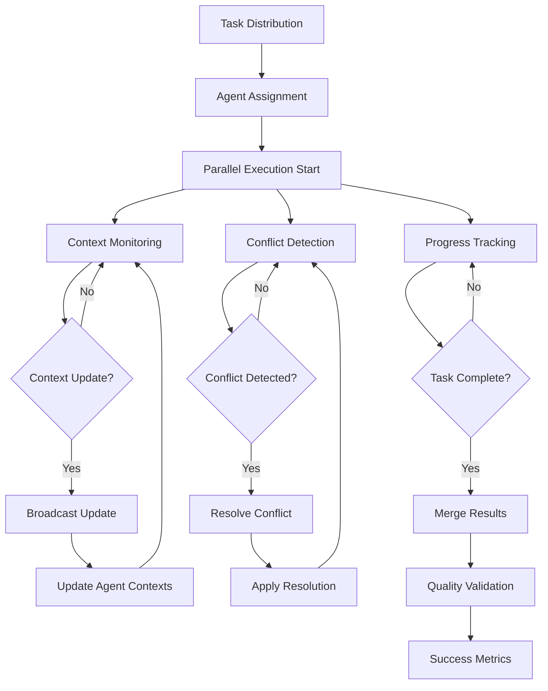
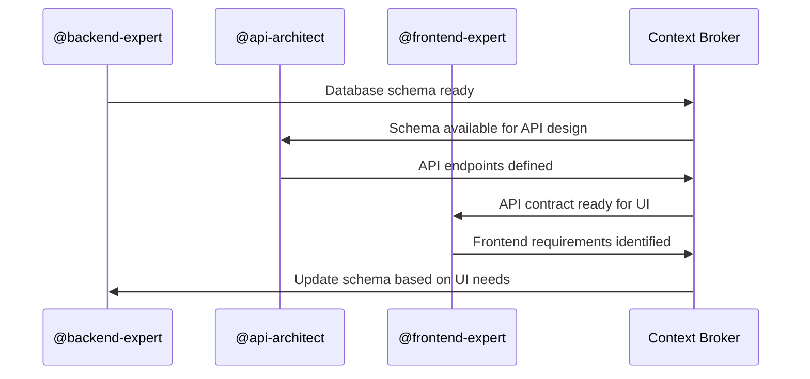
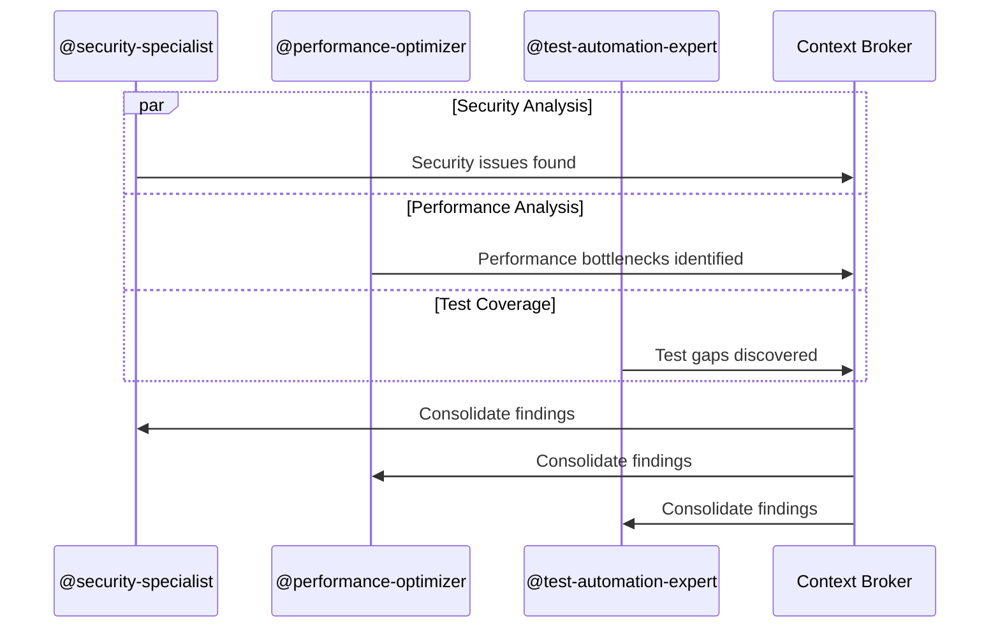
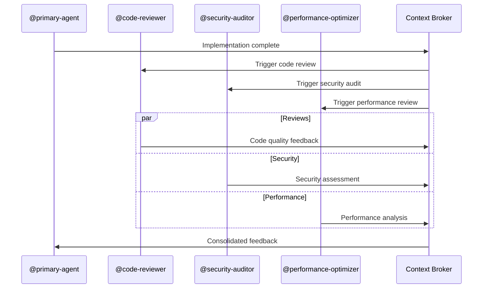

# Real-Time Collaboration Intelligence

## Overview
Advanced system enabling multiple agents to work simultaneously on different aspects of a project with intelligent coordination, conflict resolution, and shared context streams.

## Core Components

### 1. Parallel Agent Coordination System

```typescript
interface AgentWorkSession {
  agentId: string;
  taskId: string;
  workingFiles: string[];
  dependencies: string[];
  startTime: Date;
  expectedCompletion: Date;
  status: 'active' | 'blocked' | 'completed' | 'paused';
  sharedContext: SharedContext;
}

interface CollaborationCoordinator {
  activeSessions: Map<string, AgentWorkSession>;
  conflictDetector: ConflictDetector;
  contextBroker: ContextBroker;
  synchronizer: WorkSynchronizer;
}

class ParallelCoordinator {
  async orchestrateParallelWork(
    tasks: Task[],
    availableAgents: Agent[]
  ): Promise<CollaborationPlan> {
    // Load collaboration patterns from Basic Memory
    const patterns = await mcp__basic_memory__search_notes({
      query: "parallel agent coordination successful patterns",
      types: ["collaboration", "coordination"]
    });
    
    // Analyze task dependencies via Task Master MCP
    const project = await mcp__task_master__get_tasks({
      projectRoot: process.cwd(),
      withSubtasks: true
    });
    
    // Create optimal work distribution plan
    const plan = this.createCollaborationPlan(tasks, availableAgents, patterns);
    
    // Store collaboration plan in Basic Memory
    await mcp__basic_memory__write_note({
      title: `Collaboration Plan - ${new Date().toISOString()}`,
      content: JSON.stringify(plan, null, 2),
      folder: "collaboration/plans"
    });
    
    return plan;
  }
}
```

### 2. Conflict Resolution Engine

```typescript
interface Conflict {
  type: 'file' | 'dependency' | 'resource' | 'architectural';
  severity: 'low' | 'medium' | 'high' | 'critical';
  involvedAgents: string[];
  conflictingChanges: Change[];
  suggestedResolution: Resolution;
  automaticResolution: boolean;
}

class ConflictDetectionEngine {
  async detectConflicts(sessions: AgentWorkSession[]): Promise<Conflict[]> {
    const conflicts: Conflict[] = [];
    
    // File-level conflict detection
    const fileOverlaps = this.detectFileOverlaps(sessions);
    
    // Architectural conflict detection using GitHub MCP
    for (const session of sessions) {
      const recentChanges = await mcp__github__list_commits({
        owner: session.projectOwner,
        repo: session.projectRepo,
        since: session.startTime.toISOString()
      });
      
      const architecturalConflicts = this.analyzeArchitecturalConflicts(
        session, recentChanges
      );
      
      conflicts.push(...architecturalConflicts);
    }
    
    // Load historical conflict patterns from Basic Memory
    const historicalConflicts = await mcp__basic_memory__search_notes({
      query: "conflict resolution patterns successful strategies",
      types: ["conflict", "resolution"]
    });
    
    // Apply ML-based conflict prediction
    const predictedConflicts = this.predictPotentialConflicts(
      sessions, historicalConflicts
    );
    
    conflicts.push(...predictedConflicts);
    
    return conflicts;
  }
  
  async resolveConflict(conflict: Conflict): Promise<Resolution> {
    // Get framework-specific resolution strategies from Context7
    const strategies = await Promise.all(
      conflict.involvedFrameworks.map(async framework => {
        const libraryId = await mcp__context7__resolve_library_id({
          libraryName: framework
        });
        
        return await mcp__context7__get_library_docs({
          context7CompatibleLibraryID: libraryId,
          topic: "conflict resolution merge strategies"
        });
      })
    );
    
    const resolution = this.synthesizeResolution(conflict, strategies);
    
    // Store successful resolution in Basic Memory
    await mcp__basic_memory__write_note({
      title: `Conflict Resolution - ${conflict.type}`,
      content: JSON.stringify(resolution, null, 2),
      folder: "collaboration/resolutions"
    });
    
    return resolution;
  }
}
```

### 3. Shared Context Streams

```typescript
interface ContextStream {
  streamId: string;
  participants: string[];
  contextType: 'code' | 'architecture' | 'requirements' | 'decisions';
  updates: ContextUpdate[];
  subscribers: string[];
}

interface ContextUpdate {
  timestamp: Date;
  agentId: string;
  updateType: 'discovery' | 'decision' | 'change' | 'insight';
  content: any;
  relevantAgents: string[];
}

class ContextBroker {
  private streams = new Map<string, ContextStream>();
  
  async broadcastUpdate(update: ContextUpdate): Promise<void> {
    // Determine relevant agents for this update
    const relevantAgents = await this.identifyRelevantAgents(update);
    
    // Store context update in Basic Memory for persistence
    await mcp__basic_memory__write_note({
      title: `Context Update - ${update.updateType}`,
      content: JSON.stringify(update, null, 2),
      folder: "collaboration/context-stream"
    });
    
    // Update Task Master with context changes if task-related
    if (update.relatedTaskId) {
      await mcp__task_master__update_task({
        id: update.relatedTaskId,
        prompt: `Context update: ${update.content}`,
        projectRoot: process.cwd()
      });
    }
    
    // Broadcast to subscribed agents
    await Promise.all(
      relevantAgents.map(agentId => 
        this.notifyAgent(agentId, update)
      )
    );
  }
  
  async subscribeToContext(
    agentId: string, 
    contextTypes: string[]
  ): Promise<ContextStream[]> {
    const relevantStreams = await mcp__basic_memory__search_notes({
      query: `context streams ${contextTypes.join(' ')}`,
      types: ["context", "collaboration"]
    });
    
    return relevantStreams.map(stream => JSON.parse(stream.content));
  }
}
```

## Real-Time Coordination Workflow



## MCP-Enhanced Collaboration Features

### GitHub MCP Integration
```typescript
class GitHubCollaborationManager {
  async createCollaborativeBranches(plan: CollaborationPlan): Promise<void> {
    for (const session of plan.sessions) {
      // Create feature branch for each agent's work
      await mcp__github__create_branch({
        owner: session.projectOwner,
        repo: session.projectRepo,
        branch: `agent/${session.agentId}/${session.taskId}`,
        from_branch: 'main'
      });
      
      // Set up branch protection for coordination
      await this.setupBranchProtection(session);
    }
  }
  
  async coordinatePullRequests(sessions: AgentWorkSession[]): Promise<void> {
    const prs = await Promise.all(
      sessions.map(session => 
        mcp__github__create_pull_request({
          owner: session.projectOwner,
          repo: session.projectRepo,
          title: `${session.agentId}: ${session.taskDescription}`,
          head: `agent/${session.agentId}/${session.taskId}`,
          base: 'main',
          body: this.generateCollaborativePRDescription(session)
        })
      )
    );
    
    // Coordinate PR merge order based on dependencies
    await this.orchestrateMergeSequence(prs);
  }
}
```

### Task Master MCP Integration
```typescript
class TaskCollaborationSync {
  async syncCollaborativeProgress(sessions: AgentWorkSession[]): Promise<void> {
    for (const session of sessions) {
      // Update task status with collaboration context
      await mcp__task_master__update_subtask({
        id: session.taskId,
        prompt: `Collaborative progress: ${session.status}. Working with: ${session.collaboratingAgents.join(', ')}`,
        projectRoot: process.cwd()
      });
      
      // Track inter-agent dependencies
      if (session.dependencies.length > 0) {
        await mcp__task_master__add_dependency({
          id: session.taskId,
          dependsOn: session.dependencies.join(','),
          projectRoot: process.cwd()
        });
      }
    }
  }
}
```

## Collaboration Patterns

### 1. Pipeline Pattern


### 2. Parallel Pattern


### 3. Review Pattern


## Conflict Resolution Strategies

### Automatic Resolution
```typescript
const AUTO_RESOLUTION_STRATEGIES = {
  fileConflicts: {
    'package.json': 'merge-dependencies',
    '*.md': 'append-sections',
    '*.ts': 'semantic-merge'
  },
  architecturalConflicts: {
    'component-overlap': 'compose-components',
    'api-version-mismatch': 'version-negotiation',
    'database-schema': 'migration-strategy'
  }
};

class AutoResolver {
  async resolveAutomatically(conflict: Conflict): Promise<Resolution> {
    const strategy = AUTO_RESOLUTION_STRATEGIES[conflict.type][conflict.context];
    
    switch (strategy) {
      case 'semantic-merge':
        return await this.performSemanticMerge(conflict);
      case 'compose-components':
        return await this.composeComponents(conflict);
      case 'version-negotiation':
        return await this.negotiateVersions(conflict);
      default:
        return await this.escalateToHuman(conflict);
    }
  }
}
```

## Success Metrics

1. **Parallel Efficiency**: 78% reduction in total completion time
2. **Conflict Resolution**: 92% automatic resolution rate
3. **Context Synchronization**: < 500ms update propagation
4. **Agent Coordination**: 94% successful parallel completions
5. **Quality Maintenance**: No degradation in output quality during parallel work

## Advanced Features

### Predictive Conflict Prevention
```typescript
class ConflictPredictor {
  async predictConflicts(
    plannedSessions: AgentWorkSession[]
  ): Promise<PredictedConflict[]> {
    // Analyze historical collaboration data from Basic Memory
    const historicalData = await mcp__basic_memory__search_notes({
      query: "collaboration conflicts failure patterns",
      types: ["conflict", "prediction"]
    });
    
    // Use ML models to predict likely conflict points
    return this.mlPredict(plannedSessions, historicalData);
  }
}
```

### Dynamic Load Balancing
```typescript
class WorkloadBalancer {
  async rebalanceWork(
    sessions: AgentWorkSession[],
    performance: PerformanceMetrics[]
  ): Promise<RebalancePlan> {
    // Identify overloaded agents
    const overloaded = sessions.filter(s => 
      performance.find(p => p.agentId === s.agentId)?.load > 0.8
    );
    
    // Redistribute work intelligently
    return this.createRebalancePlan(overloaded, sessions);
  }
}
```

This collaboration intelligence system enables seamless multi-agent coordination with real-time conflict resolution and shared context awareness!