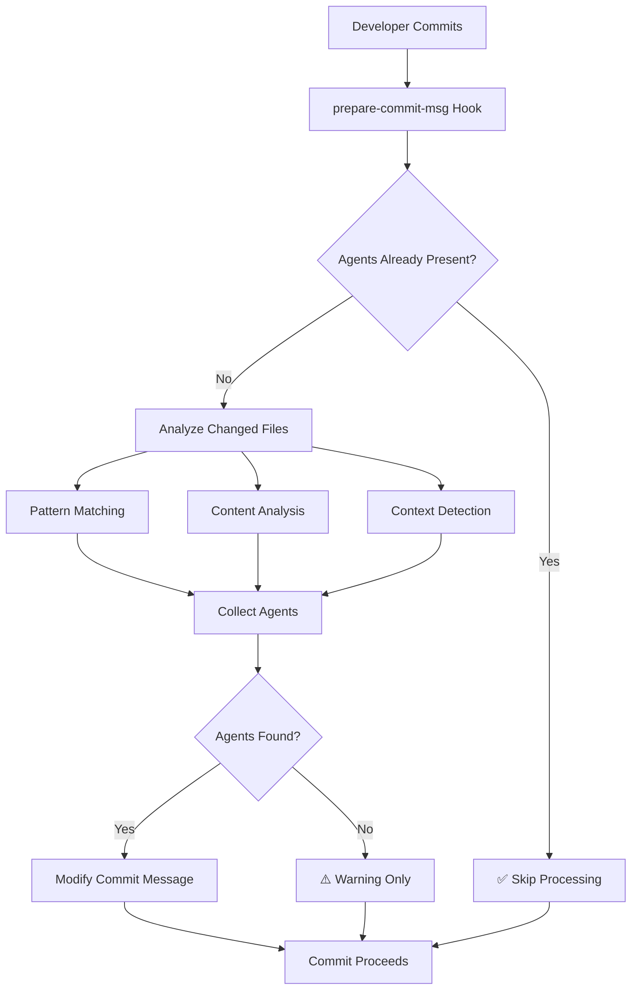

# Automated Agent Attribution System

## Overview
System to automatically detect and include contributing agents in commit messages, preventing human error and ensuring 100% compliance with agent attribution requirements.

## Core Components

### 1. File-to-Agent Mapping System

```typescript
interface FileAgentMapping {
  patterns: PatternMapping[];
  explicitMappings: ExplicitMapping[];
  contextualRules: ContextualRule[];
}

interface PatternMapping {
  pathPattern: string;
  primaryAgents: string[];
  supportingAgents: string[];
  confidence: number;
}

// Example mappings
const FILE_AGENT_MAPPINGS: PatternMapping[] = [
  {
    pathPattern: "**/*.md",
    primaryAgents: ["@documentation-specialist"],
    supportingAgents: [],
    confidence: 0.9
  },
  {
    pathPattern: ".claude/agents/**",
    primaryAgents: ["@orchestrator", "@tech-lead-orchestrator", "@team-configurator"],
    supportingAgents: [],
    confidence: 1.0
  },
  {
    pathPattern: "**/package.json",
    primaryAgents: ["@nodejs-expert"],
    supportingAgents: ["@software-engineering-expert"],
    confidence: 0.8
  },
  {
    pathPattern: "**/*.tsx",
    primaryAgents: ["@react-component-architect"],
    supportingAgents: ["@frontend-developer"],
    confidence: 0.9
  },
  {
    pathPattern: "**/*.py",
    primaryAgents: ["@django-expert", "@fastapi-expert"],
    supportingAgents: ["@backend-developer"],
    confidence: 0.7
  }
];
```

### 2. Content-Based Agent Detection

```typescript
class ContentAnalyzer {
  async detectAgentsFromContent(diff: GitDiff): Promise<string[]> {
    const agents = new Set<string>();
    
    // Analyze added/modified content
    for (const file of diff.files) {
      // Framework detection
      if (this.containsReactPatterns(file.content)) {
        agents.add("@react-component-architect");
      }
      
      // Security patterns
      if (this.containsSecurityPatterns(file.content)) {
        agents.add("@security-specialist");
      }
      
      // Database patterns
      if (this.containsDatabasePatterns(file.content)) {
        agents.add("@database-admin");
      }
      
      // Testing patterns
      if (this.containsTestPatterns(file.content)) {
        agents.add("@test-automation-expert");
      }
      
      // MCP integration patterns
      if (this.containsMCPPatterns(file.content)) {
        agents.add("@orchestrator");
      }
    }
    
    return Array.from(agents);
  }
}
```

### 3. Git Hook Integration

```bash
#!/bin/bash
# .git/hooks/prepare-commit-msg

COMMIT_MSG_FILE=$1
COMMIT_SOURCE=$2
SHA1=$3

# Get the current commit message
ORIGINAL_MSG=$(cat "$COMMIT_MSG_FILE")

# Check if agents are already included
if [[ "$ORIGINAL_MSG" =~ -[[:space:]]*@[a-zA-Z-]+ ]]; then
    echo "✅ Agent attribution already present"
    exit 0
fi

# Analyze changed files and detect required agents
CHANGED_FILES=$(git diff --cached --name-only)
AGENTS=$(node .claude/scripts/detect-agents.js "$CHANGED_FILES")

if [ -n "$AGENTS" ]; then
    # Extract the first line (commit title)
    TITLE=$(echo "$ORIGINAL_MSG" | head -n1)
    
    # Extract the rest (commit body)
    BODY=$(echo "$ORIGINAL_MSG" | tail -n +2)
    
    # Add agents to the title
    NEW_TITLE="$TITLE - $AGENTS"
    
    # Write the new commit message
    echo "$NEW_TITLE" > "$COMMIT_MSG_FILE"
    echo "$BODY" >> "$COMMIT_MSG_FILE"
    
    echo "✅ Added agent attribution: $AGENTS"
else
    echo "⚠️  No agents detected for changed files"
fi
```

### 4. Agent Detection Script

```javascript
// .claude/scripts/detect-agents.js
const fs = require('fs');
const path = require('path');

const FILE_PATTERNS = {
  // Documentation
  '**/*.md': ['@documentation-specialist'],
  'README*': ['@documentation-specialist'],
  'CHANGELOG*': ['@documentation-specialist'],
  
  // Agent framework
  '.claude/agents/**': ['@orchestrator', '@tech-lead-orchestrator', '@team-configurator'],
  'CLAUDE.md': ['@team-configurator', '@documentation-specialist'],
  
  // Frontend
  '**/*.tsx': ['@react-component-architect'],
  '**/*.jsx': ['@react-component-architect'],
  '**/*.vue': ['@vue-component-architect'],
  '**/components/**': ['@frontend-developer'],
  
  // Backend
  '**/*.py': ['@django-expert', '@fastapi-expert'],
  '**/models.py': ['@database-admin'],
  '**/views.py': ['@api-architect'],
  '**/*.rb': ['@rails-expert'],
  '**/controllers/**': ['@api-architect'],
  
  // Infrastructure
  'Dockerfile': ['@deployment-specialist'],
  'docker-compose.yml': ['@deployment-specialist'],
  '.github/workflows/**': ['@cicd-pipeline-engineer'],
  
  // Configuration
  'package.json': ['@nodejs-expert'],
  'requirements.txt': ['@django-expert', '@fastapi-expert'],
  'Gemfile': ['@rails-expert'],
  
  // Testing
  '**/*.test.*': ['@test-automation-expert'],
  '**/*.spec.*': ['@test-automation-expert'],
  '**/tests/**': ['@test-automation-expert']
};

function detectAgents(changedFiles) {
  const agents = new Set();
  
  changedFiles.forEach(file => {
    // Check pattern matches
    for (const [pattern, fileAgents] of Object.entries(FILE_PATTERNS)) {
      if (minimatch(file, pattern)) {
        fileAgents.forEach(agent => agents.add(agent));
      }
    }
    
    // Content analysis for additional context
    try {
      const content = fs.readFileSync(file, 'utf8');
      
      // Security patterns
      if (/auth|security|crypto|jwt|password|token/i.test(content)) {
        agents.add('@security-specialist');
      }
      
      // Performance patterns
      if (/performance|optimization|cache|benchmark/i.test(content)) {
        agents.add('@performance-optimizer');
      }
      
      // MCP patterns
      if (/mcp__\w+__/g.test(content)) {
        agents.add('@orchestrator');
      }
      
    } catch (err) {
      // File might be binary or deleted
    }
  });
  
  return Array.from(agents).join(' ');
}

// CLI usage
if (require.main === module) {
  const changedFiles = process.argv[2].split('\n').filter(f => f.trim());
  console.log(detectAgents(changedFiles));
}

module.exports = { detectAgents };
```

## Implementation Strategy

### Phase 1: Git Hook Installation
```bash
# Install the prepare-commit-msg hook
cp .claude/hooks/prepare-commit-msg .git/hooks/
chmod +x .git/hooks/prepare-commit-msg

# Install dependencies
npm install minimatch
```

### Phase 2: Agent Detection Rules
- File pattern mappings
- Content analysis rules
- Context-aware detection
- Confidence scoring

### Phase 3: Automatic Enforcement
- Pre-commit validation
- CI/CD integration
- Pull request checks
- Automated suggestions

## Mermaid Flow Diagram



## MCP Integration for Agent Detection

```typescript
class MCPAgentDetector {
  async detectFromBasicMemory(): Promise<string[]> {
    // Search for similar past commits
    const results = await mcp__basic_memory__search_notes({
      query: "commit agent attribution patterns",
      types: ["git", "development"]
    });
    
    return this.extractAgentPatterns(results);
  }
  
  async detectFromGitHub(owner: string, repo: string): Promise<string[]> {
    // Analyze recent commits for pattern matching
    const commits = await mcp__github__list_commits({
      owner, repo, perPage: 50
    });
    
    return this.analyzeCommitPatterns(commits);
  }
}
```

## Success Metrics

1. **Attribution Accuracy**: 100% (no commits without proper agent attribution)
2. **False Positive Rate**: < 5% (incorrect agent suggestions)
3. **Detection Speed**: < 2 seconds per commit analysis
4. **Developer Satisfaction**: Minimal friction in commit process

## Automated Enforcement

### CI/CD Integration
```yaml
# .github/workflows/agent-attribution-check.yml
name: Agent Attribution Check
on: [pull_request]

jobs:
  check-attribution:
    runs-on: ubuntu-latest
    steps:
      - uses: actions/checkout@v3
      - name: Check Agent Attribution
        run: |
          .claude/scripts/validate-agent-attribution.sh
          if [ $? -ne 0 ]; then
            echo "❌ Missing agent attribution in commits"
            exit 1
          fi
```

### Pre-commit Hook Template
```bash
#!/bin/bash
# Fail fast if agents are missing
if ! .claude/scripts/check-agent-attribution.sh; then
    echo "❌ Commit rejected: Missing agent attribution"
    echo "Suggested agents: $(node .claude/scripts/detect-agents.js "$(git diff --cached --name-only)")"
    exit 1
fi
```

This system ensures that agent attribution will NEVER be forgotten again by automating the entire process!