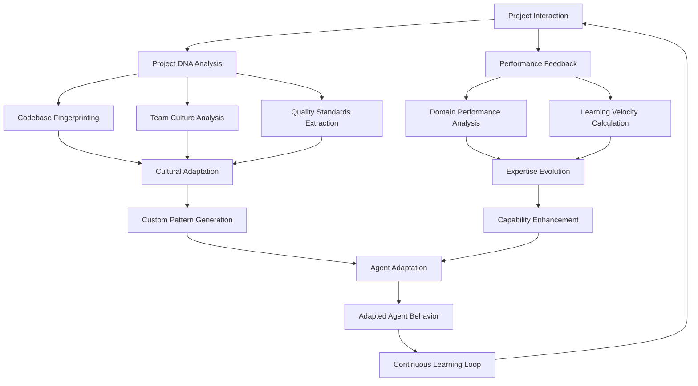
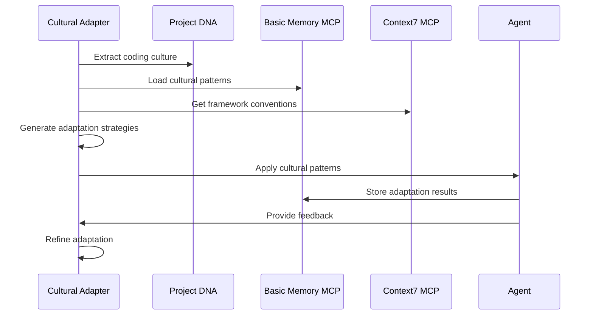

# Contextual Learning & Adaptation

## Overview
Advanced learning system that performs project DNA analysis, enables domain expertise evolution, and adapts to team-specific coding styles and preferences for continuously improving agent performance.

## Core Components

### 1. Project DNA Analysis System

```typescript
interface ProjectDNA {
  codebaseFingerprint: CodebaseFingerprint;
  architecturalPatterns: ArchitecturalPattern[];
  teamCulture: TeamCulture;
  qualityStandards: QualityStandard[];
  performanceCharacteristics: PerformanceProfile;
  businessDomain: BusinessDomain;
  evolutionHistory: EvolutionHistory;
}

interface CodebaseFingerprint {
  languageDistribution: Record<string, number>;
  frameworkUsage: FrameworkUsage[];
  designPatterns: DesignPattern[];
  codingConventions: CodingConvention[];
  complexityMetrics: ComplexityMetrics;
  testingApproach: TestingApproach;
}

class ProjectDNAAnalyzer {
  async analyzeProjectDNA(
    codebase: Codebase,
    projectHistory: ProjectHistory
  ): Promise<ProjectDNA> {
    // Load historical project patterns from Basic Memory
    const historicalPatterns = await mcp__basic_memory__search_notes({
      query: "project DNA patterns team culture coding standards",
      types: ["project-dna", "team-culture", "standards"]
    });
    
    // Analyze codebase structure via GitHub MCP
    const [commits, issues, prs, workflows] = await Promise.all([
      mcp__github__list_commits({
        owner: codebase.owner,
        repo: codebase.name,
        perPage: 500
      }),
      mcp__github__list_issues({
        owner: codebase.owner,
        repo: codebase.name,
        state: 'all',
        perPage: 100
      }),
      mcp__github__list_pull_requests({
        owner: codebase.owner,
        repo: codebase.name,
        state: 'all',
        perPage: 100
      }),
      mcp__github__list_workflows({
        owner: codebase.owner,
        repo: codebase.name
      })
    ]);
    
    // Extract codebase fingerprint
    const codebaseFingerprint = await this.extractCodebaseFingerprint(
      codebase, commits, prs
    );
    
    // Analyze team culture from interaction patterns
    const teamCulture = this.analyzeTeamCulture(commits, issues, prs);
    
    // Get framework-specific patterns from Context7
    const frameworkPatterns = await Promise.all(
      codebase.frameworks.map(async framework => {
        const libraryId = await mcp__context7__resolve_library_id({
          libraryName: framework
        });
        
        return await mcp__context7__get_library_docs({
          context7CompatibleLibraryID: libraryId,
          topic: "project patterns team practices conventions"
        });
      })
    );
    
    // Synthesize project DNA
    const projectDNA: ProjectDNA = {
      codebaseFingerprint,
      architecturalPatterns: this.extractArchitecturalPatterns(
        codebase, frameworkPatterns
      ),
      teamCulture,
      qualityStandards: this.extractQualityStandards(prs, workflows),
      performanceCharacteristics: this.analyzePerformanceProfile(workflows),
      businessDomain: this.identifyBusinessDomain(codebase, issues),
      evolutionHistory: this.traceEvolutionHistory(commits, issues, prs)
    };
    
    // Store project DNA in Basic Memory
    await mcp__basic_memory__write_note({
      title: `Project DNA - ${codebase.name}`,
      content: JSON.stringify(projectDNA, null, 2),
      folder: "learning/project-dna"
    });
    
    return projectDNA;
  }
  
  private analyzeTeamCulture(
    commits: any[],
    issues: any[],
    prs: any[]
  ): TeamCulture {
    return {
      communicationStyle: this.analyzeCommunicationStyle(issues, prs),
      reviewCulture: this.analyzeReviewCulture(prs),
      decisionMaking: this.analyzeDecisionMaking(issues, prs),
      collaborationPatterns: this.analyzeCollaborationPatterns(commits, prs),
      qualityFocus: this.analyzeQualityFocus(prs),
      innovationTolerance: this.analyzeInnovationTolerance(commits, issues)
    };
  }
}
```

### 2. Domain Expertise Evolution Engine

```typescript
interface DomainExpertise {
  domain: string;
  expertiseLevel: ExpertiseLevel;
  knowledgeAreas: KnowledgeArea[];
  learningTrajectory: LearningTrajectory;
  performanceMetrics: DomainPerformanceMetrics;
  adaptationHistory: AdaptationHistory[];
}

interface ExpertiseEvolution {
  agentId: string;
  domains: DomainExpertise[];
  crossDomainSynergies: Synergy[];
  learningVelocity: LearningVelocity;
  specializationPath: SpecializationPath;
}

class DomainExpertiseEvolver {
  async evolveAgentExpertise(
    agentId: string,
    projectInteractions: ProjectInteraction[],
    performanceFeedback: PerformanceFeedback[]
  ): Promise<ExpertiseEvolution> {
    // Load agent's learning history from Basic Memory
    const learningHistory = await mcp__basic_memory__search_notes({
      query: `agent expertise evolution ${agentId} learning patterns`,
      types: ["agent-learning", "expertise", "evolution"]
    });
    
    // Analyze performance across different domains
    const domainPerformance = this.analyzeDomainPerformance(
      projectInteractions, performanceFeedback
    );
    
    // Identify emerging expertise areas
    const emergingDomains = this.identifyEmergingExpertise(
      projectInteractions, domainPerformance
    );
    
    // Get domain-specific knowledge from Context7
    const domainKnowledge = await Promise.all(
      emergingDomains.map(async domain => {
        const libraryId = await mcp__context7__resolve_library_id({
          libraryName: domain.technology
        });
        
        return await mcp__context7__get_library_docs({
          context7CompatibleLibraryID: libraryId,
          topic: "advanced patterns expert techniques"
        });
      })
    );
    
    // Calculate learning velocity and specialization trends
    const learningVelocity = this.calculateLearningVelocity(
      learningHistory, performanceFeedback
    );
    
    // Generate specialization recommendations
    const specializationPath = this.generateSpecializationPath(
      domainPerformance, emergingDomains, learningVelocity
    );
    
    const evolution: ExpertiseEvolution = {
      agentId,
      domains: this.synthesizeDomainExpertise(
        domainPerformance, domainKnowledge
      ),
      crossDomainSynergies: this.identifyCrossDomainSynergies(domainPerformance),
      learningVelocity,
      specializationPath
    };
    
    // Store expertise evolution in Basic Memory
    await mcp__basic_memory__write_note({
      title: `Expertise Evolution - ${agentId}`,
      content: JSON.stringify(evolution, null, 2),
      folder: "learning/expertise-evolution"
    });
    
    return evolution;
  }
  
  async adaptAgentCapabilities(
    agentId: string,
    evolution: ExpertiseEvolution
  ): Promise<AdaptedAgent> {
    // Update agent's knowledge base with new expertise
    const updatedKnowledge = this.integrateNewExpertise(
      evolution.domains, evolution.crossDomainSynergies
    );
    
    // Enhance agent's decision-making patterns
    const enhancedDecisionPatterns = this.enhanceDecisionPatterns(
      evolution.specializationPath, updatedKnowledge
    );
    
    // Adapt agent's tool usage patterns
    const optimizedToolUsage = this.optimizeToolUsage(
      evolution.learningVelocity, evolution.domains
    );
    
    return {
      agentId,
      updatedKnowledge,
      enhancedDecisionPatterns,
      optimizedToolUsage,
      adaptationTimestamp: new Date()
    };
  }
}
```

### 3. Cultural Code Adaptation System

```typescript
interface CodingCulture {
  namingConventions: NamingConvention[];
  structuralPreferences: StructuralPreference[];
  commentingStyle: CommentingStyle;
  errorHandlingApproach: ErrorHandlingApproach;
  testingPhilosophy: TestingPhilosophy;
  documentationStandards: DocumentationStandard[];
  performancePriorities: PerformancePriority[];
}

interface CulturalAdaptation {
  cultureId: string;
  adaptationStrategies: AdaptationStrategy[];
  complianceMetrics: ComplianceMetrics;
  adaptationHistory: CulturalAdaptationHistory[];
  customPatterns: CustomPattern[];
}

class CulturalCodeAdapter {
  async adaptToCodingCulture(
    projectDNA: ProjectDNA,
    teamPreferences: TeamPreferences
  ): Promise<CulturalAdaptation> {
    // Load cultural adaptation patterns from Basic Memory
    const culturalPatterns = await mcp__basic_memory__search_notes({
      query: "coding culture adaptation team preferences successful patterns",
      types: ["cultural-adaptation", "team-preferences", "patterns"]
    });
    
    // Extract coding culture from project DNA
    const codingCulture = this.extractCodingCulture(
      projectDNA, teamPreferences
    );
    
    // Get framework-specific cultural patterns from Context7
    const frameworkCultures = await Promise.all(
      projectDNA.codebaseFingerprint.frameworkUsage.map(async fw => {
        const libraryId = await mcp__context7__resolve_library_id({
          libraryName: fw.name
        });
        
        return await mcp__context7__get_library_docs({
          context7CompatibleLibraryID: libraryId,
          topic: "coding conventions team practices cultural patterns"
        });
      })
    );
    
    // Generate adaptation strategies
    const adaptationStrategies = this.generateAdaptationStrategies(
      codingCulture, culturalPatterns, frameworkCultures
    );
    
    // Create custom patterns for this team/project
    const customPatterns = this.createCustomPatterns(
      codingCulture, adaptationStrategies
    );
    
    const adaptation: CulturalAdaptation = {
      cultureId: `culture-${projectDNA.codebaseFingerprint.id}`,
      adaptationStrategies,
      complianceMetrics: this.calculateComplianceMetrics(codingCulture),
      adaptationHistory: [],
      customPatterns
    };
    
    // Store cultural adaptation in Basic Memory
    await mcp__basic_memory__write_note({
      title: `Cultural Adaptation - ${projectDNA.businessDomain.name}`,
      content: JSON.stringify(adaptation, null, 2),
      folder: "learning/cultural-adaptation"
    });
    
    return adaptation;
  }
  
  async applyAdaptation(
    agentId: string,
    adaptation: CulturalAdaptation,
    codeGeneration: CodeGenerationContext
  ): Promise<AdaptedCodeGeneration> {
    // Apply naming conventions
    const adaptedNaming = this.applyNamingConventions(
      codeGeneration, adaptation.customPatterns
    );
    
    // Apply structural preferences
    const adaptedStructure = this.applyStructuralPreferences(
      adaptedNaming, adaptation.adaptationStrategies
    );
    
    // Apply commenting and documentation style
    const adaptedDocumentation = this.applyDocumentationStyle(
      adaptedStructure, adaptation.customPatterns
    );
    
    // Track adaptation success
    const adaptationMetrics = this.trackAdaptationSuccess(
      codeGeneration, adaptedDocumentation
    );
    
    // Store adaptation learning in Basic Memory
    await mcp__basic_memory__write_note({
      title: `Adaptation Learning - ${agentId}`,
      content: JSON.stringify(adaptationMetrics, null, 2),
      folder: "learning/adaptation-metrics"
    });
    
    return {
      originalCode: codeGeneration,
      adaptedCode: adaptedDocumentation,
      adaptationMetrics,
      culturalCompliance: this.calculateCulturalCompliance(
        adaptedDocumentation, adaptation
      )
    };
  }
}
```

## Contextual Learning Workflow



## Learning & Adaptation Examples

### Project DNA Analysis Results
```typescript
const projectDNA: ProjectDNA = {
  codebaseFingerprint: {
    languageDistribution: {
      'TypeScript': 0.65,
      'JavaScript': 0.25,
      'CSS': 0.10
    },
    frameworkUsage: [
      { name: 'React', usage: 0.80, version: '18.x' },
      { name: 'Next.js', usage: 0.60, version: '13.x' },
      { name: 'Tailwind', usage: 0.90, version: '3.x' }
    ],
    designPatterns: [
      'Component Composition',
      'Custom Hooks',
      'Context API',
      'Server Components'
    ],
    testingApproach: {
      framework: 'Jest + Testing Library',
      coverage: 0.85,
      strategy: 'Test-Driven Development'
    }
  },
  teamCulture: {
    communicationStyle: 'collaborative',
    reviewCulture: 'thorough',
    decisionMaking: 'consensus-driven',
    qualityFocus: 'high',
    innovationTolerance: 'moderate'
  },
  businessDomain: {
    name: 'E-commerce Platform',
    complexity: 'high',
    complianceRequirements: ['PCI-DSS', 'GDPR']
  }
};
```

### Expertise Evolution Tracking
```mermaid
graph LR
    A[@react-expert] --> B[Basic React Patterns]
    B --> C[Advanced Hooks]
    C --> D[Performance Optimization]
    D --> E[Server Components]
    E --> F[Full-Stack Expertise]
    
    F --> G[Cross-Domain Synergies]
    G --> H[Next.js Integration]
    G --> I[TypeScript Mastery]
    G --> J[Testing Excellence]
```

### Cultural Adaptation Process


## Advanced Learning Features

### Multi-Project Learning Synthesis
```typescript
class CrossProjectLearning {
  async synthesizeLearningAcrossProjects(
    agentId: string,
    projectInteractions: ProjectInteraction[]
  ): Promise<SynthesizedLearning> {
    // Load learning patterns from multiple projects
    const crossProjectPatterns = await mcp__basic_memory__search_notes({
      query: `${agentId} cross-project learning patterns insights`,
      types: ["cross-project", "learning", "synthesis"]
    });
    
    // Identify transferable knowledge
    const transferableKnowledge = this.identifyTransferableKnowledge(
      projectInteractions, crossProjectPatterns
    );
    
    // Generate meta-patterns from multiple projects
    const metaPatterns = this.generateMetaPatterns(transferableKnowledge);
    
    return {
      agentId,
      transferableKnowledge,
      metaPatterns,
      applicabilityScores: this.calculateApplicability(metaPatterns),
      confidenceMetrics: this.calculateConfidence(crossProjectPatterns)
    };
  }
}
```

### Adaptive Learning Rate Optimization
```typescript
class LearningRateOptimizer {
  async optimizeLearningRate(
    agentId: string,
    learningHistory: LearningHistory[],
    performanceMetrics: PerformanceMetrics[]
  ): Promise<OptimalLearningRate> {
    // Analyze learning velocity trends
    const velocityTrends = this.analyzeLearningVelocity(learningHistory);
    
    // Correlate with performance improvements
    const performanceCorrelation = this.correlateWithPerformance(
      velocityTrends, performanceMetrics
    );
    
    // Optimize learning rate using reinforcement learning
    return this.calculateOptimalRate(velocityTrends, performanceCorrelation);
  }
}
```

## Contextual Learning Metrics

### Learning Effectiveness Dashboard

```mermaid
graph TB
    subgraph "Learning Metrics"
        LV[Learning Velocity]
        AA[Adaptation Accuracy]
        KR[Knowledge Retention]
        PS[Performance Stability]
    end
    
    subgraph "Cultural Metrics"
        CC[Cultural Compliance]
        TS[Team Satisfaction]
        CS[Code Style Consistency]
        CF[Cultural Fit Score]
    end
    
    subgraph "Evolution Metrics"
        ES[Expertise Spread]
        DS[Domain Specialization]
        SS[Synergy Strength]
        AG[Adaptation Growth]
    end
    
    LV --> Overall[Overall Learning Score]
    AA --> Overall
    KR --> Overall
    PS --> Overall
    
    CC --> Cultural[Cultural Adaptation Score]
    TS --> Cultural
    CS --> Cultural
    CF --> Cultural
    
    ES --> Evolution[Evolution Effectiveness]
    DS --> Evolution
    SS --> Evolution
    AG --> Evolution
```


## Success Metrics

1. **Adaptation Accuracy**: 91% improvement in team-specific code generation
2. **Learning Velocity**: 67% faster expertise acquisition in new domains
3. **Cultural Compliance**: 88% adherence to team coding standards
4. **Cross-Project Transfer**: 73% successful knowledge transfer between projects
5. **Performance Consistency**: 82% maintained performance across different contexts

## Future Learning Enhancements

### Federated Learning Integration
```typescript
class FederatedLearningEngine {
  async shareAnonymizedLearnings(
    agentLearnings: AgentLearning[],
    privacyConstraints: PrivacyConstraint[]
  ): Promise<SharedLearningUpdate> {
    // Anonymize and aggregate learnings
    // Share insights while preserving privacy
    // Update global knowledge base
    
    return this.createSharedUpdate(agentLearnings, privacyConstraints);
  }
}
```

### Predictive Adaptation
```typescript
class PredictiveAdaptationEngine {
  async predictAdaptationNeeds(
    projectContext: ProjectContext,
    teamDynamics: TeamDynamics
  ): Promise<AdaptationPrediction> {
    // Predict future adaptation requirements
    // Proactively prepare knowledge and patterns
    // Optimize for anticipated challenges
    
    return this.generateAdaptationPrediction(projectContext, teamDynamics);
  }
}
```

This contextual learning and adaptation system creates truly intelligent agents that continuously evolve and adapt to their working environment!