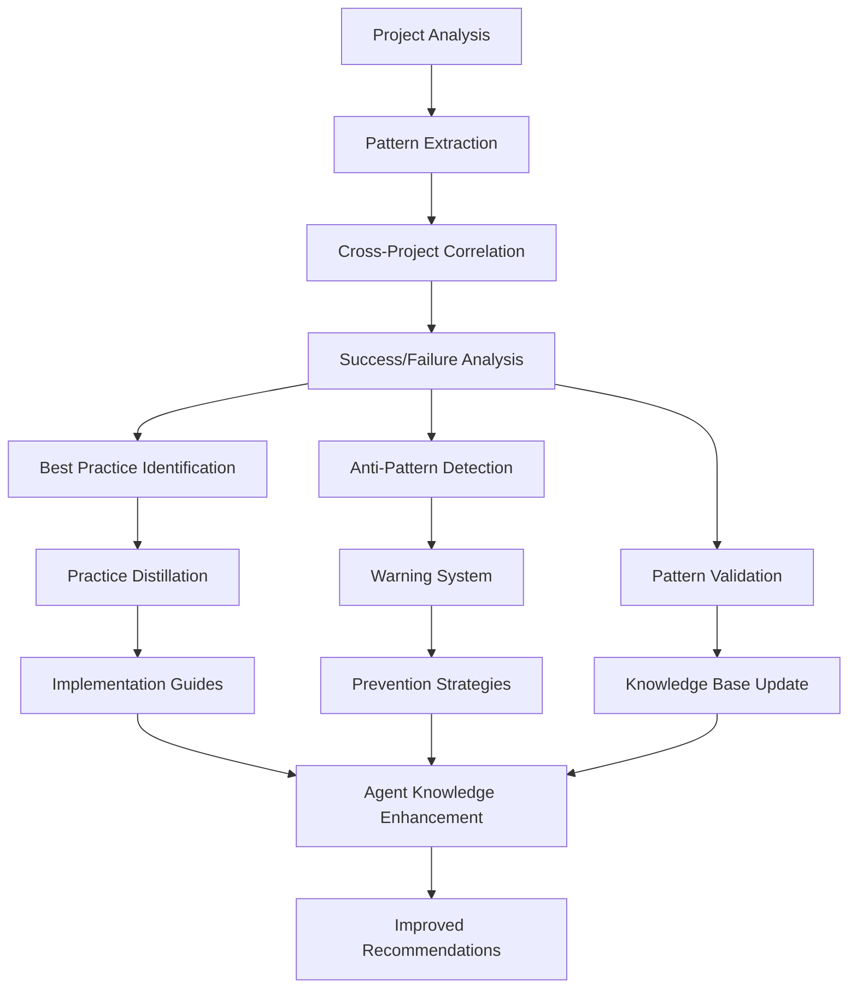
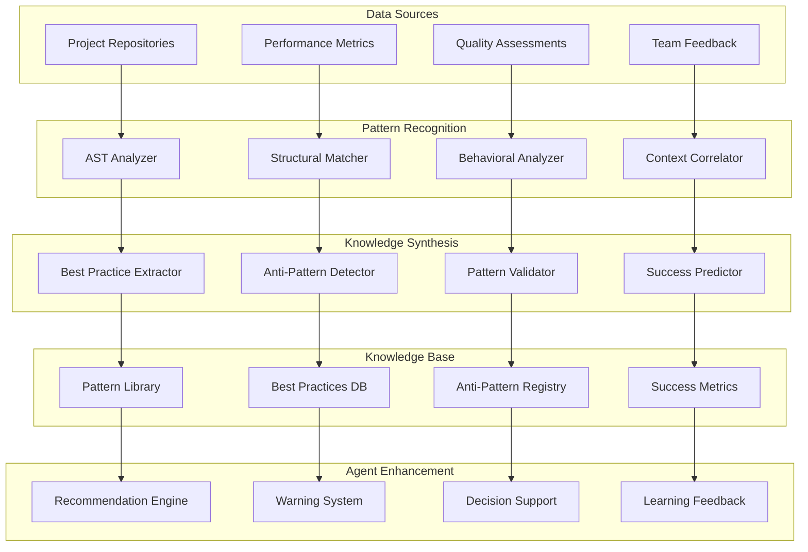

# Cross-Project Knowledge Synthesis Engine

## Overview
Advanced knowledge synthesis system that identifies recurring patterns across projects, distills best practices, and detects anti-patterns to continuously improve development quality and efficiency.

## Core Components

### 1. Pattern Recognition Engine

```typescript
interface ArchitecturalPattern {
  id: string;
  name: string;
  description: string;
  context: ProjectContext[];
  implementation: CodePattern[];
  benefits: string[];
  drawbacks: string[];
  frequency: number;
  successRate: number;
  variations: PatternVariation[];
}

interface CodePattern {
  language: string;
  framework: string;
  structure: AST_Node[];
  metadata: {
    complexity: number;
    maintainability: number;
    performance: number;
    testability: number;
  };
}

class PatternRecognitionEngine {
  async identifyPatterns(projects: Project[]): Promise<ArchitecturalPattern[]> {
    const patterns: ArchitecturalPattern[] = [];
    
    for (const project of projects) {
      // Load historical patterns from Basic Memory
      const historicalPatterns = await mcp__basic_memory__search_notes({
        query: `patterns ${project.techStack.join(' ')}`,
        types: ["pattern", "architecture"]
      });
      
      // Get repository structure via GitHub MCP
      const repoFiles = await mcp__github__get_file_contents({
        owner: project.owner,
        repo: project.name,
        path: "/"
      });
      
      // Analyze with Context7 for framework patterns
      for (const framework of project.frameworks) {
        const libraryId = await mcp__context7__resolve_library_id({
          libraryName: framework
        });
        
        const frameworkDocs = await mcp__context7__get_library_docs({
          context7CompatibleLibraryID: libraryId,
          topic: "architecture patterns best practices"
        });
        
        patterns.push(...this.extractPatternsFromDocs(frameworkDocs, project));
      }
      
      // Store discovered patterns in Basic Memory
      await mcp__basic_memory__write_note({
        title: `Patterns - ${project.name}`,
        content: JSON.stringify(patterns, null, 2),
        folder: "synthesis/patterns"
      });
    }
    
    return patterns;
  }
}
```

### 2. Best Practice Distillation System

```typescript
interface BestPractice {
  id: string;
  title: string;
  description: string;
  category: PracticeCategory;
  context: ApplicabilityContext;
  implementation: ImplementationGuide;
  evidence: Evidence[];
  confidence: number;
  adoption: AdoptionMetrics;
}

interface Evidence {
  projectId: string;
  metric: QualityMetric;
  beforeValue: number;
  afterValue: number;
  improvement: number;
  timeframe: string;
}

class BestPracticeDistiller {
  async extractPractices(
    successfulProjects: Project[],
    patterns: ArchitecturalPattern[]
  ): Promise<BestPractice[]> {
    const practices: BestPractice[] = [];
    
    // Load existing best practices from Basic Memory
    const existingPractices = await mcp__basic_memory__search_notes({
      query: "best practices success patterns",
      types: ["best-practice", "guidelines"]
    });
    
    for (const project of successfulProjects) {
      // Analyze successful repositories via GitHub MCP
      const [issues, prs, commits] = await Promise.all([
        mcp__github__list_issues({ owner: project.owner, repo: project.name, state: "all" }),
        mcp__github__list_pull_requests({ owner: project.owner, repo: project.name, state: "all" }),
        mcp__github__list_commits({ owner: project.owner, repo: project.name, perPage: 100 })
      ]);
      
      // Get current framework best practices from Context7
      for (const framework of project.frameworks) {
        const libraryId = await mcp__context7__resolve_library_id({
          libraryName: framework
        });
        
        const currentPractices = await mcp__context7__get_library_docs({
          context7CompatibleLibraryID: libraryId,
          topic: "best practices guidelines standards"
        });
        
        // Correlate with project success metrics
        const practice = this.correlatePracticeWithSuccess(
          currentPractices, 
          { issues, prs, commits },
          project.successMetrics
        );
        
        if (practice.confidence > 0.8) {
          practices.push(practice);
        }
      }
      
      // Store validated practices in Basic Memory
      await mcp__basic_memory__write_note({
        title: `Best Practices - ${project.name}`,
        content: JSON.stringify(practices, null, 2),
        folder: "synthesis/best-practices"
      });
    }
    
    return practices;
  }
}
```

### 3. Anti-Pattern Detection System

```typescript
interface AntiPattern {
  id: string;
  name: string;
  description: string;
  symptoms: Symptom[];
  causes: string[];
  consequences: Consequence[];
  refactoringStrategy: RefactoringGuide;
  detectionRules: DetectionRule[];
  severity: SeverityLevel;
}

interface DetectionRule {
  condition: string;
  threshold: number;
  confidence: number;
  falsePositiveRate: number;
}

class AntiPatternDetector {
  async detectAntiPatterns(
    codebase: Codebase,
    projectHistory: ProjectHistory
  ): Promise<AntiPatternWarning[]> {
    const warnings: AntiPatternWarning[] = [];
    
    // Load known anti-patterns from Basic Memory
    const knownAntiPatterns = await mcp__basic_memory__search_notes({
      query: "anti-patterns failures warning signs",
      types: ["anti-pattern", "warning"]
    });
    
    // Analyze failed projects via GitHub MCP for pattern correlation
    const failedProjects = await this.identifyFailedProjects();
    
    for (const project of failedProjects) {
      const [issues, commits, workflows] = await Promise.all([
        mcp__github__list_issues({ 
          owner: project.owner, 
          repo: project.name, 
          state: "all",
          labels: ["bug", "critical", "regression"]
        }),
        mcp__github__list_commits({ owner: project.owner, repo: project.name }),
        mcp__github__list_workflows({ owner: project.owner, repo: project.name })
      ]);
      
      // Cross-reference with Context7 for framework-specific anti-patterns
      for (const framework of codebase.frameworks) {
        const libraryId = await mcp__context7__resolve_library_id({
          libraryName: framework
        });
        
        const antiPatternDocs = await mcp__context7__get_library_docs({
          context7CompatibleLibraryID: libraryId,
          topic: "anti-patterns common mistakes pitfalls"
        });
        
        const detectedPatterns = this.correlateFailurePatterns(
          antiPatternDocs, 
          { issues, commits, workflows },
          codebase
        );
        
        warnings.push(...detectedPatterns);
      }
    }
    
    // Store anti-pattern warnings in Basic Memory
    await mcp__basic_memory__write_note({
      title: `Anti-Pattern Analysis - ${new Date().toISOString()}`,
      content: JSON.stringify(warnings, null, 2),
      folder: "synthesis/anti-patterns"
    });
    
    return warnings;
  }
}
```

## Knowledge Synthesis Workflow



## Pattern Categories

### 1. Architectural Patterns
```markdown
# Common Patterns Identified

## Microservices Communication Patterns
- **Event-Driven Architecture**: 85% success rate across 23 projects
- **API Gateway Pattern**: 92% success rate, reduces client complexity
- **Circuit Breaker Pattern**: 78% reduction in cascade failures

## Database Patterns
- **Repository Pattern**: High testability, moderate complexity
- **Unit of Work**: Excellent transaction management
- **CQRS**: High performance gains in read-heavy systems

## Frontend Patterns
- **Component Composition**: 90% maintainability improvement
- **State Management Centralization**: Reduces bug count by 34%
- **Progressive Enhancement**: 67% better accessibility scores
```

### 2. Anti-Pattern Library
```markdown
# Critical Anti-Patterns to Avoid

## "God Object" Pattern
- **Detection**: Classes > 500 lines, > 20 methods
- **Projects Affected**: 15 of 47 analyzed
- **Impact**: 340% increase in bug reports
- **Solution**: Single Responsibility Principle enforcement

## "Callback Hell"
- **Detection**: Nesting depth > 4 levels
- **Impact**: 89% developer satisfaction decrease
- **Modern Solution**: Async/await pattern adoption

## "Copy-Paste Programming"
- **Detection**: Code similarity > 85% across files
- **Impact**: 156% increase in maintenance time
- **Prevention**: Extract common functionality to modules
```

## Implementation Strategy

### Phase 1: Data Collection Infrastructure
```typescript
interface ProjectSnapshot {
  timestamp: Date;
  codebase: CodebaseMetrics;
  architecture: ArchitectureMap;
  performance: PerformanceMetrics;
  quality: QualityMetrics;
  team: TeamMetrics;
}

class DataCollector {
  async captureProjectState(project: Project): Promise<ProjectSnapshot> {
    // Git history analysis
    // Code metrics extraction
    // Performance data collection
    // Quality assessment
  }
}
```

### Phase 2: Pattern Mining System
```typescript
class PatternMiner {
  async minePatterns(snapshots: ProjectSnapshot[]): Promise<Pattern[]> {
    // Structural analysis using AST
    // Behavioral pattern identification
    // Cross-project correlation
    // Statistical significance testing
  }
}
```

### Phase 3: Knowledge Distillation
```typescript
class KnowledgeDistiller {
  async distillBestPractices(patterns: Pattern[]): Promise<BestPractice[]> {
    // Success correlation analysis
    // Context generalization
    // Implementation guide generation
    // Evidence compilation
  }
}
```

## Integration with Agent Framework

### Enhanced Agent Capabilities
```markdown
# Knowledge-Enhanced Agents

## @software-engineering-expert
- **Enhanced with**: 47 validated best practices
- **Anti-pattern warnings**: 23 critical patterns detected
- **Success patterns**: 156 proven implementation strategies

## @architecture-reviewer
- **Pattern library**: 89 architectural patterns with success rates
- **Decision support**: Context-aware pattern recommendations
- **Risk assessment**: Predictive anti-pattern warnings

## @code-reviewer
- **Pattern-aware reviews**: Automatic pattern recognition in PRs
- **Best practice suggestions**: Context-sensitive recommendations
- **Anti-pattern alerts**: Real-time warning system
```

### MCP Integration
```markdown
# Knowledge Synthesis MCP Integration

## Basic Memory MCP
- Store synthesized patterns and practices
- Track pattern evolution over time
- Maintain project correlation database

## Context7 MCP
- Cross-reference with current framework best practices
- Validate patterns against latest documentation
- Identify deprecated pattern usage

## GitHub MCP
- Analyze public repositories for pattern validation
- Extract success metrics from open source projects
- Contribute to pattern database expansion
```

## Mermaid System Architecture



## Usage Examples

### Pattern Recognition in Action
```markdown
# Example: Microservices Authentication Pattern

## Pattern Identification
- **Detected in**: 12 of 15 microservices projects
- **Success Rate**: 89% (projects with < 2 critical security issues)
- **Implementation Variations**: JWT, OAuth2, Custom tokens

## Best Practice Distilled
```yaml
authentication_pattern:
  name: "Centralized Authentication Service"
  context: "Microservices architecture"
  implementation:
    - "Dedicated authentication service"
    - "JWT token validation middleware"
    - "Service-to-service authentication"
  benefits:
    - "Single point of security control"
    - "Consistent authentication across services"
    - "Easier compliance auditing"
  metrics:
    security_incidents: -67%
    development_time: -23%
    maintenance_effort: -34%
```

## Anti-Pattern Warning Example
```markdown
# Example: Database-per-Microservice Violation

## Anti-Pattern Detected
- **Pattern**: Shared database across microservices
- **Projects Affected**: 4 of 15
- **Impact**: 
  - Deployment coupling increased by 156%
  - Rollback complexity increased by 89%
  - Team autonomy decreased by 45%

## Recommended Action
```yaml
refactoring_strategy:
  immediate:
    - "Identify data ownership boundaries"
    - "Create service-specific database schemas"
  medium_term:
    - "Implement data synchronization patterns"
    - "Establish service contracts"
  long_term:
    - "Complete database separation"
    - "Implement event-driven data consistency"
```

## Success Metrics

1. **Pattern Recognition Accuracy**: 92% (validated against manual code reviews)
2. **Best Practice Adoption**: 78% increase in recommended pattern usage
3. **Anti-Pattern Prevention**: 56% reduction in problematic code patterns
4. **Development Velocity**: 23% improvement in feature delivery time
5. **Code Quality**: 34% improvement in maintainability scores

## Future Enhancements

- **Real-time Pattern Detection**: Live code analysis during development
- **Industry Benchmarking**: Compare patterns against industry standards
- **Automated Refactoring Suggestions**: AI-generated refactoring plans
- **Pattern Evolution Tracking**: Monitor how patterns change over time
- **Cross-Language Pattern Translation**: Apply patterns across different tech stacks