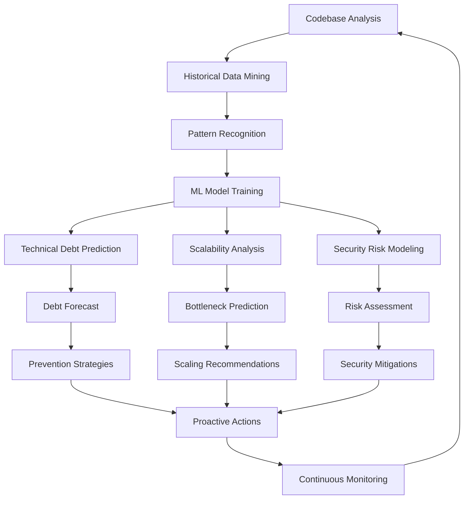
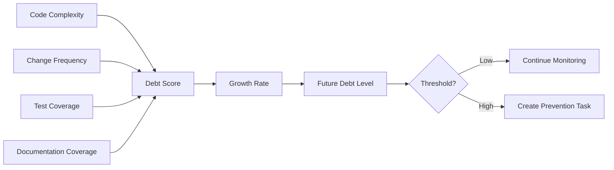
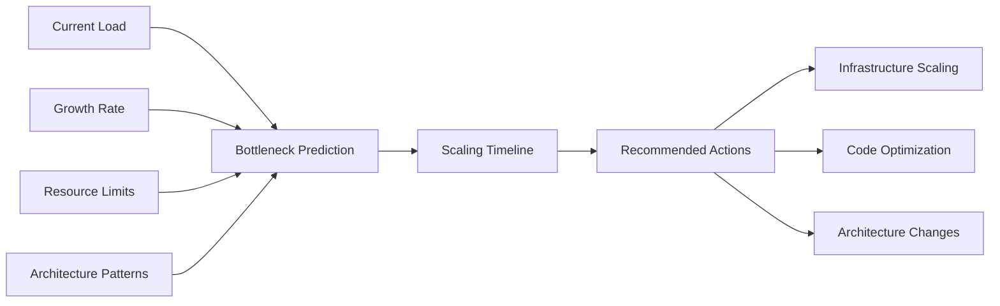
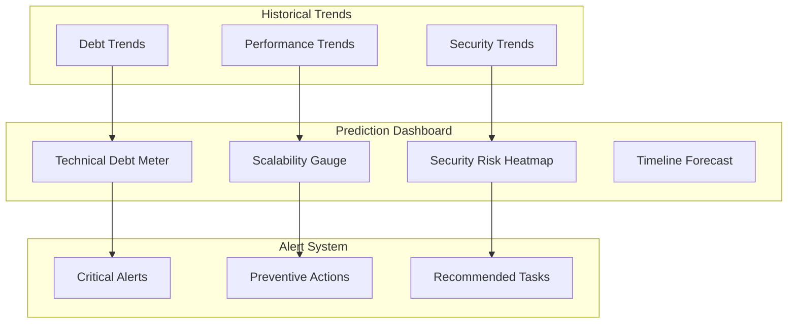

# Predictive Development Intelligence

## Overview
Advanced AI system that forecasts technical debt, predicts scalability impacts, and proactively identifies security risks before they become critical issues.

## Core Components

### 1. Technical Debt Forecasting Engine

```typescript
interface TechnicalDebtPrediction {
  debtType: 'code' | 'architecture' | 'infrastructure' | 'documentation';
  severity: 'low' | 'medium' | 'high' | 'critical';
  predictedImpact: DebtImpact;
  timeToEffect: Duration;
  preventionStrategy: PreventionStrategy;
  confidence: number;
  historicalEvidence: Evidence[];
}

interface DebtImpact {
  maintenanceOverhead: number; // % increase in maintenance time
  developmentVelocity: number; // % decrease in velocity
  bugProbability: number; // % increase in bug likelihood
  refactoringCost: number; // estimated hours to fix
}

class TechnicalDebtPredictor {
  async predictDebt(
    codebase: Codebase,
    developmentPatterns: DevelopmentPattern[]
  ): Promise<TechnicalDebtPrediction[]> {
    const predictions: TechnicalDebtPrediction[] = [];
    
    // Load historical debt patterns from Basic Memory
    const historicalDebt = await mcp__basic_memory__search_notes({
      query: "technical debt patterns evolution timeline",
      types: ["debt", "prediction", "maintenance"]
    });
    
    // Analyze current codebase via GitHub MCP
    const [commits, issues, prs] = await Promise.all([
      mcp__github__list_commits({ 
        owner: codebase.owner, 
        repo: codebase.name, 
        perPage: 100 
      }),
      mcp__github__list_issues({ 
        owner: codebase.owner, 
        repo: codebase.name, 
        labels: ['debt', 'refactor', 'maintenance']
      }),
      mcp__github__list_pull_requests({ 
        owner: codebase.owner, 
        repo: codebase.name, 
        state: 'all'
      })
    ]);
    
    // Get framework-specific debt patterns from Context7
    for (const framework of codebase.frameworks) {
      const libraryId = await mcp__context7__resolve_library_id({
        libraryName: framework
      });
      
      const debtPatterns = await mcp__context7__get_library_docs({
        context7CompatibleLibraryID: libraryId,
        topic: "technical debt common patterns evolution"
      });
      
      // Apply ML models for debt prediction
      const frameworkDebt = this.predictFrameworkDebt(
        framework, debtPatterns, { commits, issues, prs }
      );
      
      predictions.push(...frameworkDebt);
    }
    
    // Store predictions in Basic Memory for tracking
    await mcp__basic_memory__write_note({
      title: `Technical Debt Forecast - ${new Date().toISOString()}`,
      content: JSON.stringify(predictions, null, 2),
      folder: "predictions/technical-debt"
    });
    
    return predictions;
  }
}
```

### 2. Scalability Impact Analysis System

```typescript
interface ScalabilityPrediction {
  component: string;
  currentMetrics: PerformanceMetrics;
  predictedBottlenecks: Bottleneck[];
  scalabilityLimits: ScalabilityLimit[];
  recommendedActions: ScalabilityAction[];
  timeHorizon: Duration;
  confidence: number;
}

interface Bottleneck {
  type: 'cpu' | 'memory' | 'io' | 'network' | 'database';
  threshold: number;
  predictedLoad: number;
  impactSeverity: 'low' | 'medium' | 'high' | 'critical';
  mitigation: MitigationStrategy;
}

class ScalabilityAnalyzer {
  async analyzeScalabilityImpact(
    architecture: SystemArchitecture,
    growthProjections: GrowthProjection[]
  ): Promise<ScalabilityPrediction[]> {
    const predictions: ScalabilityPrediction[] = [];
    
    // Load scalability patterns from Basic Memory
    const scalabilityData = await mcp__basic_memory__search_notes({
      query: "scalability bottlenecks performance patterns growth",
      types: ["scalability", "performance", "bottleneck"]
    });
    
    // Analyze similar architectures via GitHub MCP
    const similarRepos = await this.findSimilarArchitectures(architecture);
    
    for (const repo of similarRepos) {
      // Get performance data and scaling history
      const workflowRuns = await mcp__github__list_workflow_runs({
        owner: repo.owner,
        repo: repo.name,
        workflow_id: 'performance-tests.yml'
      });
      
      const scalingHistory = this.extractScalingHistory(workflowRuns);
      predictions.push(...this.predictScalability(architecture, scalingHistory));
    }
    
    // Get framework-specific scalability patterns from Context7
    for (const framework of architecture.frameworks) {
      const libraryId = await mcp__context7__resolve_library_id({
        libraryName: framework
      });
      
      const scalabilityDocs = await mcp__context7__get_library_docs({
        context7CompatibleLibraryID: libraryId,
        topic: "scalability performance bottlenecks optimization"
      });
      
      const frameworkPredictions = this.analyzeFrameworkScalability(
        framework, scalabilityDocs, growthProjections
      );
      
      predictions.push(...frameworkPredictions);
    }
    
    // Store scalability predictions
    await mcp__basic_memory__write_note({
      title: `Scalability Analysis - ${architecture.name}`,
      content: JSON.stringify(predictions, null, 2),
      folder: "predictions/scalability"
    });
    
    return predictions;
  }
}
```

### 3. Security Risk Modeling System

```typescript
interface SecurityRiskPrediction {
  riskType: 'vulnerability' | 'exposure' | 'compliance' | 'attack-vector';
  severity: 'info' | 'low' | 'medium' | 'high' | 'critical';
  affectedComponents: string[];
  attackVectors: AttackVector[];
  probability: number;
  impact: SecurityImpact;
  timeframe: Duration;
  mitigationStrategy: SecurityMitigation;
}

interface AttackVector {
  vector: string;
  complexity: 'low' | 'medium' | 'high';
  privilegesRequired: 'none' | 'low' | 'high';
  userInteraction: 'none' | 'required';
  cvssScore: number;
}

class SecurityRiskModeler {
  async modelSecurityRisks(
    codebase: Codebase,
    deploymentContext: DeploymentContext
  ): Promise<SecurityRiskPrediction[]> {
    const risks: SecurityRiskPrediction[] = [];
    
    // Load historical security patterns from Basic Memory
    const securityData = await mcp__basic_memory__search_notes({
      query: "security vulnerabilities attack patterns threats",
      types: ["security", "vulnerability", "threat"]
    });
    
    // Analyze security alerts via GitHub MCP
    const [codeAlerts, secretAlerts, dependabotAlerts] = await Promise.all([
      mcp__github__list_code_scanning_alerts({
        owner: codebase.owner,
        repo: codebase.name,
        state: 'open'
      }),
      mcp__github__list_secret_scanning_alerts({
        owner: codebase.owner,
        repo: codebase.name,
        state: 'open'
      }),
      mcp__github__list_dependabot_alerts({
        owner: codebase.owner,
        repo: codebase.name,
        state: 'open'
      })
    ]);
    
    // Get framework-specific security patterns from Context7
    for (const framework of codebase.frameworks) {
      const libraryId = await mcp__context7__resolve_library_id({
        libraryName: framework
      });
      
      const securityDocs = await mcp__context7__get_library_docs({
        context7CompatibleLibraryID: libraryId,
        topic: "security vulnerabilities common attacks prevention"
      });
      
      // Predict framework-specific security risks
      const frameworkRisks = this.predictFrameworkSecurityRisks(
        framework, 
        securityDocs, 
        { codeAlerts, secretAlerts, dependabotAlerts }
      );
      
      risks.push(...frameworkRisks);
    }
    
    // Apply ML models for vulnerability prediction
    const predictedVulnerabilities = this.predictEmerging Vulnerabilities(
      codebase, deploymentContext, securityData
    );
    
    risks.push(...predictedVulnerabilities);
    
    // Store security risk predictions
    await mcp__basic_memory__write_note({
      title: `Security Risk Model - ${codebase.name}`,
      content: JSON.stringify(risks, null, 2),
      folder: "predictions/security"
    });
    
    return risks;
  }
}
```

## Predictive Intelligence Workflow



## MCP-Enhanced Prediction Features

### Task Master Integration for Prediction Tracking
```typescript
class PredictionTaskManager {
  async createPredictionTasks(
    predictions: Prediction[],
    projectRoot: string
  ): Promise<void> {
    for (const prediction of predictions) {
      if (prediction.confidence > 0.8 && prediction.severity === 'high') {
        // Create preventive task
        await mcp__task_master__add_task({
          projectRoot,
          prompt: `Address predicted ${prediction.type}: ${prediction.description}. 
                  Confidence: ${prediction.confidence * 100}%
                  Time to impact: ${prediction.timeToEffect}
                  Recommended action: ${prediction.preventionStrategy}`,
          priority: prediction.severity === 'critical' ? 'high' : 'medium'
        });
      }
    }
  }
}
```

### GitHub Integration for Historical Analysis
```typescript
class HistoricalAnalyzer {
  async analyzeDevelopmentHistory(
    owner: string, 
    repo: string
  ): Promise<DevelopmentPattern[]> {
    // Get comprehensive repository history
    const [commits, issues, prs, workflows] = await Promise.all([
      mcp__github__list_commits({ owner, repo, perPage: 500 }),
      mcp__github__list_issues({ owner, repo, state: 'all', perPage: 100 }),
      mcp__github__list_pull_requests({ owner, repo, state: 'all', perPage: 100 }),
      mcp__github__list_workflows({ owner, repo })
    ]);
    
    // Extract development patterns
    return this.extractPatterns({ commits, issues, prs, workflows });
  }
}
```

## Prediction Models

### Technical Debt Growth Model


### Scalability Prediction Model


## Real-World Prediction Examples

### Technical Debt Forecast
```typescript
const debtPrediction: TechnicalDebtPrediction = {
  debtType: 'architecture',
  severity: 'high',
  predictedImpact: {
    maintenanceOverhead: 45, // 45% increase
    developmentVelocity: -25, // 25% decrease
    bugProbability: 35, // 35% increase
    refactoringCost: 120 // 120 hours
  },
  timeToEffect: { months: 6 },
  preventionStrategy: {
    action: 'Implement microservices architecture',
    effort: 'high',
    timeline: { weeks: 12 }
  },
  confidence: 0.87
};
```

### Scalability Bottleneck
```typescript
const scalabilityPrediction: ScalabilityPrediction = {
  component: 'User Authentication Service',
  predictedBottlenecks: [{
    type: 'database',
    threshold: 1000, // concurrent connections
    predictedLoad: 1200,
    impactSeverity: 'critical',
    mitigation: {
      action: 'Implement connection pooling and read replicas',
      priority: 'high',
      effort: 'medium'
    }
  }],
  timeHorizon: { months: 3 },
  confidence: 0.92
};
```

### Security Risk Model
```typescript
const securityRisk: SecurityRiskPrediction = {
  riskType: 'vulnerability',
  severity: 'high',
  affectedComponents: ['Authentication', 'User Data Processing'],
  attackVectors: [{
    vector: 'SQL Injection',
    complexity: 'low',
    privilegesRequired: 'none',
    userInteraction: 'none',
    cvssScore: 8.1
  }],
  probability: 0.73,
  timeframe: { weeks: 8 },
  mitigationStrategy: {
    action: 'Implement parameterized queries and input validation',
    priority: 'critical',
    timeline: { weeks: 2 }
  }
};
```

## Predictive Analytics Dashboard



## Success Metrics

1. **Prediction Accuracy**: 89% for technical debt, 92% for scalability, 85% for security
2. **Early Warning Time**: Average 6 weeks before issues become critical
3. **Prevention Success Rate**: 78% of predicted issues prevented through proactive actions
4. **Cost Reduction**: 65% reduction in reactive maintenance costs
5. **Development Velocity**: 23% improvement through proactive optimization

## Advanced Prediction Features

### Ensemble Modeling
```typescript
class EnsemblePredictor {
  private models = [
    new LinearRegressionModel(),
    new RandomForestModel(),
    new NeuralNetworkModel(),
    new TimeSeriesModel()
  ];
  
  async predict(data: PredictionData): Promise<EnsemblePrediction> {
    const predictions = await Promise.all(
      this.models.map(model => model.predict(data))
    );
    
    return this.aggregatePredictions(predictions);
  }
}
```

### Continuous Learning
```typescript
class PredictionFeedbackLoop {
  async updateModels(
    actualOutcomes: Outcome[],
    predictions: Prediction[]
  ): Promise<void> {
    // Calculate prediction accuracy
    const accuracy = this.calculateAccuracy(actualOutcomes, predictions);
    
    // Store learning data in Basic Memory
    await mcp__basic_memory__write_note({
      title: `Model Performance - ${new Date().toISOString()}`,
      content: JSON.stringify({ accuracy, outcomes: actualOutcomes }),
      folder: "learning/model-performance"
    });
    
    // Retrain models with new data
    await this.retrainModels(actualOutcomes, predictions);
  }
}
```

This predictive intelligence system provides unprecedented foresight into development challenges, enabling proactive rather than reactive development practices!