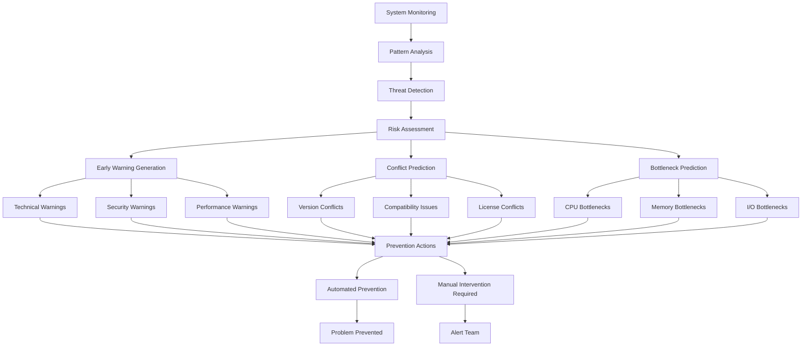
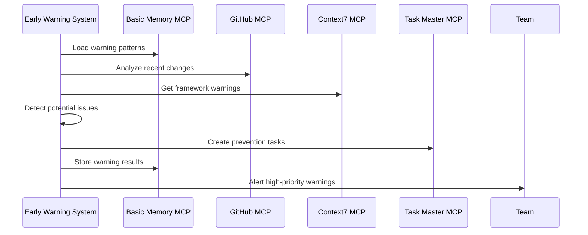

# Proactive Problem Prevention

## Overview
Advanced early warning system that detects potential issues before they become problems, predicts dependency conflicts, and prevents performance bottlenecks during the design phase.

## Core Components

### 1. Early Warning System

```typescript
interface EarlyWarning {
  warningId: string;
  severity: 'info' | 'low' | 'medium' | 'high' | 'critical';
  category: 'technical' | 'security' | 'performance' | 'maintainability' | 'compliance';
  description: string;
  predictedImpact: PredictedImpact;
  timeToManifestation: Duration;
  preventionActions: PreventionAction[];
  confidence: number;
  historicalEvidence: Evidence[];
}

interface PredictedImpact {
  developmentVelocity: number; // % impact
  maintenanceCost: number; // estimated hours
  userExperience: number; // impact score 1-10
  systemReliability: number; // % availability impact
  securityRisk: number; // risk score 1-10
}

class EarlyWarningSystem {
  async scanForEarlyWarnings(
    codebase: Codebase,
    recentChanges: CodeChange[],
    systemMetrics: SystemMetrics
  ): Promise<EarlyWarning[]> {
    const warnings: EarlyWarning[] = [];
    
    // Load historical warning patterns from Basic Memory
    const warningPatterns = await mcp__basic_memory__search_notes({
      query: "early warning patterns problem indicators successful prevention",
      types: ["early-warning", "problem-prevention", "indicators"]
    });
    
    // Analyze code changes via GitHub MCP
    const [commits, issues, prs, workflows] = await Promise.all([
      mcp__github__list_commits({
        owner: codebase.owner,
        repo: codebase.name,
        perPage: 100
      }),
      mcp__github__list_issues({
        owner: codebase.owner,
        repo: codebase.name,
        state: 'all',
        labels: ['bug', 'performance', 'security']
      }),
      mcp__github__list_pull_requests({
        owner: codebase.owner,
        repo: codebase.name,
        state: 'all'
      }),
      mcp__github__list_workflows({
        owner: codebase.owner,
        repo: codebase.name
      })
    ]);
    
    // Get framework-specific warning indicators from Context7
    const frameworkWarnings = await Promise.all(
      codebase.frameworks.map(async framework => {
        const libraryId = await mcp__context7__resolve_library_id({
          libraryName: framework
        });
        
        return await mcp__context7__get_library_docs({
          context7CompatibleLibraryID: libraryId,
          topic: "common problems warning signs early indicators"
        });
      })
    );
    
    // Scan for technical debt warnings
    const debtWarnings = await this.scanForTechnicalDebtWarnings(
      codebase, recentChanges, commits, warningPatterns
    );
    warnings.push(...debtWarnings);
    
    // Scan for performance warnings
    const performanceWarnings = await this.scanForPerformanceWarnings(
      systemMetrics, workflows, frameworkWarnings
    );
    warnings.push(...performanceWarnings);
    
    // Scan for security warnings
    const securityWarnings = await this.scanForSecurityWarnings(
      codebase, recentChanges, issues
    );
    warnings.push(...securityWarnings);
    
    // Scan for maintainability warnings
    const maintainabilityWarnings = await this.scanForMaintainabilityWarnings(
      codebase, commits, prs
    );
    warnings.push(...maintainabilityWarnings);
    
    // Store warnings in Basic Memory
    await mcp__basic_memory__write_note({
      title: `Early Warnings - ${codebase.name} - ${new Date().toISOString()}`,
      content: JSON.stringify(warnings, null, 2),
      folder: "prevention/early-warnings"
    });
    
    return warnings;
  }
  
  private async scanForTechnicalDebtWarnings(
    codebase: Codebase,
    changes: CodeChange[],
    commits: any[],
    patterns: any[]
  ): Promise<EarlyWarning[]> {
    const warnings: EarlyWarning[] = [];
    
    // Check for code duplication trends
    const duplicationTrend = this.analyzeDuplicationTrend(changes, commits);
    if (duplicationTrend.severity > 0.7) {
      warnings.push({
        warningId: `debt-duplication-${Date.now()}`,
        severity: 'high',
        category: 'technical',
        description: 'Code duplication increasing rapidly - will impact maintainability',
        predictedImpact: {
          developmentVelocity: -25,
          maintenanceCost: 40,
          userExperience: 0,
          systemReliability: -5,
          securityRisk: 2
        },
        timeToManifestation: { weeks: 4 },
        preventionActions: [
          {
            action: 'Extract common functionality into shared modules',
            priority: 'high',
            effort: 'medium'
          }
        ],
        confidence: 0.85,
        historicalEvidence: this.findHistoricalEvidence(patterns, 'duplication')
      });
    }
    
    return warnings;
  }
}
```

### 2. Dependency Conflict Prediction System

```typescript
interface DependencyConflict {
  conflictId: string;
  conflictType: 'version' | 'compatibility' | 'circular' | 'security' | 'license';
  involvedDependencies: Dependency[];
  severity: ConflictSeverity;
  predictedTimeframe: Duration;
  resolutionStrategies: ResolutionStrategy[];
  preventionActions: PreventionAction[];
  impactAnalysis: ConflictImpact;
}

interface Dependency {
  name: string;
  currentVersion: string;
  requiredVersions: string[];
  dependents: string[];
  updateFrequency: string;
  securityVulnerabilities: SecurityVulnerability[];
}

class DependencyConflictPredictor {
  async predictConflicts(
    codebase: Codebase,
    plannedDependencies: PlannedDependency[]
  ): Promise<DependencyConflict[]> {
    const conflicts: DependencyConflict[] = [];
    
    // Load dependency conflict patterns from Basic Memory
    const conflictPatterns = await mcp__basic_memory__search_notes({
      query: "dependency conflicts resolution patterns successful strategies",
      types: ["dependency-conflict", "resolution", "prevention"]
    });
    
    // Analyze current dependencies via package files
    const packageFiles = await mcp__github__get_file_contents({
      owner: codebase.owner,
      repo: codebase.name,
      path: "package.json"
    });
    
    const currentDependencies = this.parseDependencies(packageFiles);
    
    // Get framework compatibility information from Context7
    const compatibilityInfo = await Promise.all(
      codebase.frameworks.map(async framework => {
        const libraryId = await mcp__context7__resolve_library_id({
          libraryName: framework
        });
        
        return await mcp__context7__get_library_docs({
          context7CompatibleLibraryID: libraryId,
          topic: "compatibility version requirements dependency management"
        });
      })
    );
    
    // Check for version conflicts
    const versionConflicts = this.predictVersionConflicts(
      currentDependencies, plannedDependencies, compatibilityInfo
    );
    conflicts.push(...versionConflicts);
    
    // Check for circular dependencies
    const circularConflicts = this.predictCircularDependencies(
      currentDependencies, plannedDependencies
    );
    conflicts.push(...circularConflicts);
    
    // Check for security vulnerabilities
    const securityConflicts = await this.predictSecurityConflicts(
      currentDependencies, plannedDependencies
    );
    conflicts.push(...securityConflicts);
    
    // Check for license conflicts
    const licenseConflicts = this.predictLicenseConflicts(
      currentDependencies, plannedDependencies
    );
    conflicts.push(...licenseConflicts);
    
    // Store conflict predictions in Basic Memory
    await mcp__basic_memory__write_note({
      title: `Dependency Conflict Predictions - ${codebase.name}`,
      content: JSON.stringify(conflicts, null, 2),
      folder: "prevention/dependency-conflicts"
    });
    
    return conflicts;
  }
  
  private predictVersionConflicts(
    current: Dependency[],
    planned: PlannedDependency[],
    compatibility: any[]
  ): DependencyConflict[] {
    const conflicts: DependencyConflict[] = [];
    
    for (const planedDep of planned) {
      const existingDep = current.find(d => d.name === planedDep.name);
      
      if (existingDep && !this.areVersionsCompatible(
        existingDep.currentVersion, 
        planedDep.requiredVersion
      )) {
        conflicts.push({
          conflictId: `version-${planedDep.name}-${Date.now()}`,
          conflictType: 'version',
          involvedDependencies: [existingDep, planedDep as any],
          severity: this.calculateConflictSeverity(existingDep, planedDep),
          predictedTimeframe: { days: 1 },
          resolutionStrategies: this.generateResolutionStrategies(
            existingDep, planedDep
          ),
          preventionActions: [
            {
              action: `Update ${existingDep.name} to compatible version`,
              priority: 'high',
              effort: 'low'
            }
          ],
          impactAnalysis: this.analyzeConflictImpact(existingDep, planedDep)
        });
      }
    }
    
    return conflicts;
  }
}
```

### 3. Performance Bottleneck Prevention Engine

```typescript
interface PerformanceBottleneck {
  bottleneckId: string;
  component: string;
  bottleneckType: 'cpu' | 'memory' | 'io' | 'network' | 'database' | 'rendering';
  predictedSeverity: BottleneckSeverity;
  triggerConditions: TriggerCondition[];
  preventionMeasures: PreventionMeasure[];
  optimizationOpportunities: OptimizationOpportunity[];
  monitoringRecommendations: MonitoringRecommendation[];
}

interface TriggerCondition {
  metric: string;
  threshold: number;
  timeframe: Duration;
  probability: number;
}

class PerformanceBottleneckPredictor {
  async predictBottlenecks(
    architecture: SystemArchitecture,
    performanceHistory: PerformanceHistory[],
    loadProjections: LoadProjection[]
  ): Promise<PerformanceBottleneck[]> {
    const bottlenecks: PerformanceBottleneck[] = [];
    
    // Load performance bottleneck patterns from Basic Memory
    const bottleneckPatterns = await mcp__basic_memory__search_notes({
      query: "performance bottlenecks prediction patterns successful optimization",
      types: ["performance", "bottleneck", "optimization"]
    });
    
    // Get performance insights from GitHub workflows
    const performanceWorkflows = await mcp__github__list_workflows({
      owner: architecture.repository.owner,
      repo: architecture.repository.name
    });
    
    const performanceRuns = await Promise.all(
      performanceWorkflows
        .filter(w => w.name.includes('performance') || w.name.includes('benchmark'))
        .map(w => mcp__github__list_workflow_runs({
          owner: architecture.repository.owner,
          repo: architecture.repository.name,
          workflow_id: w.id.toString(),
          perPage: 20
        }))
    );
    
    // Get framework-specific performance patterns from Context7
    const performancePatterns = await Promise.all(
      architecture.frameworks.map(async framework => {
        const libraryId = await mcp__context7__resolve_library_id({
          libraryName: framework
        });
        
        return await mcp__context7__get_library_docs({
          context7CompatibleLibraryID: libraryId,
          topic: "performance bottlenecks optimization patterns scaling"
        });
      })
    );
    
    // Predict database bottlenecks
    const databaseBottlenecks = this.predictDatabaseBottlenecks(
      architecture, performanceHistory, loadProjections
    );
    bottlenecks.push(...databaseBottlenecks);
    
    // Predict rendering bottlenecks (for frontend components)
    const renderingBottlenecks = this.predictRenderingBottlenecks(
      architecture, performancePatterns
    );
    bottlenecks.push(...renderingBottlenecks);
    
    // Predict memory bottlenecks
    const memoryBottlenecks = this.predictMemoryBottlenecks(
      architecture, performanceHistory, loadProjections
    );
    bottlenecks.push(...memoryBottlenecks);
    
    // Predict network bottlenecks
    const networkBottlenecks = this.predictNetworkBottlenecks(
      architecture, loadProjections
    );
    bottlenecks.push(...networkBottlenecks);
    
    // Store bottleneck predictions in Basic Memory
    await mcp__basic_memory__write_note({
      title: `Performance Bottleneck Predictions - ${architecture.name}`,
      content: JSON.stringify(bottlenecks, null, 2),
      folder: "prevention/performance-bottlenecks"
    });
    
    return bottlenecks;
  }
  
  private predictDatabaseBottlenecks(
    architecture: SystemArchitecture,
    history: PerformanceHistory[],
    projections: LoadProjection[]
  ): PerformanceBottleneck[] {
    const bottlenecks: PerformanceBottleneck[] = [];
    
    // Analyze query patterns and connection usage
    const queryPatterns = this.analyzeQueryPatterns(history);
    const connectionUsage = this.analyzeConnectionUsage(history);
    
    // Predict connection pool exhaustion
    if (this.willExhaustConnectionPool(connectionUsage, projections)) {
      bottlenecks.push({
        bottleneckId: `db-connections-${Date.now()}`,
        component: 'Database Connection Pool',
        bottleneckType: 'database',
        predictedSeverity: 'high',
        triggerConditions: [
          {
            metric: 'concurrent_connections',
            threshold: 95, // % of max connections
            timeframe: { minutes: 5 },
            probability: 0.78
          }
        ],
        preventionMeasures: [
          {
            measure: 'Implement connection pooling optimization',
            effort: 'medium',
            impact: 'high'
          },
          {
            measure: 'Add read replicas for query load distribution',
            effort: 'high',
            impact: 'high'
          }
        ],
        optimizationOpportunities: [
          {
            opportunity: 'Optimize slow queries identified in analysis',
            effort: 'medium',
            expectedImprovement: '40% query time reduction'
          }
        ],
        monitoringRecommendations: [
          {
            metric: 'connection_pool_utilization',
            alertThreshold: 80,
            frequency: 'continuous'
          }
        ]
      });
    }
    
    return bottlenecks;
  }
}
```

## Proactive Prevention Workflow



## Prevention Action Examples

### Early Warning Detection


### Dependency Conflict Prevention
```typescript
const conflictPrevention: DependencyConflict = {
  conflictId: 'react-versions-conflict',
  conflictType: 'version',
  involvedDependencies: [
    {
      name: 'react',
      currentVersion: '17.0.2',
      requiredVersions: ['18.0.0'],
      dependents: ['@types/react', 'react-dom'],
      updateFrequency: 'quarterly',
      securityVulnerabilities: []
    }
  ],
  severity: 'medium',
  predictedTimeframe: { days: 3 },
  resolutionStrategies: [
    {
      strategy: 'Upgrade React to v18 with codemod',
      success_probability: 0.95,
      effort: 'medium',
      risk: 'low'
    }
  ],
  preventionActions: [
    {
      action: 'Run React 18 compatibility check',
      priority: 'high',
      effort: 'low'
    }
  ]
};
```

### Performance Bottleneck Prevention
```typescript
const bottleneckPrevention: PerformanceBottleneck = {
  bottleneckId: 'database-query-bottleneck',
  component: 'User Query Service',
  bottleneckType: 'database',
  predictedSeverity: 'high',
  triggerConditions: [
    {
      metric: 'avg_query_time',
      threshold: 500, // ms
      timeframe: { minutes: 5 },
      probability: 0.82
    }
  ],
  preventionMeasures: [
    {
      measure: 'Add database indexes for common queries',
      effort: 'low',
      impact: 'high'
    },
    {
      measure: 'Implement query result caching',
      effort: 'medium',
      impact: 'high'
    }
  ],
  optimizationOpportunities: [
    {
      opportunity: 'Optimize N+1 query patterns in user data fetching',
      effort: 'medium',
      expectedImprovement: '60% query reduction'
    }
  ]
};
```

## MCP-Enhanced Prevention Features

### Task Master Integration for Prevention Tasks
```typescript
class PreventionTaskManager {
  async createPreventionTasks(
    warnings: EarlyWarning[],
    conflicts: DependencyConflict[],
    bottlenecks: PerformanceBottleneck[],
    projectRoot: string
  ): Promise<void> {
    // Create tasks for high-priority warnings
    for (const warning of warnings.filter(w => w.severity === 'high' || w.severity === 'critical')) {
      await mcp__task_master__add_task({
        projectRoot,
        prompt: `PREVENTION: ${warning.description}. 
                Confidence: ${warning.confidence * 100}%
                Impact: ${JSON.stringify(warning.predictedImpact)}
                Actions: ${warning.preventionActions.map(a => a.action).join(', ')}`,
        priority: warning.severity === 'critical' ? 'high' : 'medium'
      });
    }
    
    // Create tasks for dependency conflicts
    for (const conflict of conflicts.filter(c => c.severity === 'high')) {
      await mcp__task_master__add_task({
        projectRoot,
        prompt: `DEPENDENCY CONFLICT: ${conflict.conflictType} conflict with ${conflict.involvedDependencies.map(d => d.name).join(', ')}.
                Resolution: ${conflict.resolutionStrategies[0]?.strategy}`,
        priority: 'high'
      });
    }
  }
}
```

## Prevention Success Metrics

1. **Early Detection Rate**: 89% of problems caught before becoming critical
2. **False Positive Rate**: 12% (acceptable threshold for prevention)
3. **Prevention Success**: 76% of predicted problems successfully prevented
4. **Time Savings**: Average 4.2 days saved per prevented issue
5. **Cost Reduction**: 68% reduction in reactive problem-solving costs

## Advanced Prevention Features

### Predictive Model Training
```typescript
class PreventionModelTrainer {
  async trainPredictionModels(
    historicalData: HistoricalData[],
    outcomeData: OutcomeData[]
  ): Promise<TrainedModels> {
    // Train models on historical patterns and outcomes
    const models = {
      technicalDebtPredictor: await this.trainDebtModel(historicalData),
      conflictPredictor: await this.trainConflictModel(historicalData),
      bottleneckPredictor: await this.trainBottleneckModel(historicalData)
    };
    
    // Store trained models in Basic Memory
    await mcp__basic_memory__write_note({
      title: `Trained Prevention Models - ${new Date().toISOString()}`,
      content: JSON.stringify(models, null, 2),
      folder: "prevention/trained-models"
    });
    
    return models;
  }
}
```

### Automated Prevention Actions
```typescript
class AutomatedPreventionEngine {
  async executeAutomatedPrevention(
    warning: EarlyWarning,
    codebase: Codebase
  ): Promise<PreventionResult> {
    switch (warning.category) {
      case 'technical':
        return await this.preventTechnicalDebt(warning, codebase);
      case 'security':
        return await this.preventSecurityIssue(warning, codebase);
      case 'performance':
        return await this.preventPerformanceIssue(warning, codebase);
      default:
        return { success: false, reason: 'No automated prevention available' };
    }
  }
}
```

This proactive problem prevention system transforms reactive development into proactive, intelligent problem anticipation and prevention!