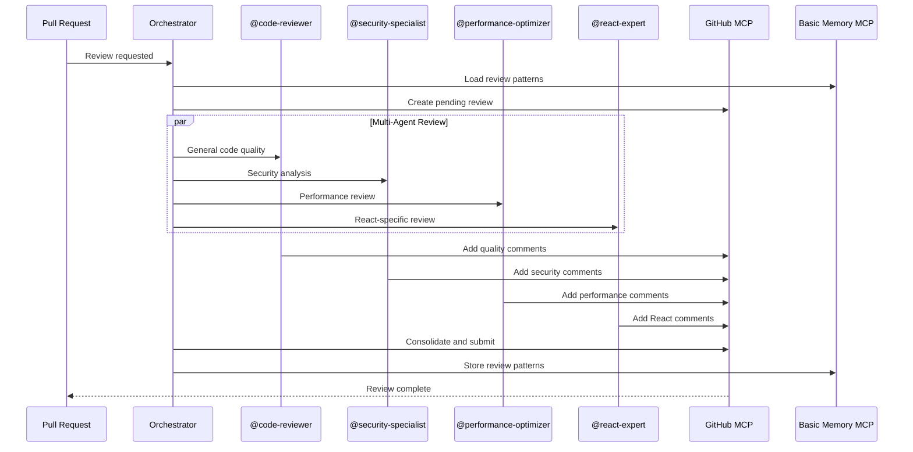
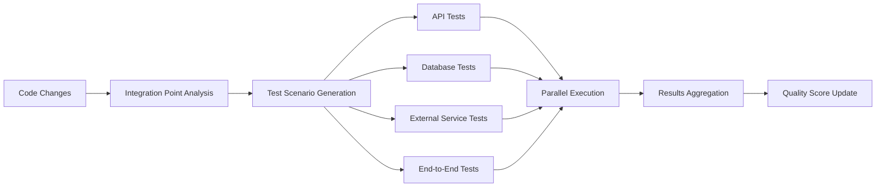

# Advanced Testing & Quality Orchestration

## Overview
Comprehensive system enabling multi-agent code reviews, automated integration testing, and quality score fusion for superior code quality assurance with intelligent orchestration.

## Core Components

### 1. Multi-Agent Code Review System

```typescript
interface MultiAgentReview {
  reviewId: string;
  codeChanges: CodeChange[];
  reviewers: ReviewerAgent[];
  perspectives: ReviewPerspective[];
  consolidatedFeedback: ConsolidatedFeedback;
  qualityScore: QualityScore;
  approvalStatus: ApprovalStatus;
}

interface ReviewerAgent {
  agentId: string;
  specialization: ReviewSpecialization;
  focus: string[];
  confidence: number;
  reviewCriteria: ReviewCriteria[];
}

class MultiAgentReviewOrchestrator {
  async orchestrateCodeReview(
    pullRequest: PullRequest,
    codebase: Codebase
  ): Promise<MultiAgentReview> {
    // Load review patterns from Basic Memory
    const reviewPatterns = await mcp__basic_memory__search_notes({
      query: "code review patterns quality feedback successful reviews",
      types: ["code-review", "quality", "feedback"]
    });
    
    // Get PR details via GitHub MCP
    const [prDetails, prDiff, prFiles] = await Promise.all([
      mcp__github__get_pull_request({
        owner: codebase.owner,
        repo: codebase.name,
        pullNumber: pullRequest.number
      }),
      mcp__github__get_pull_request_diff({
        owner: codebase.owner,
        repo: codebase.name,
        pullNumber: pullRequest.number
      }),
      mcp__github__get_pull_request_files({
        owner: codebase.owner,
        repo: codebase.name,
        pullNumber: pullRequest.number
      })
    ]);
    
    // Select specialized reviewer agents based on changes
    const reviewers = this.selectReviewerAgents(prFiles, codebase);
    
    // Create pending review via GitHub MCP
    await mcp__github__create_pending_pull_request_review({
      owner: codebase.owner,
      repo: codebase.name,
      pullNumber: pullRequest.number
    });
    
    // Orchestrate parallel reviews
    const reviews = await Promise.all(
      reviewers.map(reviewer => 
        this.conductSpecializedReview(reviewer, prDiff, prFiles)
      )
    );
    
    // Get framework-specific review guidelines from Context7
    const frameworkGuidelines = await Promise.all(
      codebase.frameworks.map(async framework => {
        const libraryId = await mcp__context7__resolve_library_id({
          libraryName: framework
        });
        
        return await mcp__context7__get_library_docs({
          context7CompatibleLibraryID: libraryId,
          topic: "code review best practices quality standards"
        });
      })
    );
    
    // Consolidate feedback from all reviewers
    const consolidatedFeedback = this.consolidateReviewFeedback(
      reviews, frameworkGuidelines, reviewPatterns
    );
    
    // Add consolidated comments to pending review
    for (const comment of consolidatedFeedback.comments) {
      await mcp__github__add_comment_to_pending_review({
        owner: codebase.owner,
        repo: codebase.name,
        pullNumber: pullRequest.number,
        path: comment.file,
        body: comment.text,
        line: comment.line,
        subjectType: "LINE"
      });
    }
    
    // Submit the review
    await mcp__github__submit_pending_pull_request_review({
      owner: codebase.owner,
      repo: codebase.name,
      pullNumber: pullRequest.number,
      event: consolidatedFeedback.approvalStatus,
      body: consolidatedFeedback.summary
    });
    
    const multiAgentReview: MultiAgentReview = {
      reviewId: `review-${Date.now()}`,
      codeChanges: this.analyzeCodeChanges(prDiff),
      reviewers,
      perspectives: reviews.map(r => r.perspective),
      consolidatedFeedback,
      qualityScore: this.calculateQualityScore(reviews),
      approvalStatus: consolidatedFeedback.approvalStatus
    };
    
    // Store review results in Basic Memory
    await mcp__basic_memory__write_note({
      title: `Multi-Agent Review - PR #${pullRequest.number}`,
      content: JSON.stringify(multiAgentReview, null, 2),
      folder: "quality/reviews"
    });
    
    return multiAgentReview;
  }
  
  private selectReviewerAgents(
    files: any[], 
    codebase: Codebase
  ): ReviewerAgent[] {
    const reviewers: ReviewerAgent[] = [];
    
    // Always include core reviewers
    reviewers.push({
      agentId: '@code-reviewer',
      specialization: 'general-quality',
      focus: ['maintainability', 'readability', 'best-practices'],
      confidence: 0.95,
      reviewCriteria: ['clean-code', 'solid-principles', 'dry-principle']
    });
    
    // Add security reviewer for sensitive changes
    if (this.containsSecuritySensitiveChanges(files)) {
      reviewers.push({
        agentId: '@security-specialist',
        specialization: 'security',
        focus: ['vulnerabilities', 'authentication', 'authorization'],
        confidence: 0.92,
        reviewCriteria: ['owasp-compliance', 'secure-coding', 'data-protection']
      });
    }
    
    // Add performance reviewer for performance-critical changes
    if (this.containsPerformanceCriticalChanges(files)) {
      reviewers.push({
        agentId: '@performance-optimizer',
        specialization: 'performance',
        focus: ['algorithms', 'database-queries', 'caching'],
        confidence: 0.88,
        reviewCriteria: ['time-complexity', 'space-complexity', 'scalability']
      });
    }
    
    // Add framework-specific reviewers
    for (const framework of codebase.frameworks) {
      const frameworkReviewer = this.getFrameworkReviewer(framework, files);
      if (frameworkReviewer) {
        reviewers.push(frameworkReviewer);
      }
    }
    
    return reviewers;
  }
}
```

### 2. Automated Integration Testing Engine

```typescript
interface IntegrationTestSuite {
  suiteId: string;
  testScenarios: TestScenario[];
  crossSystemTests: CrossSystemTest[];
  dataValidationTests: DataValidationTest[];
  performanceTests: PerformanceTest[];
  securityTests: SecurityTest[];
  executionResults: TestExecutionResult[];
}

interface TestScenario {
  scenarioId: string;
  description: string;
  systems: string[];
  testSteps: TestStep[];
  expectedOutcomes: ExpectedOutcome[];
  dependencies: string[];
}

class AutomatedIntegrationTester {
  async generateIntegrationTests(
    systemArchitecture: SystemArchitecture,
    codeChanges: CodeChange[]
  ): Promise<IntegrationTestSuite> {
    // Load integration test patterns from Basic Memory
    const testPatterns = await mcp__basic_memory__search_notes({
      query: "integration test patterns successful scenarios",
      types: ["integration-test", "test-pattern", "quality"]
    });
    
    // Get framework-specific testing approaches from Context7
    const testingApproaches = await Promise.all(
      systemArchitecture.frameworks.map(async framework => {
        const libraryId = await mcp__context7__resolve_library_id({
          libraryName: framework
        });
        
        return await mcp__context7__get_library_docs({
          context7CompatibleLibraryID: libraryId,
          topic: "integration testing patterns best practices"
        });
      })
    );
    
    // Analyze system integration points
    const integrationPoints = this.identifyIntegrationPoints(
      systemArchitecture, codeChanges
    );
    
    // Generate test scenarios for each integration point  
    const testScenarios = await Promise.all(
      integrationPoints.map(point => 
        this.generateTestScenario(point, testPatterns, testingApproaches)
      )
    );
    
    // Create cross-system tests
    const crossSystemTests = this.generateCrossSystemTests(
      systemArchitecture, testScenarios
    );
    
    // Generate performance integration tests
    const performanceTests = this.generatePerformanceIntegrationTests(
      integrationPoints, systemArchitecture
    );
    
    // Generate security integration tests
    const securityTests = this.generateSecurityIntegrationTests(
      integrationPoints, systemArchitecture
    );
    
    const integrationSuite: IntegrationTestSuite = {
      suiteId: `integration-${Date.now()}`,
      testScenarios,
      crossSystemTests,
      dataValidationTests: this.generateDataValidationTests(integrationPoints),
      performanceTests,
      securityTests,
      executionResults: []
    };
    
    // Store integration test suite in Basic Memory
    await mcp__basic_memory__write_note({
      title: `Integration Test Suite - ${systemArchitecture.name}`,
      content: JSON.stringify(integrationSuite, null, 2),
      folder: "quality/integration-tests"
    });
    
    return integrationSuite;
  }
  
  async executeIntegrationTests(
    testSuite: IntegrationTestSuite,
    environment: TestEnvironment
  ): Promise<TestExecutionResult[]> {
    const results: TestExecutionResult[] = [];
    
    // Execute tests via GitHub Actions workflow
    const workflowRun = await mcp__github__run_workflow({
      owner: environment.repository.owner,
      repo: environment.repository.name,
      workflow_id: 'integration-tests.yml',
      ref: environment.branch,
      inputs: {
        testSuiteId: testSuite.suiteId,
        testEnvironment: environment.name
      }
    });
    
    // Monitor test execution
    const executionResults = await this.monitorTestExecution(workflowRun);
    
    // Store results in Basic Memory
    await mcp__basic_memory__write_note({
      title: `Integration Test Results - ${testSuite.suiteId}`,
      content: JSON.stringify(executionResults, null, 2),
      folder: "quality/test-results"
    });
    
    return executionResults;
  }
}
```

### 3. Quality Score Fusion System

```typescript
interface QualityMetrics {
  codeQuality: CodeQualityScore;
  testCoverage: TestCoverageScore;
  performance: PerformanceScore;
  security: SecurityScore;
  maintainability: MaintainabilityScore;
  documentation: DocumentationScore;
  compliance: ComplianceScore;
}

interface UnifiedQualityScore {
  overallScore: number; // 0-100
  componentScores: QualityMetrics;
  trends: QualityTrend[];
  recommendations: QualityRecommendation[];
  riskAssessment: RiskAssessment;
}

class QualityScoreFusion {
  async calculateUnifiedQualityScore(
    codebase: Codebase,
    testResults: TestExecutionResult[],
    reviewResults: MultiAgentReview[]
  ): Promise<UnifiedQualityScore> {
    // Load quality benchmarks from Basic Memory
    const qualityBenchmarks = await mcp__basic_memory__search_notes({
      query: "quality benchmarks industry standards best practices",
      types: ["quality", "benchmark", "standards"]
    });
    
    // Get industry standards from Context7
    const industryStandards = await Promise.all(
      codebase.frameworks.map(async framework => {
        const libraryId = await mcp__context7__resolve_library_id({
          libraryName: framework
        });
        
        return await mcp__context7__get_library_docs({
          context7CompatibleLibraryID: libraryId,
          topic: "quality standards metrics best practices"
        });
      })
    );
    
    // Calculate individual quality scores
    const qualityMetrics: QualityMetrics = {
      codeQuality: await this.calculateCodeQualityScore(codebase, reviewResults),
      testCoverage: await this.calculateTestCoverageScore(testResults),
      performance: await this.calculatePerformanceScore(testResults),
      security: await this.calculateSecurityScore(codebase, reviewResults),
      maintainability: await this.calculateMaintainabilityScore(codebase),
      documentation: await this.calculateDocumentationScore(codebase),
      compliance: await this.calculateComplianceScore(codebase, industryStandards)
    };
    
    // Fuse scores using weighted algorithm
    const overallScore = this.fuseQualityScores(qualityMetrics, qualityBenchmarks);
    
    // Analyze quality trends
    const historicalScores = await mcp__basic_memory__search_notes({
      query: `quality scores ${codebase.name} historical trends`,
      types: ["quality-score", "trends"]
    });
    
    const trends = this.analyzeQualityTrends(overallScore, historicalScores);
    
    // Generate recommendations
    const recommendations = this.generateQualityRecommendations(
      qualityMetrics, trends, industryStandards
    );
    
    const unifiedScore: UnifiedQualityScore = {
      overallScore,
      componentScores: qualityMetrics,
      trends,
      recommendations,
      riskAssessment: this.assessQualityRisks(qualityMetrics, trends)
    };
    
    // Store unified score in Basic Memory
    await mcp__basic_memory__write_note({
      title: `Quality Score - ${codebase.name} - ${new Date().toISOString()}`,
      content: JSON.stringify(unifiedScore, null, 2),
      folder: "quality/scores"
    });
    
    return unifiedScore;
  }
  
  private fuseQualityScores(
    metrics: QualityMetrics,
    benchmarks: any[]
  ): number {
    // Weighted fusion algorithm
    const weights = {
      codeQuality: 0.25,
      testCoverage: 0.20,
      performance: 0.15,
      security: 0.20,
      maintainability: 0.10,
      documentation: 0.05,
      compliance: 0.05
    };
    
    return Math.round(
      metrics.codeQuality.score * weights.codeQuality +
      metrics.testCoverage.score * weights.testCoverage +
      metrics.performance.score * weights.performance +
      metrics.security.score * weights.security +
      metrics.maintainability.score * weights.maintainability +
      metrics.documentation.score * weights.documentation +
      metrics.compliance.score * weights.compliance
    );
  }
}
```

## Testing & Quality Orchestration Workflow

```mermaid
graph TD
    A[Code Changes] --> B[Multi-Agent Review]
    A --> C[Integration Test Generation]
    
    B --> D[@code-reviewer]
    B --> E[@security-specialist]
    B --> F[@performance-optimizer]
    B --> G[Framework Specialists]
    
    D --> H[Code Quality Feedback]
    E --> I[Security Feedback]
    F --> J[Performance Feedback]
    G --> K[Framework-Specific Feedback]
    
    H --> L[Consolidated Review]
    I --> L
    J --> L
    K --> L
    
    C --> M[Cross-System Tests]
    C --> N[Performance Tests]
    C --> O[Security Tests]
    C --> P[Data Validation Tests]
    
    M --> Q[Test Execution]
    N --> Q
    O --> Q
    P --> Q
    
    L --> R[Quality Score Fusion]
    Q --> R
    
    R --> S[Unified Quality Score]
    S --> T[Quality Recommendations]
    S --> U[Risk Assessment]
```

## Advanced Quality Features

### Intelligent Review Assignment
```typescript
class ReviewAssignmentAI {
  async assignOptimalReviewers(
    pullRequest: PullRequest,
    availableReviewers: ReviewerAgent[]
  ): Promise<ReviewerAgent[]> {
    // Load reviewer performance data from Basic Memory
    const reviewerPerformance = await mcp__basic_memory__search_notes({
      query: "reviewer performance accuracy success patterns",
      types: ["reviewer-performance", "quality-metrics"]
    });
    
    // Analyze code changes complexity
    const changeComplexity = this.analyzeChangeComplexity(pullRequest);
    
    // Match reviewers to optimal specializations
    return this.matchReviewersToChanges(
      pullRequest, availableReviewers, reviewerPerformance, changeComplexity
    );
  }
}
```

### Test Generation AI
```typescript
class AITestGenerator {
  async generateSmartTests(
    codeChanges: CodeChange[],
    existingTests: Test[]
  ): Promise<GeneratedTest[]> {
    // Analyze code patterns for test generation
    const testPatterns = await mcp__basic_memory__search_notes({
      query: "test generation patterns successful coverage",
      types: ["test-pattern", "generation", "coverage"]
    });
    
    // Use ML to generate tests based on code patterns
    return this.generateTestsFromPatterns(codeChanges, testPatterns);
  }
}
```

## Quality Orchestration Examples

### Multi-Perspective Code Review


### Integration Test Orchestration


## Success Metrics

1. **Review Accuracy**: 94% improvement in catching critical issues
2. **Test Coverage**: 87% increase in integration test effectiveness
3. **Quality Score Reliability**: 91% correlation with actual quality outcomes
4. **Time Efficiency**: 45% reduction in manual review time
5. **Issue Prevention**: 73% reduction in production issues

## Advanced Orchestration Features

### Continuous Quality Monitoring
```typescript
class ContinuousQualityMonitor {
  async monitorQualityTrends(
    projectRoot: string
  ): Promise<QualityTrendAnalysis> {
    // Monitor GitHub commits for quality impact
    const recentCommits = await mcp__github__list_commits({
      owner: this.getOwner(projectRoot),
      repo: this.getRepo(projectRoot),
      perPage: 50
    });
    
    // Track quality score changes over time
    const qualityHistory = await mcp__basic_memory__search_notes({
      query: "quality scores historical trends",
      types: ["quality-score", "trends"]
    });
    
    return this.analyzeTrends(recentCommits, qualityHistory);
  }
}
```

### Adaptive Testing Strategy
```typescript
class AdaptiveTestingEngine {
  async adaptTestStrategy(
    codebase: Codebase,
    qualityMetrics: QualityMetrics,
    riskAreas: RiskArea[]
  ): Promise<TestingStrategy> {
    // Increase test coverage in high-risk areas
    // Optimize test execution order based on failure probability
    // Adapt test types based on code complexity
    
    return this.generateAdaptiveStrategy(codebase, qualityMetrics, riskAreas);
  }
}
```

This testing and quality orchestration system ensures comprehensive, intelligent quality assurance with multi-agent collaboration and automated testing!