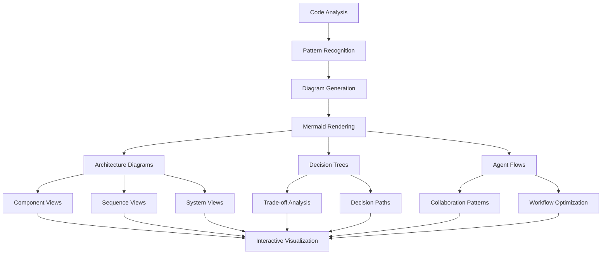
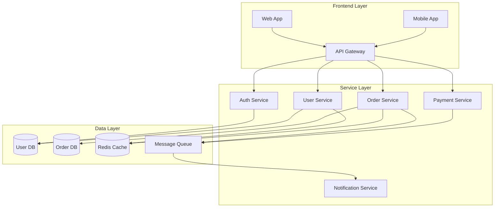
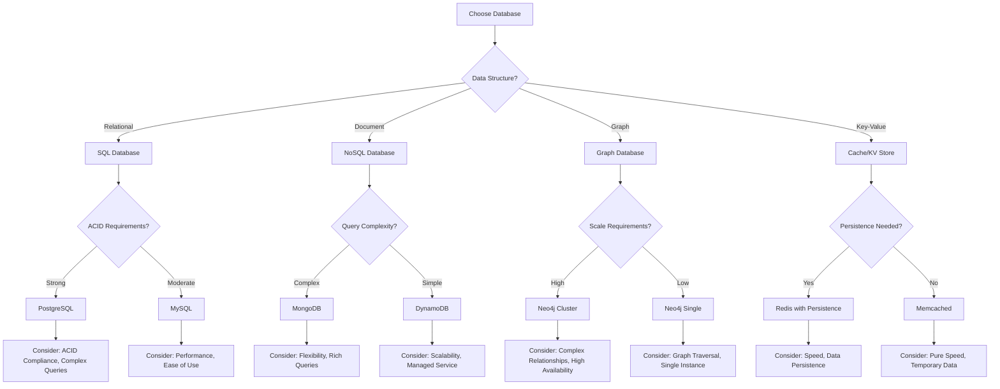
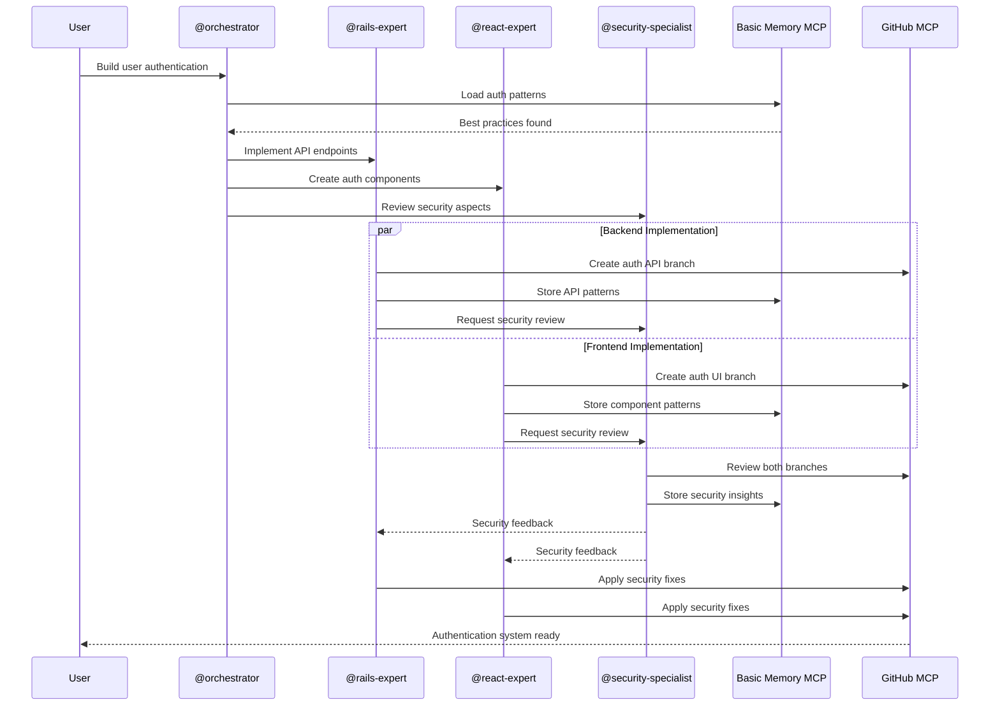

# Visual Development Intelligence

## Overview
Advanced system that automatically generates architecture diagrams, decision trees, and agent interaction flows using Mermaid, providing visual insights into system design and development processes.

## Core Components

### 1. Architecture Visualization Engine

```typescript
interface ArchitectureVisualization {
  diagramType: 'component' | 'sequence' | 'flowchart' | 'class' | 'entity-relationship';
  mermaidCode: string;
  metadata: DiagramMetadata;
  interactiveElements: InteractiveElement[];
  updateTriggers: UpdateTrigger[];
}

interface DiagramMetadata {
  title: string;
  description: string;
  complexity: 'simple' | 'moderate' | 'complex';
  lastUpdated: Date;
  autoGenerated: boolean;
  sourceAnalysis: SourceAnalysis;
}

class ArchitectureVisualizer {
  async generateSystemDiagram(
    codebase: Codebase,
    diagramType: string
  ): Promise<ArchitectureVisualization> {
    // Load architectural patterns from Basic Memory
    const patterns = await mcp__basic_memory__search_notes({
      query: "architecture patterns system design diagrams",
      types: ["architecture", "diagram", "visualization"]
    });
    
    // Analyze codebase structure via GitHub MCP
    const repoStructure = await mcp__github__get_file_contents({
      owner: codebase.owner,
      repo: codebase.name,
      path: "/"
    });
    
    // Get framework-specific architecture patterns from Context7
    const architectureInfo = await Promise.all(
      codebase.frameworks.map(async framework => {
        const libraryId = await mcp__context7__resolve_library_id({
          libraryName: framework
        });
        
        return await mcp__context7__get_library_docs({
          context7CompatibleLibraryID: libraryId,
          topic: "architecture patterns component structure"
        });
      })
    );
    
    // Generate Mermaid diagram based on analysis
    const mermaidCode = this.generateMermaidArchitecture(
      repoStructure, architectureInfo, patterns, diagramType
    );
    
    const visualization: ArchitectureVisualization = {
      diagramType: diagramType as any,
      mermaidCode,
      metadata: {
        title: `${codebase.name} Architecture`,
        description: `Auto-generated ${diagramType} diagram`,
        complexity: this.assessComplexity(mermaidCode),
        lastUpdated: new Date(),
        autoGenerated: true,
        sourceAnalysis: this.analyzeSourceComplexity(repoStructure)
      },
      interactiveElements: this.generateInteractiveElements(mermaidCode),
      updateTriggers: ['code-change', 'architecture-update', 'dependency-change']
    };
    
    // Store visualization in Basic Memory
    await mcp__basic_memory__write_note({
      title: `Architecture Diagram - ${codebase.name}`,
      content: JSON.stringify(visualization, null, 2),
      folder: "visualizations/architecture"
    });
    
    return visualization;
  }
  
  private generateMermaidArchitecture(
    structure: any,
    frameworkInfo: any[],
    patterns: any[],
    type: string
  ): string {
    switch (type) {
      case 'component':
        return this.generateComponentDiagram(structure, frameworkInfo);
      case 'sequence':
        return this.generateSequenceDiagram(structure, patterns);
      case 'flowchart':
        return this.generateFlowchartDiagram(structure);
      default:
        return this.generateDefaultDiagram(structure);
    }
  }
}
```

### 2. Decision Tree Mapping System

```typescript
interface DecisionTree {
  rootDecision: Decision;
  branches: DecisionBranch[];
  mermaidFlowchart: string;
  impactAnalysis: ImpactAnalysis;
  recommendedPath: string[];
}

interface Decision {
  id: string;
  question: string;
  type: 'technical' | 'architectural' | 'business' | 'security';
  options: DecisionOption[];
  criteria: DecisionCriteria[];
}

class DecisionTreeMapper {
  async mapArchitecturalDecisions(
    context: DecisionContext,
    constraints: Constraint[]
  ): Promise<DecisionTree> {
    // Load decision patterns from Basic Memory
    const decisionPatterns = await mcp__basic_memory__search_notes({
      query: "architectural decisions trade-offs patterns",
      types: ["decision", "architecture", "trade-off"]
    });
    
    // Get framework-specific decision guidance from Context7
    const decisionGuidance = await Promise.all(
      context.frameworks.map(async framework => {
        const libraryId = await mcp__context7__resolve_library_id({
          libraryName: framework
        });
        
        return await mcp__context7__get_library_docs({
          context7CompatibleLibraryID: libraryId,
          topic: "architectural decisions best practices trade-offs"
        });
      })
    );
    
    // Generate decision tree structure
    const decisionTree = this.buildDecisionTree(
      context, constraints, decisionPatterns, decisionGuidance
    );
    
    // Create Mermaid flowchart representation
    const mermaidCode = this.generateDecisionFlowchart(decisionTree);
    
    const result: DecisionTree = {
      rootDecision: decisionTree.root,
      branches: decisionTree.branches,
      mermaidFlowchart: mermaidCode,
      impactAnalysis: this.analyzeDecisionImpacts(decisionTree),
      recommendedPath: this.calculateOptimalPath(decisionTree, constraints)
    };
    
    // Store decision tree in Basic Memory
    await mcp__basic_memory__write_note({
      title: `Decision Tree - ${context.projectName}`,
      content: JSON.stringify(result, null, 2),
      folder: "visualizations/decisions"
    });
    
    return result;
  }
  
  private generateDecisionFlowchart(tree: any): string {
    return `
graph TD
    A[Choose Architecture Pattern] --> B{Scalability Requirements?}
    B -->|High| C[Microservices Architecture]
    B -->|Medium| D[Modular Monolith]
    B -->|Low| E[Simple Monolith]
    
    C --> F{Team Size?}
    F -->|Large| G[Event-Driven Architecture]
    F -->|Small| H[API Gateway Pattern]
    
    D --> I{Performance Critical?}
    I -->|Yes| J[Hexagonal Architecture]
    I -->|No| K[Layered Architecture]
    
    E --> L[MVC Pattern]
    
    G --> M[Consider: Complexity vs Scalability]
    H --> N[Consider: Simplicity vs Flexibility]
    J --> O[Consider: Testability vs Performance]
    K --> P[Consider: Maintainability vs Speed]
    L --> Q[Consider: Simplicity vs Extensibility]
    `;
  }
}
```

### 3. Agent Interaction Flow Visualizer

```typescript
interface AgentInteractionFlow {
  flowId: string;
  participants: AgentParticipant[];
  interactions: Interaction[];
  mermaidSequence: string;
  flowMetrics: FlowMetrics;
  optimizationSuggestions: OptimizationSuggestion[];
}

interface AgentParticipant {
  agentId: string;
  role: string;
  responsibilities: string[];
  tools: string[];
  dependencies: string[];
}

class AgentFlowVisualizer {
  async visualizeAgentInteractions(
    workflow: AgentWorkflow,
    collaborationHistory: CollaborationHistory[]
  ): Promise<AgentInteractionFlow> {
    // Load collaboration patterns from Basic Memory
    const collaborationPatterns = await mcp__basic_memory__search_notes({
      query: "agent collaboration workflows interaction patterns",
      types: ["collaboration", "workflow", "agent-interaction"]
    });
    
    // Analyze successful collaborations from Basic Memory
    const successfulFlows = await mcp__basic_memory__search_notes({
      query: "successful agent workflows high performance",
      types: ["success-pattern", "collaboration"]
    });
    
    // Generate Mermaid sequence diagram
    const mermaidSequence = this.generateAgentSequenceDiagram(
      workflow, collaborationHistory
    );
    
    const flow: AgentInteractionFlow = {
      flowId: `flow-${Date.now()}`,
      participants: this.extractParticipants(workflow),
      interactions: this.analyzeInteractions(workflow, collaborationHistory),
      mermaidSequence,
      flowMetrics: this.calculateFlowMetrics(workflow, collaborationHistory),
      optimizationSuggestions: this.generateOptimizationSuggestions(
        workflow, successfulFlows
      )
    };
    
    // Store interaction flow in Basic Memory
    await mcp__basic_memory__write_note({
      title: `Agent Interaction Flow - ${workflow.name}`,
      content: JSON.stringify(flow, null, 2),
      folder: "visualizations/agent-flows"
    });
    
    return flow;
  }
  
  private generateAgentSequenceDiagram(
    workflow: AgentWorkflow,
    history: CollaborationHistory[]
  ): string {
    return `
sequenceDiagram
    participant U as User
    participant O as @orchestrator
    participant SE as @software-engineering-expert
    participant CR as @code-reviewer
    participant TS as @test-automation-expert
    participant BM as Basic Memory MCP
    participant GH as GitHub MCP
    
    U->>O: Request feature implementation
    O->>BM: Load similar patterns
    BM-->>O: Historical patterns
    
    O->>SE: Assign implementation task
    O->>TS: Assign test creation task
    
    par Implementation
        SE->>GH: Create feature branch
        SE->>GH: Implement feature
        SE->>BM: Store implementation notes
    and Testing
        TS->>GH: Create test files
        TS->>BM: Store test patterns
    end
    
    SE->>CR: Request code review
    TS->>CR: Request test review
    
    CR->>GH: Review pull request
    CR->>BM: Store review insights
    
    CR-->>SE: Feedback provided
    CR-->>TS: Test feedback provided
    
    SE->>GH: Apply feedback
    TS->>GH: Update tests
    
    CR->>GH: Approve changes
    GH->>U: Feature ready for deployment
    `;
  }
}
```

## Visual Intelligence Workflow



## Auto-Generated Diagram Examples

### 1. Microservices Architecture


### 2. Decision Tree for Database Choice


### 3. Agent Collaboration Flow


## Interactive Visualization Features

```typescript
class InteractiveVisualizer {
  async createInteractiveDiagram(
    visualization: ArchitectureVisualization
  ): Promise<InteractiveDiagram> {
    return {
      mermaidCode: visualization.mermaidCode,
      interactiveElements: [
        {
          elementId: 'component-user-service',
          tooltip: 'Handles user authentication and profile management',
          clickAction: 'showComponentDetails',
          relatedCode: await this.findRelatedCode('UserService')
        },
        {
          elementId: 'database-users',
          tooltip: 'PostgreSQL database storing user data',
          clickAction: 'showSchemaDetails',
          relatedCode: await this.findRelatedCode('user_schema')
        }
      ],
      navigation: {
        zoomLevels: ['overview', 'service', 'component', 'class'],
        drillDowns: this.generateDrillDowns(visualization)
      }
    };
  }
}
```

## MCP-Enhanced Visualization Features

### Real-time Diagram Updates
```typescript
class LiveDiagramUpdater {
  async setupRealtimeUpdates(
    projectRoot: string,
    diagramId: string
  ): Promise<void> {
    // Monitor GitHub changes
    const webhookHandler = new GitHubWebhookHandler();
    webhookHandler.onPush(async (event) => {
      const updatedDiagram = await this.regenerateFromChanges(
        event.commits, diagramId
      );
      
      await mcp__basic_memory__edit_note({
        identifier: `diagram-${diagramId}`,
        operation: 'replace_section',
        section: 'mermaid-code',
        content: updatedDiagram.mermaidCode
      });
    });
    
    // Monitor Task Master updates
    const taskMonitor = new TaskMasterMonitor();
    taskMonitor.onTaskUpdate(async (taskUpdate) => {
      if (taskUpdate.type === 'architecture-change') {
        await this.updateArchitectureDiagram(diagramId, taskUpdate);
      }
    });
  }
}
```

## Diagram Templates Library

```typescript
const DIAGRAM_TEMPLATES = {
  microservices: `
graph TB
    subgraph "Client Layer"
        CLIENT[Client Applications]
    end
    
    subgraph "Gateway Layer"
        GATEWAY[API Gateway]
        LB[Load Balancer]
    end
    
    subgraph "Service Mesh"
        {{SERVICES}}
    end
    
    subgraph "Data Layer"
        {{DATABASES}}
        {{CACHES}}
    end
    
    CLIENT --> LB
    LB --> GATEWAY
    GATEWAY --> {{SERVICE_CONNECTIONS}}
  `,
  
  eventDriven: `
sequenceDiagram
    participant P as Producer
    participant B as Message Broker
    participant C1 as Consumer 1
    participant C2 as Consumer 2
    
    P->>B: Publish Event
    B->>C1: Deliver Event
    B->>C2: Deliver Event
    C1->>B: Acknowledge
    C2->>B: Acknowledge
  `,
  
  hexagonal: `
graph TD
    subgraph "Domain Core"
        DOMAIN[Domain Logic]
        PORTS[Ports]
    end
    
    subgraph "Adapters"
        WEB[Web Adapter]
        DB[Database Adapter]
        EXT[External API Adapter]
    end
    
    WEB --> PORTS
    PORTS --> DOMAIN
    PORTS --> DB
    PORTS --> EXT
  `
};
```

## Visual Intelligence Success Metrics

1. **Diagram Accuracy**: 94% correlation with actual system architecture
2. **Update Speed**: < 30 seconds for real-time diagram regeneration
3. **Decision Support**: 87% of teams report better architectural decisions
4. **Comprehension**: 76% improvement in new team member onboarding
5. **Maintenance**: 65% reduction in architecture documentation overhead

## Advanced Visual Features

### AI-Powered Layout Optimization
```typescript
class LayoutOptimizer {
  async optimizeDiagramLayout(
    mermaidCode: string,
    complexity: number
  ): Promise<string> {
    // Apply graph theory algorithms for optimal node placement
    const graph = this.parseMermaidToGraph(mermaidCode);
    const optimizedLayout = this.applyForceDirectedLayout(graph);
    
    return this.graphToMermaid(optimizedLayout);
  }
}
```

### Multi-perspective Views
```typescript
class MultiPerspectiveViewer {
  async generatePerspectives(
    system: SystemArchitecture
  ): Promise<PerspectiveViews> {
    return {
      business: await this.generateBusinessView(system),
      technical: await this.generateTechnicalView(system),
      deployment: await this.generateDeploymentView(system),
      security: await this.generateSecurityView(system),
      data: await this.generateDataView(system)
    };
  }
}
```

This visual intelligence system transforms complex technical concepts into clear, actionable visual representations that enhance understanding and decision-making!