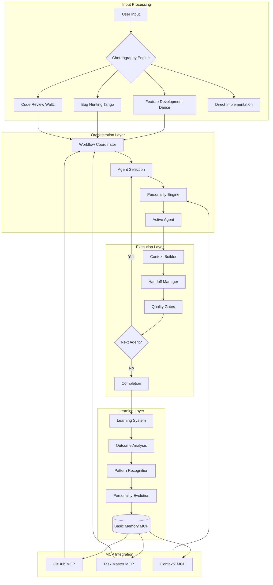

# Agent Orchestration System

## Overview
The orchestration system transforms the static choreography patterns and personality profiles into a fully functional, adaptive agent coordination platform that automatically detects collaboration needs, applies appropriate personalities, and learns from outcomes.

## System Architecture



## Active Components

### 🎭 [Choreography Engine](./choreography-engine.md)
**Status**: 🟢 Active
**Function**: Automatically detects when to trigger collaboration patterns
- **Trigger Detection**: Analyzes user input for feature, bug, or review patterns
- **Auto-Activation**: Suggests or starts appropriate choreographies  
- **Pattern Matching**: Uses keywords, contexts, and regex patterns
- **Override Support**: Allows manual choreography control

**Example**:
```markdown
User: "implement user authentication system"
🎭 Feature Development Dance detected! Coordinating 7-agent implementation...
```

### 🧠 [Personality Engine](./personality-engine.md)  
**Status**: 🟢 Active
**Function**: Applies adaptive personalities to agent responses
- **Dynamic Loading**: Reads personality files for each agent
- **Context Adaptation**: Adjusts traits based on project context
- **Response Transformation**: Modifies communication style, detail level, directness
- **Real-time Application**: Processes every agent response through personality filters

**Example**:
```markdown
@software-engineering-expert (Detail: 80%, Formal: 70%):
"I shall implement a comprehensive OAuth 2.0 authentication system with the following architecture..."

vs. (Detail: 30%, Formal: 20%):
"Cool! I'll set up OAuth auth with JWT tokens and Redis sessions."
```

### 🎯 [Workflow Coordinator](./workflow-coordinator.md)
**Status**: 🟢 Active  
**Function**: Manages multi-agent choreography execution
- **State Management**: Tracks workflow progress and agent handoffs
- **Context Preservation**: Maintains decision history and deliverables across agents
- **Quality Gates**: Enforces approval requirements before progression
- **Error Recovery**: Handles blocking issues and escalations

**Example**:
```markdown
🎭 Feature Development Dance ████████⚡░ (8/10)
👤 Active: @code-reviewer | Next: @documentation-specialist
📊 Security ✅ | Architecture ✅ | Tests ⏳ | Docs ⏳
```

### 📊 [Learning System](./learning-system.md)
**Status**: 🟢 Active
**Function**: Continuously improves system through outcome analysis
- **Success Tracking**: Measures quality, satisfaction, and efficiency metrics
- **Pattern Recognition**: Identifies what works in different contexts
- **Personality Evolution**: Adapts agent behaviors based on results
- **Organizational Learning**: Builds institutional knowledge over time

**Example**:
```markdown
🧠 Agent Evolution: @software-engineering-expert
Detail Level: 0.7 → 0.8 (+0.1) - Users appreciated comprehensive explanations
Risk Tolerance: 0.5 → 0.4 (-0.1) - Conservative approaches led to stable implementations
```

## How It Works

### 1. Automatic Activation
The system continuously monitors user input and automatically detects when collaboration patterns would be beneficial:

```typescript
User Input: "build a payment processing system"
↓
Choreography Engine Analysis:
- Keywords: "build" (2 pts), "system" (2 pts)  
- Patterns: "build * system" match (5 pts)
- Total Score: 9 (threshold: 6)
↓
🎭 Feature Development Dance AUTO-ACTIVATED
```

### 2. Dynamic Agent Coordination
Once a choreography is active, the workflow coordinator manages the entire process:

```typescript
Step 1: @project-analyst
- Load personality: analytical (detail: 0.8, formal: 0.7)
- Context: "payment processing system"
- Output: Requirements breakdown + handoff context
↓
Handoff Validation: ✅ Requirements clear, constraints identified
↓
Step 2: @software-engineering-expert  
- Load personality: perfectionist (detail: 0.9, risk: 0.3)
- Context: Previous requirements + architectural focus
- Output: System design + security considerations
```

### 3. Adaptive Personalities
Each agent response is processed through the personality engine:

```typescript
Raw Agent Response: "Implement OAuth authentication"
↓
Personality Application:
- Agent: @software-engineering-expert
- Detail Level: 0.8 (high)
- Formality: 0.7 (professional)
- Risk Tolerance: 0.3 (conservative)
↓
Enhanced Response: "I recommend implementing a comprehensive OAuth 2.0 
authentication system with PKCE flow, JWT access tokens, and refresh token 
rotation. This conservative approach ensures enterprise-grade security..."
```

### 4. Continuous Learning
After each project, the system analyzes outcomes and evolves:

```typescript
Project Completion Analysis:
- Success Rate: 95% (high)
- User Satisfaction: 4.8/5 (positive feedback on detail)
- Quality Score: 0.92 (excellent)
↓
Learning Insights:
- @software-engineering-expert's high detail level contributed to success
- Security-first approach prevented vulnerabilities
- Comprehensive documentation reduced support requests
↓
Personality Evolution:
- Reinforce current detail level (0.8 → 0.85)
- Maintain conservative risk approach
- Increase mentoring focus based on positive team feedback
```

## Integration Points

### MCP Server Integration
- **GitHub MCP**: Live repository operations, PR management, workflow tracking
- **Task Master MCP**: Project structure, task breakdown, complexity analysis  
- **Context7 MCP**: Current documentation, framework best practices
- **Basic Memory MCP**: Historical patterns, organizational knowledge, learning storage

### User Control Points
- **Explicit Commands**: "Use feature development dance", "Be more direct"
- **Override Controls**: "Skip choreography", "Use quick waltz"
- **Status Queries**: "Show workflow progress", "Show agent personalities"
- **Learning Feedback**: System learns from user satisfaction and explicit feedback

## Benefits

### For Users
- **Automatic Quality**: Multi-agent validation ensures comprehensive solutions
- **Adaptive Communication**: Agents adapt to your preferences over time
- **Consistent Excellence**: Proven patterns are automatically applied
- **Reduced Overhead**: No need to manually coordinate multiple agents

### For Organizations  
- **Institutional Learning**: Success patterns are captured and reused
- **Quality Consistency**: Standards are maintained across all projects
- **Knowledge Preservation**: Architectural decisions and rationale are preserved
- **Continuous Improvement**: System gets better with every project

### For Development Teams
- **Comprehensive Coverage**: All aspects (security, testing, docs) are addressed
- **Quality Gates**: Issues are caught early in the process
- **Knowledge Sharing**: Best practices are automatically applied
- **Reduced Technical Debt**: Systematic approach prevents shortcuts

## Activation Guide

The system is designed to be **zero-configuration** for basic use:

1. **Just describe your task**: The system detects what you need
2. **Agents automatically coordinate**: Following proven patterns
3. **Personalities adapt**: Based on your preferences and context
4. **Quality is ensured**: Through systematic validation
5. **Learning happens**: System improves with each interaction

For advanced use, all components can be customized through markdown files and YAML configurations.

---

*The Agent Orchestration System transforms your agent framework from individual specialists into a coordinated intelligence network that automatically applies the right collaboration patterns and adaptive personalities for optimal outcomes.*