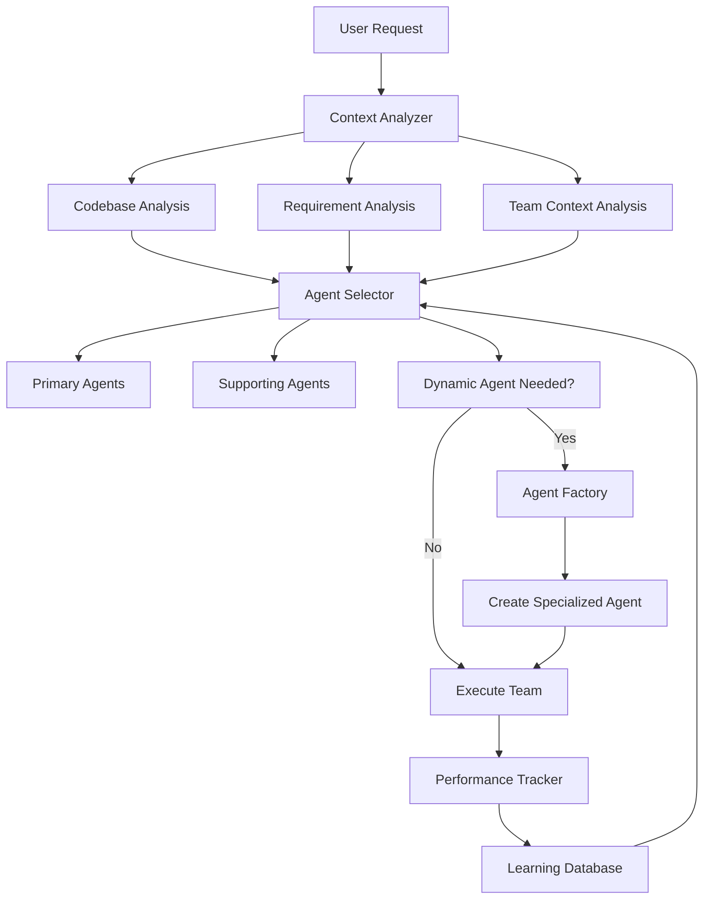
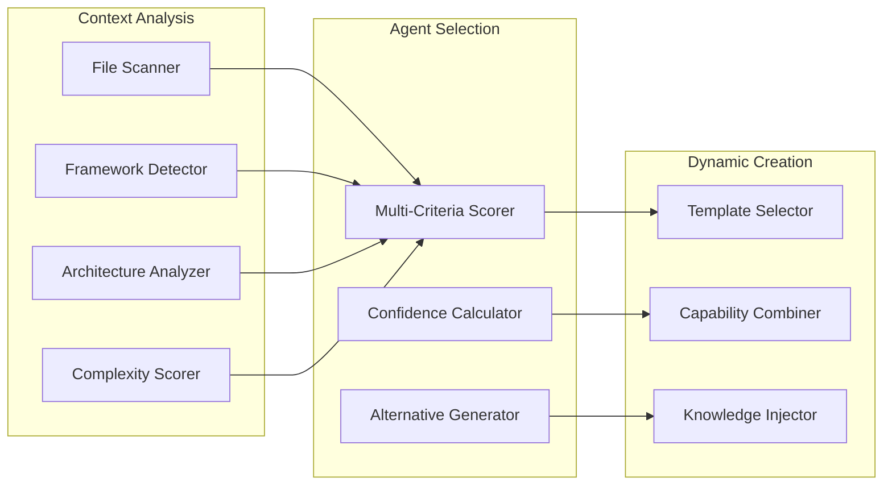

# Intelligent Agent Auto-Selection & Dynamic Orchestration

## Overview
Advanced AI orchestration system that automatically analyzes context, selects optimal agent combinations, and dynamically creates specialized agents for unique scenarios.

## Core Components

### 1. Smart Context Analysis Engine

```typescript
interface ContextAnalysis {
  codebaseAnalysis: {
    languages: string[];
    frameworks: Framework[];
    architecture: ArchitecturePattern;
    complexity: ComplexityScore;
    techStack: TechStack;
  };
  requirementAnalysis: {
    projectType: ProjectType;
    features: Feature[];
    constraints: Constraint[];
    priorities: Priority[];
  };
  teamContext: {
    expertise: ExpertiseLevel[];
    preferences: CodeStyle;
    workflowPatterns: WorkflowPattern[];
  };
}

interface AgentRecommendation {
  primaryAgents: Agent[];
  supportingAgents: Agent[];
  confidence: number;
  reasoning: string;
  alternativeOptions: AgentCombination[];
}
```

### 2. Dynamic Agent Spawning System

```typescript
interface DynamicAgentSpec {
  baseAgentType: string;
  specializations: string[];
  contextualKnowledge: KnowledgeBase;
  tools: Tool[];
  collaborationPatterns: CollaborationPattern[];
}

class AgentFactory {
  async createSpecializedAgent(
    requirements: UniqueScenario,
    baseTemplate: Agent
  ): Promise<SpecializedAgent> {
    // Analyze unique requirements
    // Combine relevant capabilities
    // Create new agent with specific focus
  }
}
```

### 3. Agent Performance Learning System

```typescript
interface PerformanceMetrics {
  taskCompletionRate: number;
  codeQuality: QualityScore;
  userSatisfaction: number;
  collaborationEffectiveness: number;
  timeToCompletion: number;
}

interface LearningData {
  agentCombination: Agent[];
  scenario: ScenarioContext;
  performance: PerformanceMetrics;
  feedback: UserFeedback;
  outcomes: ProjectOutcome[];
}
```

## Implementation Strategy

### Phase 1: Context Analysis Engine
- File type detection and analysis
- Framework identification from package.json/imports
- Architecture pattern recognition
- Complexity scoring algorithm

### Phase 2: Agent Selection Algorithm
- Multi-criteria decision making
- Confidence scoring
- Alternative recommendation generation
- Real-time optimization

### Phase 3: Dynamic Agent Creation
- Template-based agent generation
- Capability combination logic
- Knowledge base integration
- Tool assignment automation

### Phase 4: Performance Learning
- Metrics collection system
- Pattern recognition algorithms
- Recommendation improvement
- Success prediction models

## Usage Examples

```markdown
# Auto-Selection in Action

## Scenario: "Build a real-time chat application with React and Node.js"

### Context Analysis:
- **Languages**: TypeScript, JavaScript
- **Frontend**: React (detected from package.json)
- **Backend**: Node.js, WebSocket requirements
- **Architecture**: Real-time, client-server
- **Complexity**: Medium-High (real-time features)

### Recommended Agent Team:
1. **Primary**: @react-component-architect, @nodejs-expert, @websocket-specialist*
2. **Supporting**: @performance-optimizer, @security-specialist
3. **Generated**: @websocket-specialist (created on-demand)

### Reasoning:
- React expertise for component architecture
- Node.js for backend API development
- Specialized WebSocket agent created for real-time features
- Performance optimizer for real-time optimization
- Security specialist for connection security

*Generated agent with combined knowledge from @nodejs-expert + real-time patterns
```

## Mermaid Diagrams





## Integration Points

### MCP Server Integration
- **Basic Memory MCP**: Store learning data and performance patterns
- **Context7 MCP**: Access up-to-date framework capabilities for agent selection
- **GitHub MCP**: Analyze repository structure for context
- **Task Master MCP**: Track agent performance across tasks

### Agent Framework Integration
```markdown
# Enhanced Agent Invocation Syntax

## Automatic Selection
"Build authentication system" → Auto-selects @security-specialist + @rails-expert + @jwt-specialist*

## Manual Override with Intelligence
"Use @react-expert to build dashboard" → Suggests additional @data-visualization-agent + @performance-optimizer

## Dynamic Specialization
"Implement blockchain integration" → Creates @blockchain-integration-specialist from @web3-expert + @security-patterns
```

## Success Metrics

1. **Selection Accuracy**: % of times auto-selected agents complete tasks successfully
2. **Performance Improvement**: Measurable increase in code quality/completion time
3. **User Satisfaction**: Feedback scores on agent recommendations
4. **Learning Velocity**: Rate of improvement in agent selection over time
5. **Dynamic Agent Success**: Performance of generated specialized agents

## Future Enhancements

- **Predictive Agent Needs**: Anticipate agent requirements before explicit requests
- **Cross-Project Learning**: Apply learnings from similar projects
- **Agent Skill Evolution**: Continuously improve individual agent capabilities
- **Team Chemistry Optimization**: Learn which agent combinations work best together