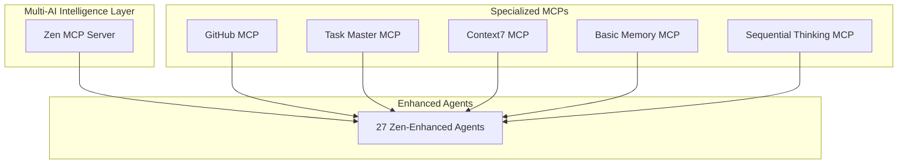

# Zen MCP Hybrid Workflows

**Multi-AI Model Orchestration for Exponential Development Intelligence**

This document outlines hybrid agent workflows that leverage Zen MCP Server's multi-AI model capabilities, transforming single-agent operations into collaborative intelligence powerhouses.

## Overview

With Zen MCP Server integration, 27 agents across the system now have access to multiple AI models through specialized tools, enabling unprecedented collaborative intelligence and workflow optimization.

### Zen MCP Tools Integrated

- **`mcp__zen__chat`**: Collaborative thinking and development discussions
- **`mcp__zen__thinkdeep`**: Extended reasoning and problem-solving  
- **`mcp__zen__codereview`**: Professional code analysis with multi-model perspectives
- **`mcp__zen__debug`**: Systematic root cause analysis across AI models
- **`mcp__zen__analyze`**: Smart file analysis with enhanced intelligence
- **`mcp__zen__consensus`**: Multi-model perspective gathering for decisions
- **`mcp__zen__planner`**: Interactive step-by-step planning
- **`mcp__zen__secaudit`**: OWASP-based security assessment
- **`mcp__zen__refactor`**: Intelligent code refactoring
- **`mcp__zen__testgen`**: Comprehensive test generation

## Tier 1: Strategic Hybrid Workflows

### 🚀 **Vibe Coding Powerhouse**

**Autonomous Development with Multi-AI Preparation**

```mermaid
graph LR
    A[@vibe-coding-coordinator] --> B[@leaf-node-detector]
    B --> C[@software-engineering-expert]
    C --> D[@verification-specialist]
    
    A -.-> |chat, thinkdeep, planner| A1[Multi-AI Preparation]
    B -.-> |analyze| B1[Safety Analysis]
    C -.-> |thinkdeep, analyze, refactor| C1[Implementation]
    D -.-> |analyze, testgen| D1[Validation]
```

**Enhanced Capabilities:**
- **15-20 minute prep** with multi-model intelligence gathering
- **Collaborative briefing** through chat tool cross-validation
- **Deep architectural analysis** via thinkdeep reasoning
- **Interactive planning** with step-by-step breakdowns
- **Safety validation** through multi-perspective analysis

**Usage Pattern:**
```
"Autonomously implement user notification system"
→ @vibe-coding-coordinator uses chat + thinkdeep + planner for comprehensive prep
→ @leaf-node-detector uses analyze for architectural safety assessment  
→ @software-engineering-expert uses thinkdeep + analyze + refactor for implementation
→ @verification-specialist uses analyze + testgen for validation strategy
```

### ⚡ **Exponential Architecture Planning**

**Multi-Hour Strategic Planning with AI Capability Awareness**

```mermaid
graph TD
    A[@exponential-planner] --> B[@system-architect]
    B --> C[@orchestrator]
    C --> D[Multiple Specialist Agents]
    
    A -.-> |thinkdeep, planner| A1[Long-term Strategy]
    B -.-> |thinkdeep, analyze| B1[Architecture Design]
    C -.-> |chat, thinkdeep, consensus| C1[Team Orchestration]
```

**Enhanced Capabilities:**
- **Multi-model strategic thinking** for exponential capability planning
- **Interactive milestone planning** with cross-AI validation
- **Architectural consensus building** through multi-perspective analysis
- **Coordinated team deployment** with intelligent agent selection

**Usage Pattern:**
```
"Plan and architect scalable e-commerce platform for 2025"
→ @exponential-planner uses thinkdeep + planner for multi-hour strategic breakdown
→ @system-architect uses thinkdeep + analyze for architectural intelligence
→ @orchestrator uses chat + thinkdeep + consensus for team coordination
→ Specialist agents receive enhanced context and collaborative intelligence
```

### 🔒 **Security-First Development**

**Multi-Model Security Validation Pipeline**

```mermaid
graph LR
    A[@security-specialist] --> B[@code-reviewer]
    B --> C[@pr-reviewer-specialist]
    
    A -.-> |analyze, debug, secaudit| A1[Security Analysis]
    B -.-> |codereview, analyze, secaudit| B1[Code Security]
    C -.-> |codereview, analyze, secaudit| C1[PR Security]
```

**Enhanced Capabilities:**
- **OWASP-based multi-model audits** with comprehensive coverage
- **Security-focused code reviews** with multiple AI perspectives
- **Vulnerability analysis** through collaborative debugging
- **Compliance validation** across multiple security frameworks

**Usage Pattern:**
```
"Implement authentication system with security validation"
→ @security-specialist uses analyze + debug + secaudit for comprehensive security assessment
→ @code-reviewer uses codereview + analyze + secaudit for security-focused review
→ @pr-reviewer-specialist uses codereview + analyze + secaudit for final validation
```

## Tier 2: Specialized Collaborative Workflows

### 🔧 **Legacy Modernization Pipeline**

**Intelligent Modernization with Multi-AI Analysis**

```mermaid
graph LR
    A[@legacy-modernization-specialist] --> B[@software-engineering-expert]
    B --> C[@test-automation-expert]
    
    A -.-> |refactor| A1[Modernization Strategy]
    B -.-> |thinkdeep, analyze, refactor| B1[Quality Implementation]
    C -.-> |testgen| C1[Comprehensive Testing]
```

**Enhanced Capabilities:**
- **Intelligent refactoring strategies** with multi-model pattern recognition
- **Deep architectural analysis** for modernization impact assessment
- **Comprehensive test generation** for legacy system validation

### 🎯 **Consensus-Driven Decision Making**

**Multi-AI Technical Decision Validation**

```mermaid
graph TD
    A[@orchestrator] --> B[@team-configurator]
    A -.-> |consensus| A1[Technical Decisions]
    B -.-> |consensus| B1[Team Optimization]
```

**Enhanced Capabilities:**
- **Multi-model perspective gathering** for technical proposals
- **Consensus building** across different AI reasoning approaches
- **Decision validation** through collaborative intelligence

### 📋 **Interactive Project Planning**

**Enhanced Planning with Multi-Model Intelligence**

```mermaid
graph TD
    A[@exponential-planner] --> B[@project-analyst]
    B --> C[@vibe-coding-coordinator]
    
    A -.-> |planner| A1[Strategic Planning]
    B -.-> |planner| B1[Project Breakdown]
    C -.-> |planner| C1[Session Planning]
```

**Enhanced Capabilities:**
- **Interactive step-by-step planning** with cross-AI validation
- **Complex project breakdown** with multiple planning perspectives
- **Session coordination** with intelligent preparation strategies

## Advanced Multi-AI Collaboration Patterns

### 🌐 **Cross-Domain Intelligence**

**Agents can now leverage different AI models for specialized capabilities:**

- **Gemini** for analytical reasoning and data processing
- **GPT-4** for creative problem-solving and natural language
- **Claude** for architectural thinking and code analysis
- **Local models** for privacy-sensitive operations

### 🔄 **Adaptive Workflow Intelligence**

**Workflows automatically adapt based on:**
- **Model availability** and performance characteristics
- **Task complexity** requiring specific AI capabilities
- **Context requirements** needing specialized model strengths
- **Quality thresholds** demanding multi-model validation

### 📊 **Collaborative Quality Gates**

**Multi-model validation at critical checkpoints:**
- **Architecture decisions** validated across multiple AI perspectives
- **Security assessments** confirmed through diverse analysis approaches
- **Code quality** verified via different model strengths
- **Performance optimization** validated through collaborative analysis

## Usage Examples

### Example 1: Full-Stack Application Development

```
User: "Build a real-time chat application with React and Node.js"

Workflow:
1. @vibe-coding-coordinator (chat + thinkdeep + planner)
   - Multi-AI preparation and planning session
   - Interactive breakdown with step-by-step validation
   
2. @system-architect (thinkdeep + analyze)  
   - Architectural design with deep reasoning
   - Multi-model system analysis and optimization
   
3. @orchestrator (chat + thinkdeep + consensus)
   - Team coordination with consensus-driven decisions
   - Multi-AI agent selection and workflow orchestration
   
4. Specialist agents with enhanced capabilities:
   - @react-expert + @nodejs-expert (framework implementation)
   - @security-specialist (analyze + debug + secaudit for real-time security)
   - @test-automation-expert (testgen for comprehensive testing)
```

### Example 2: Legacy System Modernization

```
User: "Modernize legacy PHP monolith to microservices architecture"

Workflow:
1. @legacy-modernization-specialist (refactor)
   - Intelligent modernization strategy with multi-model analysis
   
2. @software-engineering-expert (thinkdeep + analyze + refactor)
   - Deep architectural reasoning and quality implementation
   
3. @security-specialist (analyze + debug + secaudit)
   - Multi-model security validation for migration
   
4. @test-automation-expert (testgen)
   - Comprehensive test generation for legacy validation
```

### Example 3: Security-Critical Feature

```
User: "Implement payment processing with PCI compliance"

Workflow:
1. @security-specialist (analyze + debug + secaudit)
   - OWASP-based multi-model security assessment
   - Comprehensive compliance validation
   
2. @code-reviewer (codereview + analyze + secaudit)
   - Security-focused multi-model code review
   
3. @pr-reviewer-specialist (codereview + analyze + secaudit)
   - Final security validation with multi-AI perspectives
```

## Integration with Existing MCP Servers

### Enhanced MCP Orchestration

Zen MCP Server works seamlessly with existing MCP integrations:

- **GitHub MCP**: Enhanced PR reviews with multi-model intelligence
- **Task Master MCP**: Intelligent project planning with consensus validation
- **Context7 MCP**: Multi-AI documentation and framework research
- **Basic Memory MCP**: Collaborative knowledge building and pattern storage
- **Sequential Thinking MCP**: Enhanced with multi-model reasoning capabilities

### Workflow Coordination



## Best Practices

### 1. Multi-Model Validation
- Use multiple AI perspectives for critical decisions
- Validate architectural choices through consensus tools
- Cross-check security assessments with different models

### 2. Intelligent Tool Selection
- Match AI model capabilities to task requirements
- Use specialized models for domain-specific challenges
- Leverage model diversity for comprehensive analysis

### 3. Collaborative Quality Assurance
- Implement multi-model code reviews
- Use consensus-driven technical decisions
- Validate through diverse analytical approaches

### 4. Adaptive Workflow Design
- Design workflows that adapt to available models
- Create fallback strategies for model unavailability
- Optimize for model strengths and specializations

## Future Capabilities

### Model-Specific Specialization
- **Code Generation**: GPT-4 for creative implementation, Claude for architecture
- **Security Analysis**: Specialized security models for vulnerability detection
- **Performance Optimization**: Models optimized for performance analysis

### Dynamic Model Routing
- Automatic model selection based on task characteristics
- Load balancing across available AI models
- Cost optimization through intelligent model utilization

### Collaborative Learning
- Cross-model knowledge sharing and validation
- Pattern recognition across different AI approaches
- Continuous improvement through multi-model feedback

---

**Transform your development workflow with multi-AI intelligence. Every agent is now a collaborative powerhouse! 🚀🤖⚡**