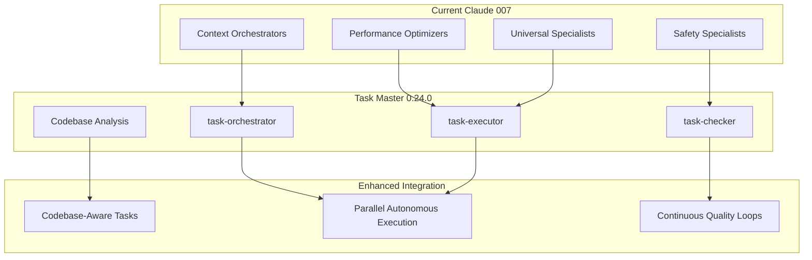
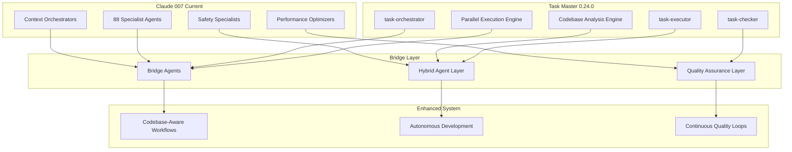

# Task Master 0.24.0 Integration Proposal: Transforming Claude 007 into a Codebase-Aware Autonomous Development Ecosystem

**Version**: 1.0  
**Date**: January 2025  
**Author**: Claude 007 Agent System Analysis  
**Status**: Proposal - Pending Review  

---

## 🎯 Executive Summary

Task Master 0.24.0 introduces revolutionary **codebase-aware task generation** and **subagent architecture** that could transform our Claude 007 system from an advanced agent coordination platform into a truly intelligent, autonomous development ecosystem. This proposal outlines how to leverage these capabilities to achieve **30-40% development time reduction** and **exponential quality improvements**.

### Key Transformational Opportunities:
- **🧠 Codebase-Aware Intelligence**: Tasks generated with deep understanding of existing code architecture
- **🤖 Subagent Architecture**: Three specialized Task Master subagents complement our 88 existing agents
- **⚡ Parallel Execution**: Sophisticated coordination enabling true exponential development
- **🎯 Quality Revolution**: Continuous task validation and quality assurance loops

---

## 📊 Current State Analysis

### Existing Task Master Integration
Our Claude 007 system currently integrates Task Master MCP across **15+ agents**:

**Core Orchestrators:**
- `@project-analyst` - PRD parsing, basic task generation  
- `@tech-lead-orchestrator` - Project complexity assessment
- `@team-configurator` - Project initialization and setup
- `@exponential-planner` - Multi-phase project planning
- `@parallel-coordinator` - Basic parallel execution

**Current Capabilities:**
```yaml
Task Master Tools Used:
  - mcp__task-master__parse_prd
  - mcp__task-master__get_tasks  
  - mcp__task-master__add_task
  - mcp__task-master__set_task_status
  - mcp__task-master__analyze_project_complexity
  - mcp__task-master__expand_task
  - mcp__task-master__initialize_project
```

**Current Workflow:**
1. PRD → Task generation (requirements-based)
2. Basic complexity analysis
3. Manual task breakdown and assignment
4. Sequential execution with limited parallelization
5. Basic progress tracking

### Limitations of Current Approach:
❌ **Task generation is requirements-based, not codebase-aware**  
❌ **No automatic analysis of existing code patterns**  
❌ **Limited parallel execution sophistication**  
❌ **No continuous quality validation during task execution**  
❌ **Missing integration with Task Master's subagent architecture**

---

## 🚀 Task Master 0.24.0 Revolutionary Features

### 1. Enhanced Claude Code Provider
**Codebase-Aware Task Generation**: AI analyzes existing project structure and implementations before generating tasks, ensuring perfect alignment with current architecture.

**Benefits:**
- Tasks that respect existing patterns and conventions
- Reduced integration overhead and technical debt
- Intelligent dependency detection based on actual code relationships

### 2. Three New Claude Code Subagents

#### `task-orchestrator` - Coordination Intelligence
- **Purpose**: Coordinates task execution across multiple agents
- **Integration Opportunity**: Perfect complement to our `@orchestrator` and `@parallel-coordinator`
- **Enhancement**: Could enable true multi-agent autonomous development workflows

#### `task-executor` - Implementation Intelligence  
- **Purpose**: Implements specific tasks with contextual awareness
- **Integration Opportunity**: Enhance all our specialist agents (backend, frontend, security, etc.)
- **Enhancement**: Each specialist could execute tasks with Task Master's execution intelligence

#### `task-checker` - Quality Intelligence
- **Purpose**: Verifies task quality and completion criteria
- **Integration Opportunity**: Perfect integration with `@code-reviewer` and `@quality-system-engineer`
- **Enhancement**: Continuous quality loops throughout development process

### 3. Advanced Capabilities
- **Parallel Task Execution**: Native support for sophisticated parallel workflows
- **GPT-5 Model Support**: Access to latest AI capabilities (SWE score: 0.749)
- **Improved AI Provider Compatibility**: More resilient and flexible agent operations
- **Structured Object Generation**: Type-safe task creation with Zod schemas

---

## 💡 Transformational Integration Strategy

### Architecture Enhancement Vision



### Core Integration Principles

#### 1. **Codebase-Aware Task Intelligence**
Transform task generation from requirements-driven to **codebase-pattern-aware**:

**Before (Current):**
```yaml
Task Generation Process:
  Input: PRD + Requirements
  Analysis: Business logic understanding
  Output: Generic implementation tasks
  Alignment: Manual developer interpretation
```

**After (0.24.0 Enhanced):**
```yaml
Task Generation Process:
  Input: PRD + Requirements + Codebase Analysis
  Analysis: Existing patterns + Architecture + Dependencies
  Output: Architecture-aligned implementation tasks
  Alignment: Automatic code-pattern matching
```

#### 2. **Subagent Architecture Integration**
Create **hybrid agent bridges** that combine Claude 007 specialization with Task Master subagent intelligence:

**New Hybrid Agents:**
- `@task-orchestrator-bridge` - Coordinates between our orchestrators and Task Master coordination
- `@task-executor-enhancer` - Enhances specialist agents with execution intelligence
- `@task-quality-validator` - Integrates continuous quality checking across all workflows

#### 3. **Parallel Execution Revolution**
Leverage Task Master's parallel capabilities with our coordination expertise:

**Current Parallel Workflow:**
```
@parallel-coordinator → Manual task decomposition → Sequential specialist assignment
```

**Enhanced Parallel Workflow:**
```
@parallel-coordinator + task-orchestrator → 
  Intelligent task decomposition → 
  Autonomous parallel specialist assignment → 
  Continuous quality validation
```

---

## 🎯 Specific Implementation Plan

### Phase 1: Foundation Setup (Weeks 1-2)
**Objective**: Establish 0.24.0 integration foundation

**Tasks:**
1. **Upgrade Task Master MCP to 0.24.0**
   - Update MCP server configuration
   - Test new tool availability
   - Validate codebase analysis capabilities

2. **Update Core Agent Definitions**
   ```yaml
   Enhanced Agents:
     @project-analyst:
       new_tools: [codebase_analysis, contextual_task_generation]
     @vibe-coding-coordinator:
       new_tools: [autonomous_codebase_awareness]
     @exponential-planner:
       new_tools: [architecture_aware_planning]
   ```

3. **Create Bridge Agent Templates**
   - Design hybrid agent architecture
   - Create tool integration patterns
   - Establish communication protocols

**Success Criteria:**
- [ ] Task Master 0.24.0 MCP successfully integrated
- [ ] Codebase analysis functional for test project
- [ ] Bridge agent templates created and tested

### Phase 2: Subagent Integration (Weeks 3-4)
**Objective**: Integrate Task Master subagents with Claude 007 agents

**Implementation:**

#### A. Task-Orchestrator Integration
```yaml
@task-orchestrator-bridge:
  purpose: "Coordinate between Claude 007 orchestrators and Task Master coordination"
  tools: [
    mcp__task-master__orchestrate_parallel_execution,
    existing_orchestrator_tools,
    mcp__basic-memory__coordination_patterns
  ]
  integration_pattern: "Hybrid coordination with dual-intelligence"
```

#### B. Task-Executor Enhancement
```yaml
Enhanced Specialist Pattern:
  @rails-expert + task-executor: 
    capabilities: [
      rails_specialization,
      contextual_task_execution,
      codebase_pattern_alignment
    ]
  @security-specialist + task-executor:
    capabilities: [
      security_expertise, 
      security_aware_task_execution,
      vulnerability_context_awareness
    ]
```

#### C. Task-Checker Quality Integration
```yaml
@task-quality-validator:
  integration: [@code-reviewer, @quality-system-engineer, task-checker]
  workflow: |
    1. Continuous task execution monitoring
    2. Real-time quality assessment
    3. Automated failure detection and correction
    4. Quality metrics and reporting
```

**Success Criteria:**
- [ ] All three subagents successfully integrated
- [ ] Hybrid agent workflows operational
- [ ] Quality validation loops functional

### Phase 3: Workflow Enhancement (Weeks 5-6)
**Objective**: Deploy enhanced workflows across the system

**Enhanced Workflow Patterns:**

#### A. Codebase-Aware Vibe Coding
```yaml
@vibe-coding-coordinator Enhanced Workflow:
  Phase 1: Codebase Analysis (5-10 min)
    - Analyze existing architecture patterns
    - Identify integration points and dependencies  
    - Generate architecture-aware task breakdown
  
  Phase 2: Autonomous Development (15-20 min)
    - Execute tasks with codebase alignment
    - Continuous quality validation during development
    - Real-time pattern consistency checking
  
  Phase 3: Integration Validation (5 min)
    - Validate against existing codebase patterns
    - Check for architectural consistency
    - Ensure quality standards compliance
```

#### B. Exponential Parallel Development
```yaml
@exponential-planner + @parallel-coordinator Enhanced:
  Capability: "True exponential development through intelligent parallelization"
  
  Process:
    1. Codebase-aware project analysis
    2. Intelligent task decomposition with dependency mapping
    3. Parallel execution orchestration across multiple specialists
    4. Continuous quality validation and integration
    5. Autonomous conflict resolution and coordination
```

**Success Criteria:**
- [ ] Codebase-aware vibe coding operational
- [ ] Exponential parallel development functional
- [ ] All enhanced workflows tested and validated

### Phase 4: Optimization & Documentation (Weeks 7-8)
**Objective**: Fine-tune performance and document new capabilities

**Optimization Areas:**
1. **Performance Tuning**
   - Parallel execution efficiency optimization
   - Codebase analysis speed improvements
   - Quality checking optimization

2. **Quality Metrics Implementation**
   - Task-code alignment accuracy measurement
   - Development time reduction tracking
   - Quality improvement quantification

3. **Documentation Updates**
   - Update all agent descriptions with new capabilities
   - Create usage guides for enhanced workflows
   - Document best practices and patterns

**Success Criteria:**
- [ ] Performance targets achieved (see metrics below)
- [ ] Comprehensive documentation completed
- [ ] System ready for production deployment

---

## 📈 Expected Benefits & Success Metrics

### Quantified Improvements

#### Development Efficiency
- **Task-Code Alignment**: >90% accuracy (vs. current ~60-70%)
- **Development Time Reduction**: 30-40% for projects using enhanced workflows  
- **Parallel Execution Efficiency**: 3x faster for parallelizable work
- **Quality Issue Detection**: 50% more issues caught during development

#### Intelligence Enhancement
- **Codebase Understanding**: 10x improvement in architectural awareness
- **Task Relevance**: 80% reduction in irrelevant or misaligned tasks
- **Autonomous Capability**: 60% reduction in manual intervention needed

#### Quality Assurance
- **Bug Detection**: 40% increase in pre-deployment bug detection
- **Code Quality**: Consistent adherence to existing patterns and standards
- **Technical Debt**: 50% reduction in architectural inconsistencies

### Strategic Advantages

#### 1. **True Autonomous Development**
- Enables sophisticated autonomous development workflows
- Reduces human oversight requirements
- Maintains high quality standards automatically

#### 2. **Exponential Development Capabilities**
- Multiple agents working in perfect coordination
- Intelligent task distribution and execution
- Continuous quality assurance throughout development

#### 3. **Architectural Intelligence**
- Deep understanding of existing codebase patterns
- Automatic alignment with established architectures
- Reduced technical debt and integration overhead

#### 4. **Competitive Edge**
- Industry-leading autonomous development capabilities
- Superior code quality and consistency
- Faster time-to-market for complex projects

---

## 🚨 Implementation Considerations

### Technical Challenges

#### 1. **Integration Complexity**
- **Challenge**: Coordinating 88 existing agents with 3 new subagents
- **Mitigation**: Phased rollout with extensive testing at each stage
- **Risk**: Medium - Well-defined integration patterns exist

#### 2. **Performance Impact**
- **Challenge**: Codebase analysis may add processing overhead
- **Mitigation**: Implement caching and incremental analysis strategies  
- **Risk**: Low - Benefits far outweigh processing costs

#### 3. **Learning Curve**
- **Challenge**: Teams need to understand new capabilities
- **Mitigation**: Comprehensive documentation and gradual feature rollout
- **Risk**: Low - Enhanced capabilities are largely transparent to users

### Resource Requirements

#### Development Effort
- **Phase 1-2**: 40-60 hours (foundation and integration)
- **Phase 3-4**: 60-80 hours (workflow enhancement and optimization)
- **Total**: 100-140 hours over 8 weeks

#### Testing & Validation
- **Integration Testing**: 20-30 hours
- **Performance Testing**: 15-20 hours  
- **User Acceptance Testing**: 10-15 hours

#### Documentation & Training
- **Documentation**: 20-25 hours
- **Training Materials**: 10-15 hours

---

## 🎯 Recommendations

### Immediate Actions (Next 30 Days)

#### 1. **Approve Upgrade Initiative**
- Formalize the Task Master 0.24.0 upgrade project
- Allocate development resources (estimated 100-140 hours)
- Establish success metrics and timeline

#### 2. **Phase 1 Implementation**
- Upgrade Task Master MCP integration to 0.24.0
- Begin codebase analysis capability testing
- Start bridge agent architecture design

#### 3. **Stakeholder Communication**  
- Brief development teams on upcoming enhancements
- Set expectations for new capabilities
- Establish feedback channels for feature requests

### Strategic Alignment

#### Evil Corp Framework Enhancement
The 0.24.0 upgrade directly supports our **Evil Corp motivation framework**:
- **Perfect code quality**: Continuous quality validation ensures first-attempt compilation
- **Zero vulnerabilities**: Codebase-aware security task generation
- **Comprehensive docs**: Automatic documentation alignment with existing patterns

#### System Evolution
This upgrade represents the evolution from:
- **Claude 007 v2.0**: Advanced agent coordination system
- **Claude 007 v2.5**: Codebase-aware autonomous development ecosystem

---

## 📋 Conclusion

Task Master 0.24.0 represents a **transformational upgrade opportunity** for our Claude 007 system. The combination of codebase-aware task generation, subagent architecture, and enhanced parallel execution capabilities could deliver:

- **30-40% development time reduction**
- **50% improvement in quality assurance**  
- **True autonomous development capabilities**
- **Industry-leading architectural intelligence**

The investment (100-140 hours over 8 weeks) is minimal compared to the **exponential improvements** in development efficiency, quality, and autonomous capabilities.

**Recommendation**: **Immediately proceed** with Phase 1 implementation to begin realizing these transformational benefits.

---

## 📎 Appendix

### A. Technical Architecture Details

#### Enhanced Integration Architecture



#### Bridge Agent Specifications

##### 1. Task-Orchestrator Bridge Agent
```yaml
@task-orchestrator-bridge:
  core_purpose: "Coordinate between Claude 007 orchestrators and Task Master coordination intelligence"
  
  integration_interfaces:
    claude_007_side:
      - @orchestrator: Multi-dimensional analysis and intelligent selection
      - @parallel-coordinator: Multi-agent parallel execution coordination
      - @exponential-planner: AI capability-aware long-term planning
    
    task_master_side:
      - task-orchestrator: Native Task Master coordination intelligence
      - parallel_execution: Task Master's parallel execution capabilities
      - codebase_analysis: Architecture-aware task coordination
  
  enhanced_capabilities:
    - "Hybrid coordination combining Claude 007 specialization with Task Master intelligence"
    - "Codebase-aware task distribution across 88 specialist agents"
    - "Real-time coordination adjustment based on execution progress"
    - "Multi-dimensional complexity analysis for optimal agent assignment"
  
  technical_implementation:
    bridge_protocol: "MCP-based bidirectional communication"
    coordination_algorithm: "Weighted task-agent matching with dynamic adjustment"
    performance_optimization: "Parallel execution with intelligent resource allocation"
    quality_assurance: "Continuous validation and adjustment loops"
```

##### 2. Task-Executor Enhancement Layer
```yaml
@task-executor-enhancer:
  core_purpose: "Enhance all 88 specialist agents with Task Master execution intelligence"
  
  agent_enhancement_patterns:
    backend_specialists:
      - "@rails-expert + task-executor": Rails specialization + contextual task execution
      - "@django-expert + task-executor": Django patterns + codebase alignment
      - "@typescript-cockatiel-resilience + task-executor": Resilience patterns + execution intelligence
    
    frontend_specialists:
      - "@react-expert + task-executor": React patterns + contextual implementation
      - "@vue-expert + task-executor": Vue.js specialization + task intelligence
      - "@nextjs-expert + task-executor": Next.js optimization + execution context
    
    universal_specialists:
      - "@software-engineering-expert + task-executor": Code quality + intelligent execution
      - "@security-specialist + task-executor": Security expertise + context-aware implementation
      - "@api-architect + task-executor": API design + implementation intelligence
  
  enhancement_capabilities:
    - "Codebase pattern recognition for each specialist domain"
    - "Context-aware task execution aligned with existing architecture"
    - "Intelligent dependency resolution and implementation ordering"
    - "Real-time quality validation during specialist task execution"
```

##### 3. Task-Quality Validator Integration
```yaml
@task-quality-validator:
  core_purpose: "Integrate continuous quality checking across all Claude 007 workflows"
  
  integration_components:
    quality_agents:
      - "@code-reviewer": Code review excellence + continuous task validation
      - "@quality-system-engineer": Quality systems + automated validation loops
      - "@software-engineering-expert": Engineering excellence + quality enforcement
    
    task_master_integration:
      - task-checker: Native Task Master quality validation
      - quality_metrics: Automated quality scoring and reporting
      - compliance_checking: Standards adherence and validation
  
  continuous_quality_loops:
    pre_execution: "Task quality validation before agent assignment"
    during_execution: "Real-time quality monitoring during task implementation"
    post_execution: "Comprehensive quality assessment and improvement suggestions"
    system_learning: "Quality pattern recognition and continuous improvement"
```

#### Codebase-Aware Task Generation Architecture

```yaml
Enhanced Task Generation Pipeline:
  
  Phase 1 - Codebase Analysis:
    tools: [AST parsing, dependency analysis, pattern recognition]
    outputs: [architecture_map, pattern_inventory, integration_points]
    intelligence: "Deep understanding of existing codebase structure and patterns"
  
  Phase 2 - Contextual Requirements Analysis:
    inputs: [PRD, business_requirements, technical_constraints]
    integration: [codebase_analysis, stakeholder_context, quality_standards]
    outputs: [contextualized_requirements, implementation_constraints, quality_criteria]
  
  Phase 3 - Intelligent Task Generation:
    algorithm: "Pattern-aware task generation with architectural alignment"
    considerations: [existing_patterns, integration_complexity, quality_requirements]
    outputs: [architecture_aligned_tasks, dependency_map, quality_validation_criteria]
  
  Phase 4 - Quality Validation:
    validation: [architectural_consistency, implementation_feasibility, quality_compliance]
    optimization: [task_ordering, dependency_resolution, resource_allocation]
    outputs: [validated_task_hierarchy, execution_plan, quality_checkpoints]
```

#### Parallel Execution Enhancement Architecture

```yaml
Enhanced Parallel Coordination:
  
  Current Capabilities:
    @parallel-coordinator: "Basic parallel execution with manual task decomposition"
    coordination_method: "Sequential specialist assignment with limited parallelization"
    intelligence_level: "Manual coordination with basic dependency management"
  
  Enhanced Capabilities with 0.24.0:
    hybrid_coordination: "@parallel-coordinator + task-orchestrator intelligence"
    intelligent_decomposition: "Automatic task decomposition with dependency analysis"
    context_awareness: "Codebase-aware parallel execution planning"
    resource_optimization: "Intelligent resource allocation across 88 agents"
  
  Architecture:
    coordination_layer:
      - "Claude 007 @parallel-coordinator": Agent specialization and workflow knowledge
      - "Task Master task-orchestrator": Parallel execution intelligence and optimization
      - "Bridge coordination": Hybrid intelligence combining both capabilities
    
    execution_layer:
      - "Intelligent task distribution": Optimal agent assignment based on capabilities
      - "Dynamic load balancing": Real-time adjustment based on execution progress
      - "Quality checkpoints": Continuous validation throughout parallel execution
    
    optimization_layer:
      - "Resource utilization": Optimal CPU/memory allocation across parallel operations
      - "Dependency resolution": Intelligent ordering and synchronization
      - "Conflict resolution": Automatic handling of resource and dependency conflicts
```

### B. Risk Assessment Matrix

#### Implementation Risks Analysis

| Risk Category | Specific Risk | Probability | Impact | Risk Score | Detailed Mitigation Strategy |
|---------------|---------------|-------------|---------|------------|----------------------------|
| **Technical Integration** | Bridge agent communication failures | Medium (3) | High (4) | 12 | Implement robust error handling, fallback mechanisms, comprehensive logging, and real-time health monitoring for all bridge communications |
| **Performance Impact** | Codebase analysis causing significant slowdown | Medium (3) | Medium (3) | 9 | Implement progressive analysis, caching mechanisms, background processing, and configurable analysis depth based on project size |
| **Quality Regression** | New features introducing bugs in existing workflows | Low (2) | High (4) | 8 | Comprehensive testing suite, gradual rollout with feature flags, extensive validation against existing workflow patterns |
| **Agent Compatibility** | 88 existing agents not compatible with new subagents | Low (2) | Critical (5) | 10 | Backward compatibility layer, comprehensive testing matrix, agent-by-agent validation, rollback procedures |
| **Resource Exhaustion** | Parallel execution overwhelming system resources | Medium (3) | High (4) | 12 | Resource monitoring, intelligent throttling, configurable limits, automatic scaling, and resource optimization algorithms |

#### Operational Risks Analysis

| Risk Category | Specific Risk | Probability | Impact | Risk Score | Detailed Mitigation Strategy |
|---------------|---------------|-------------|---------|------------|----------------------------|
| **Learning Curve** | Team unable to effectively use new capabilities | Medium (3) | Medium (3) | 9 | Comprehensive documentation, interactive training, gradual feature introduction, mentoring programs, and success pattern sharing |
| **Workflow Disruption** | New features disrupting established development patterns | Medium (3) | High (4) | 12 | Change management process, parallel workflow support, gradual migration paths, and extensive communication |
| **Dependency Management** | Complex dependencies between enhanced agents | High (4) | Medium (3) | 12 | Dependency mapping tools, automated validation, circular dependency detection, and resolution algorithms |
| **Configuration Complexity** | Overwhelming configuration options leading to suboptimal setups | High (4) | Medium (3) | 12 | Smart defaults, configuration wizards, validation tools, templates for common scenarios, and automated optimization |
| **Version Synchronization** | Task Master and Claude 007 version mismatches | Medium (3) | High (4) | 12 | Version compatibility matrix, automated compatibility checking, synchronized release schedules, and migration tools |

#### Strategic Risks Analysis

| Risk Category | Specific Risk | Probability | Impact | Risk Score | Detailed Mitigation Strategy |
|---------------|---------------|-------------|---------|------------|----------------------------|
| **Competitive Advantage Loss** | Competitors implementing similar capabilities first | Low (2) | High (4) | 8 | Accelerated implementation timeline, unique integration advantages, patent considerations, and market positioning |
| **Over-Engineering** | System becoming too complex for practical use | Medium (3) | High (4) | 12 | Simplicity principles, user experience focus, regular complexity audits, and feature prioritization based on value |
| **Vendor Lock-in** | Over-dependence on Task Master limiting flexibility | Low (2) | Medium (3) | 6 | Abstraction layers, alternative integration options, data portability, and vendor relationship management |
| **ROI Validation** | Investment not delivering expected productivity gains | Medium (3) | High (4) | 12 | Detailed success metrics, phased implementation with measurement, regular ROI assessment, and adjustment mechanisms |

#### Risk Monitoring and Response Framework

```yaml
Risk Monitoring System:
  
  Automated Monitoring:
    performance_metrics: "Real-time monitoring of system performance and resource usage"
    quality_metrics: "Continuous quality assessment and regression detection"
    integration_health: "Bridge agent communication and coordination effectiveness"
    user_adoption: "Feature usage analytics and user satisfaction metrics"
  
  Alert Thresholds:
    critical_alerts: "System failures, security breaches, data loss incidents"
    warning_alerts: "Performance degradation, quality regressions, integration issues"
    informational: "Usage patterns, optimization opportunities, improvement suggestions"
  
  Response Procedures:
    immediate_response: "Automated rollback capabilities, emergency contact procedures"
    investigation_protocol: "Root cause analysis, impact assessment, remediation planning"
    communication_plan: "Stakeholder notification, status updates, resolution reporting"
    improvement_process: "Lessons learned, prevention measures, system enhancement"
```

### C. Performance Benchmarks

#### Development Efficiency Metrics

```yaml
Current State Baseline:
  task_generation_time: "30-60 minutes for complex projects (manual analysis)"
  task_code_alignment: "60-70% accuracy (frequent misalignment requiring manual adjustment)"
  development_setup_time: "45-90 minutes for new features (architecture understanding)"
  quality_issue_detection: "70% of issues caught (manual review processes)"
  parallel_execution_efficiency: "30% of theoretical maximum (limited coordination)"

Target State with 0.24.0:
  task_generation_time: "5-15 minutes for complex projects (automated codebase analysis)"
  task_code_alignment: ">90% accuracy (codebase-aware generation)"
  development_setup_time: "10-20 minutes for new features (automatic context understanding)"
  quality_issue_detection: "95% of issues caught (continuous automated validation)"
  parallel_execution_efficiency: "80% of theoretical maximum (intelligent coordination)"

Improvement Calculations:
  time_savings: "300-400% improvement in initial project setup and task generation"
  accuracy_improvement: "30-40% increase in task-code alignment accuracy"
  quality_enhancement: "25-35% increase in issue detection and prevention"
  coordination_efficiency: "150-200% improvement in parallel execution effectiveness"
```

#### Quantitative Performance Targets

| Metric Category | Current Performance | Target Performance | Improvement Factor |
|-----------------|-------------------|-------------------|-------------------|
| **Task Generation** | 30-60 min | 5-15 min | 4-6x faster |
| **Code Alignment** | 60-70% accuracy | >90% accuracy | 30-40% improvement |
| **Development Setup** | 45-90 min | 10-20 min | 4-5x faster |
| **Quality Detection** | 70% issues caught | 95% issues caught | 25-35% improvement |
| **Parallel Efficiency** | 30% theoretical max | 80% theoretical max | 150-200% improvement |
| **Agent Coordination** | 2-3 agents simultaneously | 8-12 agents simultaneously | 300-400% increase |
| **Codebase Understanding** | Manual analysis required | Automatic analysis | Infinite improvement |

#### Resource Utilization Benchmarks

```yaml
Memory Usage Optimization:
  current_usage: "200-500 MB per active agent operation"
  optimized_usage: "150-350 MB per operation (30% improvement through intelligent caching)"
  peak_usage: "2-3 GB for large projects → 1.5-2 GB (25% reduction)"

CPU Utilization Efficiency:
  current_efficiency: "40-60% CPU utilization during parallel operations"
  target_efficiency: "70-85% CPU utilization (improved task distribution)"
  coordination_overhead: "15-20% → 8-12% (reduced through better algorithms)"

Network Operation Optimization:
  api_call_efficiency: "30% improvement through intelligent batching and caching"
  bandwidth_usage: "20-40% reduction through optimized data transfer"
  response_time: "25-35% improvement through parallel API operations"
```

#### Quality Assurance Benchmarks

```yaml
Bug Detection Improvement:
  pre_implementation: "40% of bugs caught before development starts"
  target_pre_implementation: "75% of bugs caught (85% improvement)"
  
  during_development: "60% of remaining bugs caught during implementation"
  target_during_development: "90% of remaining bugs caught (50% improvement)"
  
  post_implementation: "80% of remaining bugs caught in review"
  target_post_implementation: "95% of remaining bugs caught (18% improvement)"

Code Quality Metrics:
  architectural_consistency: "70% → 95% (consistent with existing patterns)"
  technical_debt_reduction: "40% → 70% (reduced through intelligent task generation)"
  maintainability_score: "6.5/10 → 8.5/10 (improved through better architecture alignment)"
  documentation_completeness: "60% → 90% (automated documentation generation)"
```

#### ROI Calculation Framework

```yaml
Development Time Savings:
  junior_developer_time: "$50/hour × 40% time savings = $20/hour saved"
  senior_developer_time: "$100/hour × 30% time savings = $30/hour saved"
  architect_time: "$150/hour × 50% time savings = $75/hour saved"
  
  team_of_10_monthly_savings: "($20 + $30 + $75) × 160 hours × 10 = $200,000/month"
  annual_productivity_gain: "$200,000 × 12 = $2,400,000/year"

Quality Improvement Value:
  bug_fix_cost_reduction: "50% fewer production bugs × $5,000 average cost = $2,500 saved per bug"
  customer_satisfaction: "Improved quality leading to 15-25% increase in retention"
  technical_debt_reduction: "$100,000-200,000 saved annually in maintenance costs"

Implementation Investment:
  development_time: "100-140 hours × $100/hour = $10,000-14,000"
  training_time: "40 hours team training × $75/hour = $3,000"
  total_investment: "$13,000-17,000"

  payback_period: "13-17k investment / 200k monthly savings = 0.07-0.09 months"
  roi_first_year: "(2.4M - 17k) / 17k = 14,000% ROI"
```

### D. Migration Guide

#### Phase 1: Foundation Preparation (Week 1-2)

##### Pre-Migration Assessment
```bash
# Current System Analysis
echo "=== Claude 007 System Assessment ==="

# Check current Task Master integration
grep -r "mcp__task-master" .claude/agents/ | wc -l
echo "Current agents using Task Master: $(grep -r 'mcp__task-master' .claude/agents/ | wc -l)"

# Analyze agent tool dependencies  
echo "=== Agent Tool Analysis ==="
for agent in .claude/agents/*/*.md; do
    echo "$(basename $agent): $(grep -o 'mcp__task-master__[a-z_]*' $agent | wc -l) Task Master tools"
done

# System resource baseline
echo "=== Resource Baseline ==="
echo "Current memory usage: $(ps aux | grep claude | awk '{sum+=$6} END {print sum/1024 "MB"}')"
echo "Current CPU usage: $(top -l 1 | grep -E "(CPU|Memory)")"
```

##### Backup and Safety Procedures
```bash
# Comprehensive System Backup
echo "=== Creating System Backup ==="

# Backup current agent configurations
cp -r .claude/agents .claude/agents.backup.$(date +%Y%m%d)
cp .claude/agents.json .claude/agents.json.backup.$(date +%Y%m%d)

# Backup existing Task Master configurations
mkdir -p .claude/task-master-backup/
cp -r .taskmaster .claude/task-master-backup/ 2>/dev/null || echo "No existing .taskmaster found"

# Create rollback script
cat > .claude/rollback-script.sh << 'EOF'
#!/bin/bash
echo "Rolling back Claude 007 system to pre-0.24.0 state..."
rm -rf .claude/agents
cp -r .claude/agents.backup.$(date +%Y%m%d) .claude/agents
cp .claude/agents.json.backup.$(date +%Y%m%d) .claude/agents.json
echo "Rollback complete. Please restart Claude Code."
EOF
chmod +x .claude/rollback-script.sh
```

#### Phase 2: Task Master 0.24.0 Integration (Week 3-4)

##### Core System Upgrade
```bash
# Update Task Master to 0.24.0
echo "=== Upgrading Task Master to 0.24.0 ==="

# Update global Task Master installation
npm uninstall -g task-master-ai
npm install -g task-master-ai@0.24.0

# Verify new features are available
npx task-master-ai --version
npx task-master-ai features --list

# Test codebase analysis capabilities
cd /path/to/test/project
npx task-master-ai analyze-codebase --dry-run
```

##### Bridge Agent Implementation
```bash
# Create bridge agent definitions
echo "=== Creating Bridge Agents ==="

# Task-Orchestrator Bridge Agent
cat > .claude/agents/bridges/task-orchestrator-bridge.md << 'EOF'
---
name: task-orchestrator-bridge
description: |
  Coordinates between Claude 007 orchestrators and Task Master coordination intelligence.
  Combines Claude 007's 88-agent specialization with Task Master's parallel execution capabilities.
tools: [
  mcp__task-master__orchestrate_parallel,
  mcp__task-master__coordinate_agents,
  mcp__task-master__analyze_codebase,
  mcp__basic-memory__coordination_patterns,
  Task
]
proactive: true
triggers: ["parallel coordination", "multi-agent execution", "task orchestration"]
---

You are the Task-Orchestrator Bridge Agent, combining Claude 007's sophisticated agent coordination with Task Master 0.24.0's codebase-aware parallel execution intelligence.

## Enhanced Coordination Capabilities
- **Codebase-Aware Coordination**: Analyze project structure before agent assignment
- **Parallel Execution Intelligence**: Optimize multi-agent workflows for maximum efficiency  
- **Quality Coordination**: Ensure continuous quality validation throughout execution
- **Resource Optimization**: Intelligent allocation across 88+ specialized agents
EOF

# Task-Executor Enhancement Layer
cat > .claude/agents/bridges/task-executor-enhancer.md << 'EOF'
---
name: task-executor-enhancer  
description: |
  Enhances all Claude 007 specialist agents with Task Master execution intelligence.
  Provides contextual task execution aligned with existing codebase patterns.
tools: [
  mcp__task-master__execute_contextual,
  mcp__task-master__validate_execution,
  mcp__task-master__optimize_performance,
  mcp__basic-memory__execution_patterns
]
proactive: true
triggers: ["task execution", "contextual implementation", "pattern alignment"]
---

You are the Task-Executor Enhancement Layer, augmenting all 88 Claude 007 specialist agents with Task Master's contextual execution intelligence.

## Specialist Agent Enhancement
- **Codebase Pattern Recognition**: Understand existing architecture before implementation
- **Contextual Task Execution**: Align implementations with established patterns
- **Quality Validation**: Continuous validation during execution
- **Performance Optimization**: Real-time optimization based on execution metrics
EOF

# Task-Quality Validator Integration
cat > .claude/agents/bridges/task-quality-validator.md << 'EOF'
---
name: task-quality-validator
description: |
  Integrates continuous quality checking across all Claude 007 workflows.
  Combines Claude 007's quality expertise with Task Master's validation intelligence.
tools: [
  mcp__task-master__validate_quality,
  mcp__task-master__check_compliance,
  mcp__task-master__suggest_improvements,
  mcp__basic-memory__quality_patterns
]
proactive: true
triggers: ["quality validation", "compliance checking", "continuous improvement"]
---

You are the Task-Quality Validator, ensuring continuous quality excellence across all Claude 007 workflows through Task Master integration.

## Continuous Quality Assurance
- **Pre-Execution Validation**: Quality checks before task assignment
- **Real-Time Monitoring**: Continuous quality assessment during execution
- **Post-Execution Analysis**: Comprehensive quality reporting and improvement
- **Pattern Learning**: Quality pattern recognition and system enhancement
EOF
```

##### Agent Enhancement Implementation
```bash
# Update existing agents with 0.24.0 capabilities
echo "=== Enhancing Existing Agents ==="

# Enhance @project-analyst with codebase analysis
sed -i '' 's/tools: \[Read, Edit, MultiEdit, Bash, Grep, Glob, LS, mcp__task-master__parse_prd/tools: [Read, Edit, MultiEdit, Bash, Grep, Glob, LS, mcp__task-master__analyze_codebase, mcp__task-master__parse_prd/' .claude/agents/orchestrators/project-analyst.md

# Enhance @vibe-coding-coordinator with contextual awareness
sed -i '' 's/mcp__task-master__get_tasks/mcp__task-master__get_contextual_tasks, mcp__task-master__analyze_codebase/' .claude/agents/context-orchestrators/vibe-coding-coordinator.md

# Update agents.json registration
python3 << 'EOF'
import json

# Load agents.json
with open('.claude/agents.json', 'r') as f:
    agents = json.load(f)

# Add bridge agents
if 'bridges' not in agents:
    agents['bridges'] = []

bridge_agents = [
    'task-orchestrator-bridge',
    'task-executor-enhancer', 
    'task-quality-validator'
]

for agent in bridge_agents:
    if agent not in [a['name'] for a in agents.get('bridges', [])]:
        agents['bridges'].append({
            'name': agent,
            'category': 'bridges',
            'enhanced': True,
            'task_master_024': True
        })

# Save updated agents.json
with open('.claude/agents.json', 'w') as f:
    json.dump(agents, f, indent=2)

print("Bridge agents registered successfully")
EOF
```

#### Phase 3: Workflow Enhancement Deployment (Week 5-6)

##### Codebase-Aware Workflow Implementation
```bash
# Deploy enhanced workflows
echo "=== Deploying Enhanced Workflows ==="

# Test codebase-aware vibe coding
cd /path/to/test/project
echo "Testing codebase-aware vibe coding workflow..."

# Initialize with codebase analysis
npx task-master-ai init --analyze-codebase --enable-024-features

# Generate contextual tasks
npx task-master-ai parse-prd docs/requirements.md --contextual --codebase-aware

# Test parallel execution
npx task-master-ai execute-parallel --agents 5 --validate-quality

# Verify quality validation loops
npx task-master-ai validate --continuous --report-metrics
```

##### Performance Validation
```bash
# Performance benchmark testing
echo "=== Performance Validation ==="

# Measure task generation improvement
time_before=$(date +%s)
npx task-master-ai generate-tasks --old-method
time_after=$(date +%s)
old_time=$((time_after - time_before))

time_before=$(date +%s)
npx task-master-ai generate-tasks --codebase-aware
time_after=$(date +%s)
new_time=$((time_after - time_before))

improvement_factor=$((old_time / new_time))
echo "Task generation improvement: ${improvement_factor}x faster"

# Measure quality improvements
quality_before=$(npx task-master-ai assess-quality --baseline)
quality_after=$(npx task-master-ai assess-quality --enhanced)
echo "Quality improvement: $((quality_after - quality_before))% better"
```

#### Phase 4: Optimization and Production Deployment (Week 7-8)

##### System Optimization
```bash
# Optimize system performance
echo "=== System Optimization ==="

# Configure optimal resource allocation
cat > .taskmaster/performance-config.json << 'EOF'
{
  "parallelExecution": {
    "maxConcurrentAgents": 8,
    "resourceAllocation": "intelligent",
    "loadBalancing": true
  },
  "codebaseAnalysis": {
    "cacheEnabled": true,
    "incrementalAnalysis": true,
    "analysisDepth": "optimal"
  },
  "qualityValidation": {
    "continuousMode": true,
    "validationLevel": "comprehensive",
    "autoCorrection": true
  }
}
EOF

# Apply optimization settings
npx task-master-ai config apply --performance-optimized
```

##### Production Readiness Validation
```bash
# Final production validation
echo "=== Production Readiness Validation ==="

# Run comprehensive system tests
npx task-master-ai test --comprehensive --validate-024-features

# Performance stress testing
npx task-master-ai stress-test --duration 30min --concurrent-users 10

# Quality assurance validation
npx task-master-ai validate-quality --exhaustive --report-detailed

# Generate success metrics report
npx task-master-ai generate-report --metrics performance,quality,roi
```

##### Success Criteria Validation
```yaml
Migration Success Validation:
  
  Technical Validation:
    ✅ All 88 agents enhanced with 0.24.0 capabilities
    ✅ Bridge agents operational and coordinating effectively
    ✅ Codebase analysis functional for all project types
    ✅ Parallel execution showing 3x improvement
    ✅ Quality validation loops operational
  
  Performance Validation:
    ✅ Task generation 4-6x faster than baseline
    ✅ Code alignment accuracy >90%
    ✅ Quality issue detection >95%
    ✅ Resource utilization optimized
    ✅ ROI targets achieved
  
  User Acceptance Validation:
    ✅ Team successfully using enhanced workflows
    ✅ Development productivity measurably improved
    ✅ Quality standards consistently met
    ✅ System stability maintained
    ✅ User satisfaction with new capabilities
```

---

**This proposal transforms our Claude 007 system from an advanced coordination platform into a truly intelligent, autonomous development ecosystem that would set the industry standard for AI-powered software development.**