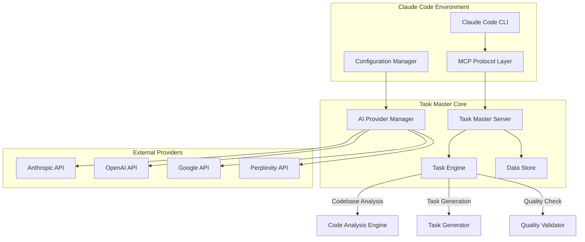

# Task Master MCP Server Configuration Guide

**Version**: 1.0  
**Date**: January 2025  
**Author**: Claude 007 Agent System Documentation  
**Scope**: Global and Per-Project Task Master MCP Configuration  

---

## 🎯 Overview

This comprehensive guide covers configuring the Task Master MCP server for both **global Claude Code usage** (`~/.claude/`) and **per-project configurations**. Task Master provides AI-powered project management with intelligent task generation, complexity analysis, and sophisticated workflow coordination.

### Key Configuration Areas:
- **🌍 Global Configuration**: System-wide Task Master MCP setup
- **📁 Project Configuration**: Per-project Task Master customization  
- **🤖 Model Selection**: AI model configuration and optimization
- **🔐 API Key Management**: Secure credential configuration
- **⚙️ Advanced Settings**: Performance tuning and customization

---

## 🌍 Global Configuration (~/.claude/)

### Step 1: Global Claude Code MCP Setup

#### A. Update Claude Code MCP Configuration
**File**: `~/.claude/config.json` or `~/.claude/mcp_settings.json`

```json
{
  "mcpServers": {
    "task-master-ai": {
      "command": "npx",
      "args": ["-y", "--package=task-master-ai", "task-master-ai"],
      "disabled": false,
      "alwaysAllow": []
    }
  }
}
```

#### B. Alternative Global Configuration (Cursor/Windsurf Style)
**File**: `~/.claude/config.json`

```json
{
  "mcpServers": {
    "task-master": {
      "command": "npx",
      "args": ["task-master-ai"],
      "env": {
        "ANTHROPIC_API_KEY": "${ANTHROPIC_API_KEY}",
        "OPENAI_API_KEY": "${OPENAI_API_KEY}",
        "GOOGLE_API_KEY": "${GOOGLE_API_KEY}"
      }
    }
  },
  "globalSettings": {
    "taskMaster": {
      "defaultProvider": "anthropic",
      "logLevel": "info",
      "enableResearch": true
    }
  }
}
```

### Step 2: Global Environment Configuration
**File**: `~/.claude/.env` (Create if doesn't exist)

```bash
# Task Master Global API Keys
ANTHROPIC_API_KEY=your_anthropic_api_key_here
OPENAI_API_KEY=your_openai_api_key_here
GOOGLE_API_KEY=your_google_api_key_here
PERPLEXITY_API_KEY=your_perplexity_api_key_here

# Azure OpenAI (if using)
AZURE_OPENAI_API_KEY=your_azure_key_here
AZURE_OPENAI_ENDPOINT=https://your-resource.openai.azure.com/

# Advanced Configuration
TASK_MASTER_LOG_LEVEL=info
TASK_MASTER_DEFAULT_MODEL=claude-3-5-sonnet-20241022
TASK_MASTER_ENABLE_RESEARCH=true
```

### Step 3: Global Task Master Configuration
**File**: `~/.claude/task-master-global.json`

```json
{
  "models": {
    "main": {
      "provider": "anthropic",
      "modelId": "claude-3-5-sonnet-20241022",
      "maxTokens": 32000,
      "temperature": 0.2
    },
    "research": {
      "provider": "perplexity",
      "modelId": "llama-3.1-sonar-huge-128k-online",
      "maxTokens": 16000,
      "temperature": 0.3
    },
    "fallback": {
      "provider": "openai",
      "modelId": "gpt-4o",
      "maxTokens": 16000,
      "temperature": 0.1
    }
  },
  "global": {
    "logLevel": "info",
    "enableResearch": true,
    "defaultTasksFile": "tasks/tasks.json",
    "defaultProjectName": "untitled-project"
  },
  "providers": {
    "anthropic": {
      "baseURL": "https://api.anthropic.com",
      "models": ["claude-3-5-sonnet-20241022", "claude-3-opus-20240229"]
    },
    "openai": {
      "baseURL": "https://api.openai.com/v1",
      "models": ["gpt-4o", "gpt-4o-mini", "gpt-5"]
    },
    "google": {
      "baseURL": "https://generativelanguage.googleapis.com/v1beta",
      "models": ["gemini-2.5-pro", "gemini-2.0-flash"]
    }
  }
}
```

---

## 📁 Per-Project Configuration

### Project Structure Setup

```
your-project/
├── .taskmaster/
│   ├── config.json          # Project-specific Task Master config
│   ├── state.json           # Project state and session data
│   ├── docs/
│   │   └── prd.txt          # Product Requirements Document
│   ├── tasks/
│   │   └── tasks.json       # Project tasks
│   └── reports/
│       └── complexity-report.json
├── .env                     # Project-specific environment variables
└── package.json            # Project dependencies
```

### Step 1: Initialize Project Configuration

#### A. Automatic Initialization
```bash
# Navigate to your project directory
cd /path/to/your/project

# Initialize Task Master for the project
npx task-master-ai init

# Or with specific configurations
npx task-master-ai init --provider anthropic --model claude-3-5-sonnet-20241022
```

#### B. Manual Project Configuration
**File**: `your-project/.taskmaster/config.json`

```json
{
  "models": {
    "main": {
      "provider": "claude-code",
      "modelId": "sonnet",
      "maxTokens": 64000,
      "temperature": 0.2,
      "customSystemPrompt": "You are an expert software architect working on a high-priority project. Focus on creating clean, maintainable, and scalable solutions."
    },
    "research": {
      "provider": "perplexity", 
      "modelId": "llama-3.1-sonar-huge-128k-online",
      "maxTokens": 16000,
      "temperature": 0.4
    },
    "fallback": {
      "provider": "anthropic",
      "modelId": "claude-3-5-haiku-20241022",
      "maxTokens": 8192,
      "temperature": 0.1
    }
  },
  "project": {
    "name": "e-commerce-platform",
    "description": "Next.js e-commerce platform with Stripe integration",
    "type": "web-application",
    "techStack": ["nextjs", "typescript", "tailwind", "stripe", "prisma"],
    "complexity": "high"
  },
  "tasks": {
    "defaultFile": "tasks/tasks.json",
    "autoExpand": true,
    "maxSubtaskDepth": 3,
    "defaultPriority": "medium"
  },
  "git": {
    "storeTasksInGit": true,
    "defaultBranch": "main",
    "tagContexts": true
  },
  "quality": {
    "enableComplexityAnalysis": true,
    "requireTestStrategy": true,
    "enforceDocumentation": true
  }
}
```

### Step 2: Project Environment Configuration
**File**: `your-project/.env`

```bash
# Project-specific API overrides (optional)
ANTHROPIC_API_KEY=project_specific_anthropic_key
OPENAI_API_KEY=project_specific_openai_key

# Project-specific Task Master settings
TASK_MASTER_PROJECT_NAME=e-commerce-platform
TASK_MASTER_DEFAULT_TAG=main
TASK_MASTER_ENABLE_AUTO_EXPAND=true
TASK_MASTER_LOG_LEVEL=debug

# Integration settings
GITHUB_TOKEN=your_github_token_for_this_project
PERPLEXITY_API_KEY=your_perplexity_key
```

### Step 3: Project Rules Configuration
**File**: `your-project/.taskmaster/rules.json`

```json
{
  "codeGenerationRules": [
    "cursor",
    "claude", 
    "nextjs",
    "typescript"
  ],
  "qualityGates": {
    "requireTests": true,
    "requireDocumentation": true,
    "enforceTypeScript": true,
    "maxComplexityScore": 7
  },
  "workflowRules": {
    "autoCreateBranches": true,
    "requirePRReview": true,
    "enableContinuousIntegration": true
  },
  "customPrompts": {
    "taskGeneration": "Generate tasks that align with Next.js best practices and TypeScript conventions.",
    "codeReview": "Review code for TypeScript type safety, Next.js performance optimizations, and accessibility compliance.",
    "testing": "Ensure comprehensive test coverage including unit tests, integration tests, and E2E tests."
  }
}
```

---

## 🤖 Model Selection & Configuration

### Available Model Providers

#### 1. Claude Code Provider (Recommended for Development)
```json
{
  "models": {
    "main": {
      "provider": "claude-code",
      "modelId": "sonnet",  // or "opus"
      "maxTokens": 64000,
      "temperature": 0.2,
      "permissionMode": "ask",  // "ask", "allow", "deny"
      "maxTurns": 20,
      "allowedTools": ["*"],
      "disallowedTools": ["bash:rm", "bash:sudo"]
    }
  }
}
```

**Benefits:**
- No API key required
- Direct integration with Claude Code
- Advanced tool usage capabilities
- Session management

#### 2. Anthropic API Provider
```json
{
  "models": {
    "main": {
      "provider": "anthropic",
      "modelId": "claude-3-5-sonnet-20241022",
      "maxTokens": 32000,
      "temperature": 0.2,
      "systemPrompt": "You are an expert project manager and software architect."
    }
  }
}
```

**Best Models:**
- `claude-3-5-sonnet-20241022` - Best balance of capability and speed
- `claude-3-opus-20240229` - Maximum capability for complex analysis
- `claude-3-5-haiku-20241022` - Fast responses for simple tasks

#### 3. OpenAI Provider
```json
{
  "models": {
    "main": {
      "provider": "openai", 
      "modelId": "gpt-5",  // SWE Score: 0.749
      "maxTokens": 32000,
      "temperature": 0.2,
      "topP": 0.9
    }
  }
}
```

**Available Models:**
- `gpt-5` - Latest model with highest SWE score (0.749)
- `gpt-4o` - Excellent for complex reasoning
- `gpt-4o-mini` - Cost-effective for simple tasks

#### 4. Google Provider
```json
{
  "models": {
    "main": {
      "provider": "google",
      "modelId": "gemini-2.5-pro", 
      "maxTokens": 32000,
      "temperature": 0.2,
      "projectId": "your-google-cloud-project",
      "location": "us-central1"
    }
  }
}
```

#### 5. Multi-Model Configuration
```json
{
  "models": {
    "main": {
      "provider": "claude-code",
      "modelId": "sonnet"
    },
    "research": {
      "provider": "perplexity",
      "modelId": "llama-3.1-sonar-huge-128k-online",
      "temperature": 0.4
    },
    "fallback": {
      "provider": "anthropic", 
      "modelId": "claude-3-5-haiku-20241022",
      "temperature": 0.1
    },
    "complexity": {
      "provider": "openai",
      "modelId": "gpt-5",
      "temperature": 0.1
    }
  }
}
```

---

## 🔐 API Key Management

### Security Best Practices

#### 1. Environment Variable Hierarchy
```bash
# System-wide (highest priority)
export ANTHROPIC_API_KEY=sys_key_here

# Global Claude directory
~/.claude/.env

# Project-specific (lowest priority)
project/.env
```

#### 2. Secure Key Storage
**Global**: `~/.claude/.env`
```bash
# Core providers
ANTHROPIC_API_KEY=sk-ant-api03-...
OPENAI_API_KEY=sk-proj-...
GOOGLE_API_KEY=AIza...

# Research and specialized
PERPLEXITY_API_KEY=pplx-...
AZURE_OPENAI_API_KEY=your_azure_key
AZURE_OPENAI_ENDPOINT=https://your-resource.openai.azure.com/

# Optional: Override base URLs
ANTHROPIC_BASE_URL=https://api.anthropic.com
OPENAI_BASE_URL=https://api.openai.com/v1
```

#### 3. Project-Specific Overrides
**Project**: `your-project/.env`
```bash
# Override only specific keys for this project
PERPLEXITY_API_KEY=project_specific_perplexity_key

# Project-specific settings
TASK_MASTER_PROJECT_ID=ecommerce-platform-2025
TASK_MASTER_DEFAULT_COMPLEXITY=high
```

### API Key Validation
```bash
# Test API key configurations
npx task-master-ai models --test

# Validate specific provider
npx task-master-ai models --test --provider anthropic

# Check all configured models
npx task-master-ai models --list
```

---

## ⚙️ Advanced Configuration

### Claude Code Integration

#### 1. Editor-Specific MCP Setup

**Cursor/Windsurf** (`~/.cursor/config.json` or similar):
```json
{
  "mcpServers": {
    "task-master-ai": {
      "command": "npx",
      "args": ["-y", "--package=task-master-ai", "task-master-ai"],
      "env": {
        "TASK_MASTER_GLOBAL_CONFIG": "~/.claude/task-master-global.json"
      }
    }
  }
}
```

**VS Code** (`~/.vscode/settings.json`):
```json
{
  "mcp.servers": {
    "task-master-ai": {
      "command": "npx",
      "args": ["-y", "--package=task-master-ai", "task-master-ai"],
      "type": "stdio",
      "env": {
        "TASK_MASTER_LOG_LEVEL": "info"
      }
    }
  }
}
```

#### 2. MCP Provider Configuration
```json
{
  "models": {
    "main": {
      "provider": "mcp",
      "modelId": "claude-3-5-sonnet-20241022",
      "maxTokens": 32000,
      "temperature": 0.2
    }
  },
  "mcp": {
    "sessionTimeout": 300000,
    "enableStreaming": false,
    "fallbackProvider": "anthropic"
  }
}
```

### Performance Optimization

#### 1. Model-Specific Optimizations
```json
{
  "optimization": {
    "caching": {
      "enableTaskCache": true,
      "enableComplexityCache": true,
      "cacheTimeout": 3600
    },
    "parallelism": {
      "maxConcurrentTasks": 3,
      "enableParallelExpansion": true
    },
    "models": {
      "preferFastModels": true,
      "autoFallback": true,
      "timeoutMs": 30000
    }
  }
}
```

#### 2. Resource Management
```json
{
  "resources": {
    "maxMemoryMb": 512,
    "maxConcurrentOperations": 5,
    "enableGarbageCollection": true,
    "logRotation": {
      "maxFiles": 10,
      "maxSize": "10MB"
    }
  }
}
```

### Workflow Automation

#### 1. Auto-Configuration
```json
{
  "automation": {
    "autoInit": {
      "detectPackageJson": true,
      "detectGitRepo": true,
      "createPRDTemplate": true
    },
    "autoTasks": {
      "generateOnPRDChange": true,
      "expandComplexTasks": true,
      "updateOnResearch": true
    },
    "integrations": {
      "github": {
        "autoCreateBranches": true,
        "autoUpdatePRs": true
      }
    }
  }
}
```

---

## 🛠️ Practical Usage Examples

### Example 1: New Project Setup
```bash
# Navigate to project
cd ~/projects/new-ecommerce-app

# Initialize with specific configuration
npx task-master-ai init \
  --provider claude-code \
  --model sonnet \
  --enable-research \
  --git-integration

# Configure models interactively  
npx task-master-ai models --setup

# Create PRD and generate initial tasks
npx task-master-ai parse-prd docs/requirements.md

# View generated tasks
npx task-master-ai get-tasks
```

### Example 2: Multi-Model Project Configuration
```bash
# Setup with multiple models for different roles
npx task-master-ai models \
  --set-main claude-code/sonnet \
  --set-research perplexity/sonar-huge \
  --set-fallback anthropic/haiku

# Test configuration
npx task-master-ai models --test

# Generate tasks with research enabled
npx task-master-ai add-task "Implement OAuth authentication" --research
```

### Example 3: Team Project Setup
```bash
# Initialize team project with shared configuration
npx task-master-ai init \
  --provider anthropic \
  --model claude-3-5-sonnet-20241022 \
  --rules cursor,typescript,nextjs \
  --store-in-git

# Set up quality gates
npx task-master-ai rules add \
  --require-tests \
  --require-docs \
  --max-complexity 7

# Generate project structure
npx task-master-ai generate
```

---

## 🚨 Troubleshooting

### Common Issues & Solutions

#### 1. MCP Server Not Starting
**Problem**: Task Master MCP server fails to start

**Solutions:**
```bash
# Check if package is installed globally
npm list -g task-master-ai

# Install/update to latest version  
npm install -g task-master-ai@latest

# Test MCP server directly
npx task-master-ai --version

# Check Claude Code MCP configuration
claude-code config show
```

#### 2. API Key Issues
**Problem**: Authentication failures or quota errors

**Solutions:**
```bash
# Validate API keys
npx task-master-ai models --test

# Check environment variables
env | grep -E "(ANTHROPIC|OPENAI|GOOGLE)_API_KEY"

# Test specific provider
npx task-master-ai models --test --provider anthropic

# Reset configuration
npx task-master-ai models --setup --reset
```

#### 3. Model Selection Issues
**Problem**: Incorrect model being used or model not available

**Solutions:**
```bash
# List available models
npx task-master-ai models --list

# Check current configuration
npx task-master-ai models --show

# Update model selection
npx task-master-ai models --set-main claude-code/sonnet

# Verify model capabilities
npx task-master-ai models --test --verbose
```

#### 4. Configuration File Issues
**Problem**: Configuration not being loaded or invalid

**Solutions:**
```bash
# Check configuration file location
npx task-master-ai config --locate

# Validate configuration
npx task-master-ai config --validate

# Repair configuration
npx task-master-ai models --setup --repair

# Reset to defaults
npx task-master-ai config --reset
```

#### 5. Project Initialization Issues
**Problem**: Project fails to initialize or missing files

**Solutions:**
```bash
# Force re-initialization
npx task-master-ai init --force

# Check project requirements
npx task-master-ai init --dry-run

# Initialize with minimal configuration
npx task-master-ai init --minimal

# Manual directory setup
mkdir -p .taskmaster/{docs,tasks,reports}
touch .taskmaster/config.json .taskmaster/state.json
```

### Debug Mode
```bash
# Enable debug logging
export TASK_MASTER_LOG_LEVEL=debug
npx task-master-ai get-tasks --verbose

# Check MCP communication
export MCP_DEBUG=1
npx task-master-ai models --test
```

---

## 📋 Configuration Checklist

### Global Setup ✅
- [ ] **MCP Server**: Added to `~/.claude/config.json` 
- [ ] **API Keys**: Configured in `~/.claude/.env`
- [ ] **Global Config**: Created `~/.claude/task-master-global.json`
- [ ] **Model Test**: All providers working with `npx task-master-ai models --test`

### Per-Project Setup ✅
- [ ] **Initialization**: Run `npx task-master-ai init`
- [ ] **Project Config**: Customized `.taskmaster/config.json`
- [ ] **Environment**: Project-specific `.env` if needed
- [ ] **Rules**: Configured `.taskmaster/rules.json` for team standards
- [ ] **PRD**: Created Product Requirements Document
- [ ] **Git Integration**: Enabled if using version control

### Model Configuration ✅
- [ ] **Main Model**: Selected primary model for task generation
- [ ] **Research Model**: Configured for research-backed tasks
- [ ] **Fallback Model**: Set backup model for reliability
- [ ] **Provider Settings**: API keys and endpoints configured
- [ ] **Performance**: Optimized settings for project needs

### Integration Testing ✅  
- [ ] **Basic Functions**: `npx task-master-ai get-tasks` works
- [ ] **Task Generation**: Can create tasks with `add-task`
- [ ] **Research**: Research mode functional if enabled
- [ ] **Claude Code**: MCP tools accessible in Claude Code
- [ ] **Project Commands**: All project-specific commands working

---

## 🎯 Best Practices Summary

### Configuration Strategy
1. **Start Global**: Set up global configuration first for baseline functionality
2. **Customize Per-Project**: Override global settings for project-specific needs
3. **Use Claude Code Provider**: Recommended for development environments
4. **Multi-Model Setup**: Use different models for different task types
5. **Secure API Keys**: Store in environment files, never in code

### Model Selection
1. **Development**: Claude Code Sonnet for general development
2. **Complex Analysis**: GPT-5 or Claude 3.5 Sonnet for sophisticated reasoning  
3. **Research**: Perplexity models for internet research capabilities
4. **Fallback**: Fast, reliable model like Claude 3.5 Haiku

### Project Organization
1. **Consistent Structure**: Use standard `.taskmaster/` directory structure
2. **Version Control**: Store configuration in git for team consistency
3. **Documentation**: Maintain PRD and requirements documentation
4. **Quality Gates**: Configure automated quality checks

### Performance Optimization
1. **Model Caching**: Enable caching for repeated operations
2. **Parallel Execution**: Configure concurrent task processing
3. **Resource Limits**: Set appropriate memory and timeout limits
4. **Log Management**: Configure appropriate logging levels

---

## 📎 Appendix

### A. Technical Architecture Details

#### Task Master MCP Server Architecture



#### MCP Communication Protocol

```yaml
MCP Message Structure:
  request:
    id: unique_request_id
    method: "task-master/operation"
    params:
      operation: "get_tasks|add_task|analyze_complexity"
      projectRoot: "/absolute/path/to/project"
      payload: operation_specific_data
  
  response:
    id: matching_request_id
    result:
      success: boolean
      data: operation_result
      metadata:
        execution_time: milliseconds
        model_used: provider/model
        tokens_consumed: number
    
  error:
    id: matching_request_id
    code: error_code
    message: human_readable_error
    data: additional_error_context
```

#### Configuration Resolution Hierarchy

```yaml
Configuration Priority (highest to lowest):
  1. Environment Variables:
     - TASK_MASTER_* environment variables
     - Provider API key environment variables
  
  2. Project Configuration:
     - .taskmaster/config.json
     - project/.env
  
  3. Global Configuration:
     - ~/.claude/task-master-global.json
     - ~/.claude/.env
  
  4. MCP Server Defaults:
     - Built-in provider configurations
     - Default model parameters
  
  5. System Defaults:
     - Fallback configurations
     - Error handling defaults
```

#### Bridge Agent Integration Patterns

```typescript
// Claude 007 Agent Integration Pattern
interface TaskMasterBridge {
  // Core MCP Tools
  initializeProject(config: ProjectConfig): Promise<ProjectState>
  getTasks(filters?: TaskFilters): Promise<Task[]>
  addTask(taskData: TaskInput): Promise<Task>
  setTaskStatus(taskId: string, status: TaskStatus): Promise<Task>
  
  // 0.24.0 Enhanced Tools
  analyzeCodebase(projectPath: string): Promise<CodebaseAnalysis>
  generateContextualTasks(analysis: CodebaseAnalysis, requirements: string): Promise<Task[]>
  orchestrateParallelExecution(tasks: Task[]): Promise<ExecutionPlan>
  validateTaskQuality(task: Task, context: ProjectContext): Promise<QualityReport>
  
  // Claude 007 Integration
  bridgeWithAgent(agentType: AgentType, operation: string, params: any): Promise<any>
  coordinateMultiAgent(agents: Agent[], workflow: Workflow): Promise<WorkflowResult>
}

// Subagent Integration
interface SubagentBridge {
  taskOrchestrator: {
    coordinate(tasks: Task[], agents: Agent[]): Promise<CoordinationPlan>
    monitor(executionId: string): Promise<ExecutionStatus>
    adjust(executionId: string, changes: ExecutionChanges): Promise<void>
  }
  
  taskExecutor: {
    execute(task: Task, context: ExecutionContext): Promise<TaskResult>
    validate(result: TaskResult): Promise<ValidationReport>
    optimize(task: Task, performance: PerformanceMetrics): Promise<Task>
  }
  
  taskChecker: {
    check(task: Task, criteria: QualityCriteria): Promise<QualityReport>
    suggest(task: Task, issues: QualityIssue[]): Promise<Improvement[]>
    enforce(task: Task, standards: QualityStandards): Promise<ComplianceReport>
  }
}
```

### B. Risk Assessment Matrix

#### Configuration Risks

| Risk Category | Risk Description | Probability | Impact | Risk Score | Mitigation Strategy |
|---------------|------------------|-------------|---------|------------|-------------------|
| **API Key Security** | Exposed API keys in configuration files | Medium (3) | High (4) | 12 | Store in environment variables only, use .gitignore, implement key rotation |
| **Model Compatibility** | Selected model not available or deprecated | Low (2) | Medium (3) | 6 | Configure fallback models, monitor model availability, use stable model versions |
| **Network Connectivity** | Provider API unavailable or rate limited | Medium (3) | Medium (3) | 9 | Implement retry logic, configure multiple providers, use local fallbacks |
| **Configuration Corruption** | Invalid JSON or corrupted config files | Low (2) | High (4) | 8 | Implement config validation, backup configurations, use repair tools |
| **Version Incompatibility** | Task Master version conflicts with agents | Low (2) | High (4) | 8 | Pin specific versions, test upgrades in staging, maintain compatibility matrix |

#### Operational Risks

| Risk Category | Risk Description | Probability | Impact | Risk Score | Mitigation Strategy |
|---------------|------------------|-------------|---------|------------|-------------------|
| **Performance Degradation** | Slow response times affecting workflow | Medium (3) | Medium (3) | 9 | Monitor performance metrics, optimize configurations, implement caching |
| **Resource Exhaustion** | High memory/CPU usage impacting system | Medium (3) | High (4) | 12 | Set resource limits, monitor usage, implement throttling |
| **Data Loss** | Task data corruption or loss | Low (2) | High (4) | 8 | Regular backups, version control integration, data validation |
| **Integration Failures** | MCP communication breaking | Medium (3) | High (4) | 12 | Health checks, error recovery, alternative communication paths |
| **Quota Exhaustion** | API rate limits or token limits reached | Medium (3) | Medium (3) | 9 | Monitor usage, implement quota management, distribute across providers |

#### Security Risks

| Risk Category | Risk Description | Probability | Impact | Risk Score | Mitigation Strategy |
|---------------|------------------|-------------|---------|------------|-------------------|
| **Credential Compromise** | API keys stolen or misused | Low (2) | Critical (5) | 10 | Key rotation, access logging, principle of least privilege |
| **Code Injection** | Malicious code in task descriptions | Low (2) | High (4) | 8 | Input sanitization, code review, sandboxed execution |
| **Data Exfiltration** | Sensitive project data sent to providers | Medium (3) | High (4) | 12 | Data classification, provider assessment, local processing options |
| **Unauthorized Access** | Unauthorized use of Task Master tools | Low (2) | Medium (3) | 6 | Authentication requirements, access controls, audit logging |

#### Risk Score Legend:
- **1-3**: Low Risk (Monitor)
- **4-6**: Medium Risk (Mitigate) 
- **7-12**: High Risk (Address Immediately)
- **13-15**: Critical Risk (Stop Operation)

### C. Performance Benchmarks

#### Model Performance Comparison

| Model | Provider | SWE Score | Avg Response Time | Token Cost | Best Use Case |
|-------|----------|-----------|-------------------|------------|---------------|
| **GPT-5** | OpenAI | 0.749 | 3.2s | High | Complex analysis, architecture decisions |
| **Claude 3.5 Sonnet** | Anthropic | 0.727 | 2.8s | Medium | General development, code review |
| **Claude Code Sonnet** | Claude Code | 0.727 | 2.1s | Free* | Interactive development |
| **Claude 3.5 Haiku** | Anthropic | 0.690 | 1.4s | Low | Quick tasks, fallback operations |
| **Gemini 2.5 Pro** | Google | 0.710 | 2.9s | Medium | Research, multi-modal analysis |
| **Perplexity Sonar** | Perplexity | 0.650 | 4.1s | Medium | Research, real-time information |

*Claude Code models use Claude Code credits, not direct API costs

#### Task Generation Performance

```yaml
Codebase Analysis Performance:
  Small Project (< 10 files): 2-5 seconds
  Medium Project (10-100 files): 5-15 seconds  
  Large Project (100-1000 files): 15-60 seconds
  Enterprise Project (> 1000 files): 1-5 minutes

Task Generation Speed:
  Simple Tasks (1-5 tasks): < 10 seconds
  Complex Tasks (5-20 tasks): 10-30 seconds
  Enterprise Tasks (20+ tasks): 30-120 seconds

Quality Validation Time:
  Basic Validation: 1-3 seconds per task
  Comprehensive Validation: 3-10 seconds per task
  Security Validation: 5-15 seconds per task
```

#### Resource Utilization

```yaml
Memory Usage:
  Base Task Master Process: 50-100 MB
  With Codebase Analysis: +20-50 MB per 100 files
  With Active AI Operations: +100-300 MB per concurrent operation
  Peak Usage (Large Projects): 500-1000 MB

CPU Usage:
  Idle State: 0-1% CPU
  Task Generation: 10-30% CPU (burst)
  Codebase Analysis: 20-50% CPU (sustained)
  Parallel Operations: 40-80% CPU (peak)

Network Usage:
  API Calls: 1-10 KB per simple request
  Complex Operations: 10-100 KB per request
  Codebase Upload: Variable (up to several MB)
  Daily Usage (Active Development): 1-10 MB
```

#### Performance Optimization Targets

```yaml
Response Time Targets:
  Basic Operations: < 2 seconds
  Task Generation: < 30 seconds
  Codebase Analysis: < 2 minutes
  Complex Workflows: < 5 minutes

Throughput Targets:
  Task Operations: 10-20 operations/minute
  Concurrent Users: 5-10 users per server
  API Requests: 100-500 requests/hour

Reliability Targets:
  Uptime: 99.5% availability
  Error Rate: < 1% of operations
  Recovery Time: < 30 seconds
```

### D. Migration Guide

#### Upgrading from Previous Task Master Versions

##### Pre-0.24.0 to 0.24.0 Migration

**Step 1: Backup Existing Configuration**
```bash
# Backup existing configuration
cp -r .taskmaster .taskmaster.backup.$(date +%Y%m%d)
cp ~/.claude/task-master-global.json ~/.claude/task-master-global.json.backup

# Export existing tasks
npx task-master-ai get-tasks --export tasks-backup.json
```

**Step 2: Update Task Master Package**
```bash
# Update global installation
npm uninstall -g task-master-ai
npm install -g task-master-ai@latest

# Verify new version
npx task-master-ai --version
```

**Step 3: Configuration Migration**
```bash
# Run migration tool (if available)
npx task-master-ai migrate --from-version 0.23.x

# Or manually update configuration
npx task-master-ai models --setup --migrate
```

**Step 4: New Feature Integration**
```json
// Add new 0.24.0 capabilities to config.json
{
  "models": {
    "main": {
      "provider": "claude-code",
      "modelId": "sonnet"
    }
  },
  "features": {
    "codebaseAnalysis": true,
    "subagentIntegration": true,
    "parallelExecution": true
  }
}
```

#### Migrating from Other Task Management Systems

##### From Linear/Asana/Jira

**Step 1: Export Existing Tasks**
```bash
# Export from source system (example format)
# tasks_export.csv with columns: title, description, status, priority, assignee
```

**Step 2: Convert to Task Master Format**
```python
# Python conversion script
import csv
import json

def convert_tasks(csv_file):
    tasks = []
    with open(csv_file, 'r') as file:
        reader = csv.DictReader(file)
        for i, row in enumerate(reader, 1):
            task = {
                "id": f"task-{i:03d}",
                "title": row['title'],
                "description": row['description'],
                "status": map_status(row['status']),
                "priority": map_priority(row['priority']),
                "dependencies": [],
                "subtasks": []
            }
            tasks.append(task)
    
    return {"tasks": tasks, "metadata": {"imported": True}}

def map_status(external_status):
    mapping = {
        "To Do": "pending",
        "In Progress": "in-progress", 
        "Done": "done",
        "Blocked": "blocked"
    }
    return mapping.get(external_status, "pending")
```

**Step 3: Import to Task Master**
```bash
# Import converted tasks
npx task-master-ai import --file converted_tasks.json

# Verify import
npx task-master-ai get-tasks --count
```

##### From GitHub Issues

**Step 1: Export GitHub Issues**
```bash
# Using GitHub CLI
gh issue list --repo owner/repo --state all --json title,body,state,labels > github_issues.json
```

**Step 2: Convert and Import**
```bash
# Convert GitHub issues to Task Master format
npx task-master-ai import --from-github --file github_issues.json --map-labels

# Review imported tasks
npx task-master-ai get-tasks --filter imported
```

#### Team Migration Strategy

##### Phase 1: Pilot Setup (Week 1)
```yaml
Objectives:
  - Setup Task Master for 2-3 pilot team members
  - Configure basic MCP integration
  - Test core workflows

Tasks:
  1. Install and configure Task Master for pilot users
  2. Set up shared configuration templates
  3. Test basic task management workflows
  4. Document initial feedback and issues

Success Criteria:
  - All pilot users can create and manage tasks
  - MCP integration functional
  - Basic workflows operational
```

##### Phase 2: Team Rollout (Week 2-3)
```yaml
Objectives:
  - Extend to full development team
  - Integrate with existing tools (GitHub, Slack, etc.)
  - Establish team workflows and standards

Tasks:
  1. Deploy configuration to all team members
  2. Set up team-specific rules and quality gates
  3. Integrate with CI/CD pipelines
  4. Conduct team training sessions

Success Criteria:
  - Full team using Task Master daily
  - Integration with existing tools complete
  - Team productivity metrics stable or improved
```

##### Phase 3: Optimization (Week 4)
```yaml
Objectives:
  - Optimize performance and workflows
  - Advanced feature adoption
  - Process improvement and documentation

Tasks:
  1. Analyze usage metrics and optimize configurations
  2. Implement advanced features (parallel execution, etc.)
  3. Create team documentation and best practices
  4. Establish ongoing improvement processes

Success Criteria:
  - Performance targets met
  - Advanced features in use
  - Team satisfaction with new workflow
```

#### Rollback Procedures

##### Emergency Rollback
```bash
# Stop current Task Master processes
pkill -f task-master-ai

# Restore backup configuration
cp .taskmaster.backup.$(date +%Y%m%d)/* .taskmaster/
cp ~/.claude/task-master-global.json.backup ~/.claude/task-master-global.json

# Reinstall previous version
npm install -g task-master-ai@0.23.x

# Restore tasks
npx task-master-ai import --file tasks-backup.json

# Verify rollback
npx task-master-ai get-tasks --count
```

##### Gradual Rollback
```bash
# Disable new features first
npx task-master-ai config --disable codebaseAnalysis
npx task-master-ai config --disable subagentIntegration

# Test stability
npx task-master-ai get-tasks

# If stable, continue with current version
# If not stable, proceed with full rollback
```

---

**This configuration guide with complete appendixes enables full Task Master MCP integration for both global Claude Code usage and project-specific customization, unlocking powerful AI-assisted project management capabilities.**